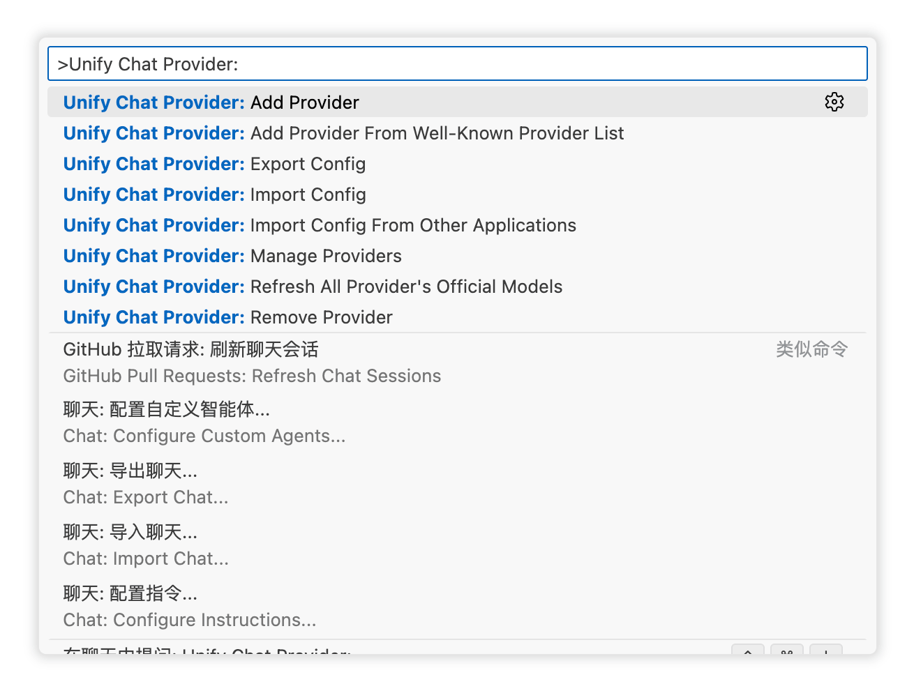
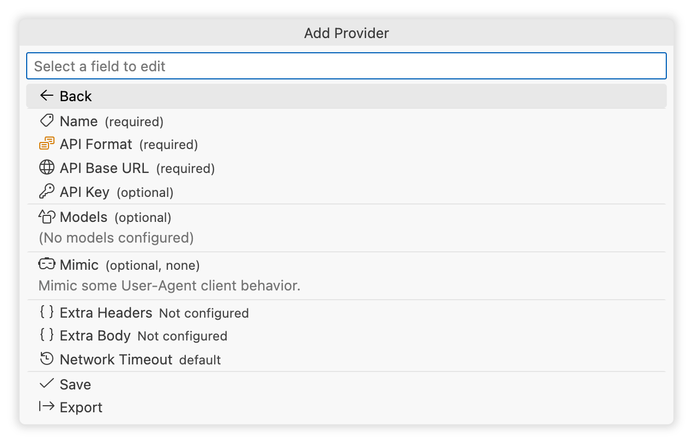

<h1 align="center">
Unify Chat Provider
</h1>

Integrate multiple LLM API providers into VS Code's GitHub Copilot Chat using the Language Model API.

<!--  

<a href="https://unocss.dev/">Documentation</a> |
<a href="https://unocss.dev/play/">Playground</a>

  -->

 

English |
<a href="./README_zh-CN.md">简体中文</a>

## Features

- **[Perfect Compatibility]()**: Supports all major LLM API formats (OpenAI Chat Completion, OpenAI Responses, Anthropic Messages, Ollama Chat).
- **[Best Performance]()**: Extremely focused on special optimizations and best practices for model providers, ensuring 100% model performance.
- **[Out of the Box]()**: Built-in recommended parameters for major providers and models, and supports automatic synchronization of provider model lists via API, without any tedious configuration.
- **[Quick Migration](#one-click-migration)**: Complete configuration import/export functions, and supports one-click migration of configurations from major applications or extensions (Claude Code, CodeX, Gemini CLI...).
- **[Controllable Parameters]()**: Open adjustment of all interface parameters, and supports custom Header and Request fields.
- **[Excellent Experience]()**: Built-in visual user interface, supports unlimited provider and model configurations, and supports coexistence of multiple configurations for the same provider or model.

## Installation

- Search for [Unify Chat Provider](https://marketplace.visualstudio.com/items?itemName=SmallMain.vscode-unify-chat-provider) in the VS Code Extension Marketplace and install it.
- Download the latest `.vsix` file from [GitHub Releases](https://github.com/smallmain/vscode-unify-chat-provider/releases), and install it in VS Code via `Install from VSIX...` or by dragging it to the extensions panel.

## Quick Start

Depending on the scenario, you can choose the most suitable method from the following:

- [One-Click Migration](#one-click-migration): Migrate from other applications or extensions.
- [One-Click Configuration](#one-click-configuration): Add built-in supported model providers.
- [Import and Export](#import-and-export): Configurations backed up or shared by others.
- [Manual Configuration](#manual-configuration): Add any provider and model completely from scratch.

Regardless of the method used for configuration, you can customize any field before or after the import is complete.

### Basic Operations

Most of the extension's interfaces are integrated into the VSCode Command Palette. Please understand its basic operation methods to complete subsequent operations:

1. Open VSCode Command Palette:
   - Open via menu `View` -> `Command Palette...`.
   - Open via shortcut `Ctrl+Shift+P` (Windows/Linux) or `Cmd+Shift+P` (Mac).
2. Search Commands:
   - Enter keyword `Unify Chat Provider:` or `ucp:` in the command palette to search for all commands.
3. Select Command:
   - Use the mouse click or keyboard up/down arrow keys to select a command, and press Enter to execute the selected command.

  

### One-Click Migration

Applications or extensions supported for one-click migration:

- Claude Code
- CodeX
- Gemini CLI

> If the application or extension you are using is not in the list above, you can complete the configuration via [One-Click Configuration](#one-click-configuration) or [Manual Configuration](#manual-configuration).

#### Steps:

1. Open VSCode Command Palette, search for `Import Config From Other Applications`.

   

   
   

   - The interface displays all supported applications or extensions and their detected configuration file paths.
   - Other operations can be performed via the button group on the far right of the list item:
     1. `Custom Path`: Select a custom configuration file path to import.
     2. `Import from Config Content`: Directly input configuration content to import.

2. Select the application or extension configuration you want to import from the popped-up list.
3. After selection, you will enter the configuration import interface, which is similar to the [Provider Configuration]() interface, where you can view or edit any fields.
4. Click the `Save` button to complete the import, and you can immediately use the models in Copilot Chat.

   

   
   

> **Note**: The following applications only support migration when using custom Base URL and API Key:
>
> - Claude Code
> - Codex
> - Gemini CLI

### One-Click Configuration

Model providers supported for one-click configuration:

- OpenAI
- Google AI Studio
- Anthropic
- xAI
- Hugging Face
- Alibaba Cloud Model Studio
- Model Scope
- Volcano Engine
- Byte Plus
- Tencent Cloud
- DeepSeek
- Xiaomi MIMO
- Ollama
- ZhiPu AI
- Z.AI
- MiniMax
- Moonshot AI

> If the application or extension you are using is not in the list above, you can add it via [Manual Configuration](#manual-configuration).

#### Steps:

1. Open VSCode Command Palette, search for `Add Provider From Well-Known Provider List`.

   

   
   

2. Select the provider you want to add from the popped-up list.
3. Enter the API Key according to the prompt, and press Enter to enter the configuration import interface, which is similar to the [Provider Configuration]() interface, where you can view or edit any fields.
   - Some providers may not require an API Key, just press Enter to skip.
4. Click the `Save` button to complete the import, and you can immediately use the models in Copilot Chat.

   

   
   

### Manual Configuration

1. Open VSCode Command Palette, search for `Add Provider`.
   

   
   

2. Fill in the configuration in the add configuration interface, which is similar to the [Provider Configuration]() interface. You can read the documentation of this interface to understand the function of each field.
3. Click the `Save` button to complete the addition, and you can immediately use the models in Copilot Chat.

## Out of the Box Support

To be added...

## Import and Export

To be added...

## Contribution

- Build: `npm run compile`
- Watch: `npm run watch`
- Interactive release: `npm run release`

## License

[MIT @ SmallMain](./LICENSE)
