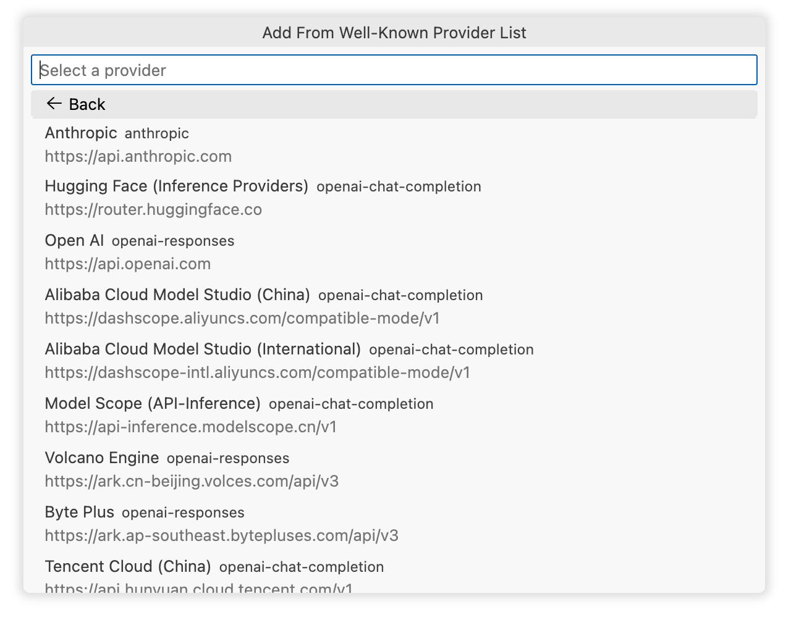
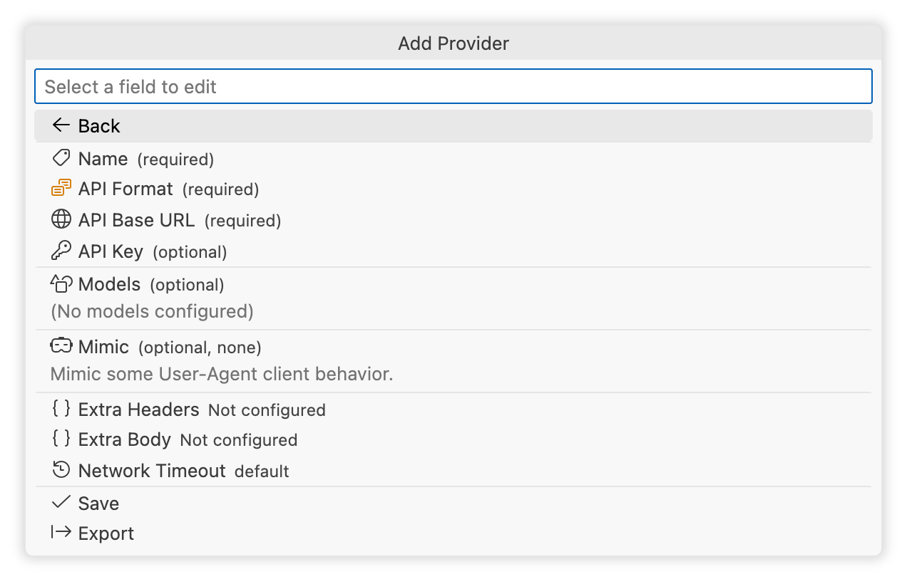
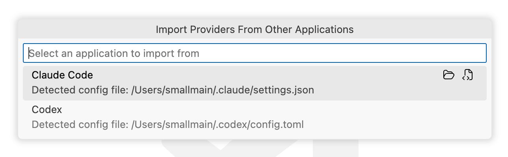

<p align="center">

</p>

<h1 align="center">
Unify Chat Provider
</h1>

<p align="center">
Integrate multiple LLM API providers into VS Code's GitHub Copilot Chat using the Language Model API.
</p>

<!-- <br>
<p align="center">
<a href="https://unocss.dev/">Documentation</a> |
<a href="https://unocss.dev/play/">Playground</a>
</p>
<br> -->

<br>
<p align="center">
<span>English</span> |
<a href="https://github.com/smallmain/vscode-unify-chat-provider/blob/main/README_zh-CN.md">简体中文</a>
</p>

## Features

- 🐑 **Free Tier Access**: Aggregates the latest free mainstream model channel configurations!
- 📦 **Out of the Box**: One-click configuration, automatic syncing of official model lists, and migration from other tools.
- 🔌 **Perfect Compatibility**: Supports all major LLM API formats (OpenAI Chat Completions, OpenAI Responses, Anthropic Messages, Ollama Chat, Gemini).
- 🎯 **Deep Adaptation**: Adapts to special API features and best practices of 45+ mainstream providers.
- 🚀 **Best Performance**: Built-in recommended parameters for 200+ mainstream models, allowing you to maximize model potential without tuning.
- 💻 **Code Completion**: Provides high-performance FIM, NES, and Next Edit Prediction code completion with full-context integration and fully customizable models and algorithms.
- 💬 **Commit Message Generation**: Provides better commit message generation than VS Code through the same UI entry point.
- 💾 **Import and Export**: Complete import/export support; import configs via Base64, JSON, URL, or URI.
- 💎 **Great UX**: Visual interface configuration, fully customizable model parameters, supports unlimited provider and model configurations, and supports coexistence of multiple configuration variants for the same provider and model.
- ✨ **One More Thing**: One-click use of your Claude Code, Gemini CLI, Antigravity, Github Copilot, OpenAI Codex (ChatGPT Plus/Pro), xAI Grok (SuperGrok / X Premium+), and Zed account quotas.

## Installation

- Requires VS Code 1.115.0 or later.
- Search for [Unify Chat Provider](https://marketplace.visualstudio.com/items?itemName=SmallMain.vscode-unify-chat-provider) in the VS Code Extension Marketplace and install it.
- Download the latest `.vsix` file from [GitHub Releases](https://github.com/smallmain/vscode-unify-chat-provider/releases), then install it in VS Code via `Install from VSIX...` or by dragging it into the Extensions view.

## Quick Start

If the provider you want to add is in the [Provider Support Table](#provider-support-table), use [One-Click Configuration](#one-click-configuration).

Otherwise, you can also [manually configure](#manual-configuration) any provider and model.

You might also be looking for:

- [One-Click Migration](#one-click-migration): Migrate from other apps or extensions.
- [Manage Providers](#manage-providers): Unified management for all providers and models.
- [Import and Export](#import-and-export): Back up or export configurations to share with others.

> ⚠️ **Avoid VS Code background tasks consuming Copilot quota**
>
> VS Code currently uses utility models for some background tasks by default. If you use a free Copilot account, this may consume your Copilot quota.
>
> You need to set these to other models in `settings.json` yourself to avoid consuming Copilot quota, or use the quick settings interface provided by this extension. See [Quick Set VS Code Default Model](#quick-set-vs-code-default-model) for details.

> ⚠️ **Allow the extension to enable Proposed APIs**
>
> This extension uses some experimental VS Code extension APIs. After installation, you may be prompted to enable these APIs, which requires administrator privileges. Allow them for the best experience.
>
> The extension will still work without them, but with the following limitations:
> - Some models will be less effective.
> - Commit message generation will be significantly less effective.
> - The native commit message generation button will be unavailable.
> - Code completion will be unavailable.
> - Preset templates will be unavailable.

## Basic Operations

The UI is integrated into the VS Code Command Palette for a more native experience. Here’s the basic workflow:

1. Open the Command Palette:
   - From the menu: `View` -> `Command Palette...`
   - Or with the shortcut: `Ctrl+Shift+P` (Windows/Linux) or `Cmd+Shift+P` (Mac)
2. Search commands:
   - Type `Unify Chat Provider:` or `ucp:` to find all commands.
3. Run a command:
   - Select a command with mouse or arrow keys, then press Enter.

<div align="center">
  
</div>

## One-Click Configuration

See the [Provider Support Table](#provider-support-table) for providers supported by one-click configuration.

> If your provider is not in the list, you can add it via [Manual Configuration](#manual-configuration).

**Steps:**

1. Open the VS Code Command Palette and search for `Unify Chat Provider: Add Provider From Well-Known Provider List`.

   <div align="center">
   
   </div>

2. Select the provider you want to add.
3. Follow the prompts to configure authentication (usually an API key, or it may require logging in via the browser), then you’ll be taken to the config import screen.
   - This screen lets you review and edit the config that will be imported.
   - For details, see the [Provider Settings](#provider-settings) section.

4. Click `Save` to complete the import and start using the models in Copilot Chat.

   <div align="center">
   
   </div>

## Code Completion

Open the VS Code Command Palette and search for `Unify Chat Provider: Code Completion Settings`.

Code completion is enabled by default, but it takes effect only after you add at least one valid completion algorithm.

### Conflict Notice

Once this extension's code completion becomes active, it automatically disables VS Code's built-in code completion.

To allow both to coexist, which is not recommended, change `Code Completion Settings -> Completion Strategy Settings -> Disable VS Code Built-in Completion`.

When multiple extensions provide code completion, VS Code returns results only from the one that responds fastest. We therefore recommend enabling code completion in only one extension.

### Supported Algorithms

| Name              | ID                  | Description                                                                                      |
| ----------------- | ------------------- | ------------------------------------------------------------------------------------------------ |
| Simple            | `simple`            | The simplest FIM implementation; sends only the current document's prefix and suffix and works with any model. |
| Copilot (Replica) | `copilot-replica`   | A complete replica of VS Code Copilot's core FIM/NES implementation that works with any model.  |
| Zed               | `zed`               | A complete replica of Zed Edit Prediction that supports Zeta models only.                       |
| Inception         | `inception`         | Implements the documented best practices and supports Mercury Edit 2 only.                      |
| Mistral           | `mistral`           | Implements the documented best practices and supports Codestral only.                           |

We recommend the [Zed](#zed) and [Inception](#inception) algorithms for better results.

### Simple

This algorithm supports any model. A model designed specifically for FIM code completion, such as Qwen Coder, is recommended.

Models such as DeepSeek V4 may support FIM but perform poorly in practice, so they are not recommended.

Steps:

1. First add a model configuration, then adjust its completion capabilities based on whether the model supports FIM:
   - Supports FIM: set `completion.template` to `fim`.
   - Supports chat only: set `completion.template` to `fim` and `completion.transport` to `compatible`.
2. Add a Simple algorithm through `Code Completion Settings -> Add From Current Provider List -> Simple`, then select the model to use.
3. Click `Save`.

### Zed

This algorithm provides the same code completion experience as the Zed editor.

Zed uses its own Zeta model family. We recommend adding it in one of two ways:

1. Add the `Zed` provider through [One-Click Configuration](#one-click-configuration) and use your Zed account quota.
2. Deploy a Zeta model locally and add it.

Assuming you used the first method to add the `Zed` provider, continue with these steps:

1. Add a Zed algorithm through `Code Completion Settings -> Add From Current Provider List -> Zed`, then select the `Zeta Cloud` model.
2. Click `Save`.

### Inception

1. Add the `Inception` provider through [One-Click Configuration](#one-click-configuration).
2. Add an Inception algorithm through `Code Completion Settings -> Add From Current Provider List -> Inception`, then select the `Mercury Edit 2` model.
3. Click `Save`.

### Mistral

1. Add the `Mistral` provider through [One-Click Configuration](#one-click-configuration).
2. Add a Mistral algorithm through `Code Completion Settings -> Add From Current Provider List -> Mistral`, then select the `Codestral` model.
3. Click `Save`.

## Manual Configuration

This section uses DeepSeek as an example, adding the provider and two models.

> DeepSeek supports [One-Click Configuration](#one-click-configuration). This section shows the manual setup for demonstration purposes.

0. Preparation: get the API information from the provider docs, at least the following:
   - `API Format`: The API format (e.g., OpenAI Chat Completions, Anthropic Messages).
   - `API Base URL`: The base URL of the API.
   - `Authentication`: Usually an API key; obtained from the user center or console after registration.

1. Open the VS Code Command Palette and search for `Unify Chat Provider: Add Provider`.

   <div align="center">
   
   </div>
   - This screen is similar to the [Provider Settings](#provider-settings) screen, and includes in-place documentation for each field.

2. Fill in the provider name: `Name`.
   - The name must be unique and is shown in the model list. Here we use `DeepSeek`.
   - You can create multiple configs for the same provider with different names, e.g., `DeepSeek-Person`, `DeepSeek-Team`.

3. Choose the API format: `API Format`.
   - DeepSeek uses the `OpenAI Chat Completion` format, so select that.
   - To see all supported formats, refer to the [API Format Support Table](#api-format-support-table).

4. Set the base URL: `API Base URL`.
   - DeepSeek’s base URL is `https://api.deepseek.com`.

5. Configure authentication: `Authentication`.
   - DeepSeek uses API Key for authentication, so select `API Key`.
   - Enter the API key generated from the DeepSeek console.

6. Click `Models` to go to the model management screen.

   <div align="center">
   
   </div>

7. Enable `Auto-Fetch Official Models`.
   - This example uses auto-fetch to reduce configuration steps; see [Auto-Fetch Official Models](#auto-fetch-official-models) for details.
   - For model fields and other ways to add models, see [Manage Models](#manage-models).

8. Click `Save` to finish. You can now use the models in Copilot Chat.

   <div align="center">
   
   </div>

## One-Click Migration

See the [Application Migration Support Table](#application-migration-support-table) to learn which apps and extensions are supported.

> If your app/extension is not in the list, you can configure it via [One-Click Configuration](#one-click-configuration) or [Manual Configuration](#manual-configuration).

**Steps:**

1. Open the VS Code Command Palette and search for `Unify Chat Provider: Import Config From Other Applications`.

  <div align="center">
  
  </div>

  - The UI lists all supported apps/extensions and the detected config file paths.
  - Use the button group on the far right of each item for additional actions:
    1. `Custom Path`: Import from a custom config file path.
    2. `Import From Config Content`: Paste the config content directly.

2. Choose the app/extension you want to import, then you’ll be taken to the config import screen.
  - This screen lets you review and edit the config that will be imported.
  - For details, see the [Provider Settings](#provider-settings) section.

3. Click `Save` to complete the import and start using the imported models in Copilot Chat.

  <div align="center">
  
  </div>

## Manage Providers

- You can create unlimited provider configurations, and multiple configs can coexist for the same provider.
- Provider names must be unique.

### Provider List

Open the VS Code Command Palette and search for `Unify Chat Provider: Manage Providers`.

<div align="center">

</div>

- `Add Provider`: Add a new provider via [Manual Configuration](#manual-configuration).
- `Add From Well-Known Provider List`: Add a new provider via [One-Click Configuration](#one-click-configuration).
- `Import From Config`: Import an existing provider config (or an array of provider configs). See [Import and Export](#import-and-export).
- `Import From Other Applications`: Import configs from other apps/extensions via [One-Click Migration](#one-click-migration).
- `Export All Providers`: Export all provider configs. See [Import and Export](#import-and-export).

The UI also shows all existing providers. Click a provider item to enter the [Model List](#model-list) screen.

The button group on the right of each provider item provides additional actions:

- `Export`: Export this provider config. See [Import and Export](#import-and-export).
- `Duplicate`: Clone this provider config to create a new one.
- `Delete`: Delete this provider config.

### Provider Settings

<div align="center">

</div>

- `Models`: This button only appears while adding or importing a config; click it to enter the [Model List](#model-list) screen.

This screen shows all configuration fields for the provider. For field details, see [Provider Parameters](#provider-parameters).

## Manage Models

- Each provider can have unlimited model configurations.
- The same model ID can exist under different providers.
- Within a single provider config, you cannot have multiple identical model IDs directly, but you can create multiple configs by adding a `#xxx` suffix.
- For example, you can add both `glm4.7` and `glm4.7#thinking` to quickly switch thinking on/off.
- The `#xxx` suffix is automatically removed when sending requests.
- Model names can be duplicated, but using distinct names is recommended to avoid confusion.

### Model List

<div align="center">

</div>

- `Add Model`: Go to [Add Model Manually](#add-model-manually).
- `Add From Well-Known Model List`: Go to [One-Click Add Models](#one-click-add-models).
- `Add From Official Model List`: Fetch the latest official model list via API. See [One-Click Add Models](#one-click-add-models).
- `Import From Config`: Import an existing model config (or an array of model configs). See [Import and Export](#import-and-export).
- `Auto-Fetch Official Models`: Enable or disable [Auto-Fetch Official Models](#auto-fetch-official-models).
- `Provider Settings`: Go to [Provider Settings](#provider-settings).
- `Export`: Export this provider config or the model array config. See [Import and Export](#import-and-export).
- `Duplicate`: Clone this provider config to create a new one.
- `Delete`: Delete this provider config.

### Add Model Manually

This screen is similar to the [Model Settings](#model-settings) screen; you can read the in-place documentation to understand each field.

### One-Click Add Models

<div align="center">

</div>

This screen lists all models that can be added with one click. You can import multiple selected models at once.

See the [Model Support Table](#model-support-table) for the full list of supported models.

### Auto-Fetch Official Models

This feature periodically fetches the latest official model list from the provider’s API and automatically configures recommended parameters, greatly simplifying model setup.

> Tip
>
> A provider’s API may not return recommended parameters. In that case, recommended parameters are looked up from an internal database by model ID. See the [Model Support Table](#model-support-table) for models that have built-in recommendations.

<div align="center">

</div>

- Auto-fetched models show an `internet` icon before the model name.
- If an auto-fetched model ID conflicts with a manually configured one, only the manually configured model is shown.
- Auto-fetched models are refreshed periodically; you can also click `(click to fetch)` to refresh manually.
- Run the VS Code command `Unify Chat Provider: Refresh All Provider's Official Models` to trigger refresh for all providers.

### Model Settings

<div align="center">

</div>

- `Export`: Export this model config. See [Import and Export](#import-and-export).
- `Duplicate`: Clone this model config to create a new one.
- `Delete`: Delete this model config.

This screen shows all configuration fields for the model. For field details, see [Model Parameters](#model-parameters).

### Sync Built-in Parameters to All Configs

Run `Unify Chat Provider: Sync Built-in Parameters to All Configs` to sync local model parameters with the built-in model parameters.

This is typically used after a new version updates or optimizes built-in model parameters, allowing you to sync existing configs in one click.

## Commit Message Generation

You can generate commit messages via the following commands:

- `Unify Chat Provider: Generate Commit Message`
- `Unify Chat Provider: Generate Commit Message(All Changes)`
- `Unify Chat Provider: Generate Commit Message(Staged Changes)`
- `Unify Chat Provider: Generate Commit Message(Unstaged Changes)`

You can also click the sparkle button on the right side of the commit message input box in the Source Control view to generate a commit message (on first use, you need to click the dropdown arrow next to the button and select `Unify Chat Provider: Generate Commit Message` from the dropdown menu).

## Balance Monitoring

Use this feature to monitor provider balances in `Provider Settings`.

- Run the VS Code command `Unify Chat Provider: Provider Balance Monitoring` to open the balance monitoring panel.
- Configure it from the `Balance Monitor` field.
- Built-in methods:
  - `Moonshot AI Balance`: no extra config required; uses provider `baseUrl` and API key.
  - `Kimi Code Usage`: no extra config required; uses provider `baseUrl` and API key.
  - `New API Balance`: always shows API key balance; user balance is optional and requires `userId` + `systemToken` (sensitive data).
  - `DeepSeek Balance`: no extra config required; uses provider `baseUrl` and API key.
  - `OpenRouter Balance`: no extra config required; uses provider `baseUrl` and API key.
  - `SiliconFlow Balance`: no extra config required; uses provider `baseUrl` and API key.
  - `AIHubMix Balance`: no extra balance config required; uses provider `baseUrl`, API key, and optional `APP-Code` from provider `extraHeaders`.
  - `Claude Relay Service Balance`: no extra config required; uses provider `baseUrl` and API key.
  - `Antigravity Usage`: no extra config required; uses the provider OAuth credential and project settings.
  - `Gemini CLI Usage`: no extra config required; uses the provider OAuth credential and optional project settings.
  - `Codex Usage`: no extra config required; uses provider credential (API key or Codex auth token).
- Run the VS Code command `Unify Chat Provider: Refresh All Providers' Balance Information` to force refresh balances for all configured providers.

## Adjust Parameters

### Global Settings

- Most `unifyChatProvider.*` settings are application-scoped and shared across profiles on the same device.
- Code completion and commit message generation settings are window-scoped and can be configured per workspace.

<details>

| Name                               | ID                                             | Description                                                                                                                                          |
| ---------------------------------- | ---------------------------------------------- | ---------------------------------------------------------------------------------------------------------------------------------------------------- |
| Enable Detailed Logging            | `verbose`                                      | Enables detailed request and response logs. Default: `false`.                                                                                        |
| Model Display Name Template        | `modelDisplayNameTemplate`                     | Template for chat model names. Default: `{modelName}{{ ({providerName})}}`.                                                                          |
| Store API Key in Settings          | `storeApiKeyInSettings`                        | Whether to store syncable sensitive data in `settings.json`. Default: `false`; see [Cloud Sync Compatibility](#cloud-sync-compatibility).            |
| Newest Providers First             | `providerList.newestFirst`                     | Whether to show the most recently added or modified providers first in management views. Default: `true`.                                            |
| Balance Refresh Interval           | `balanceRefreshIntervalMs`                     | Periodic provider balance refresh interval in milliseconds. Default: `60000`; minimum: `1000`.                                                       |
| Balance Throttle Window            | `balanceThrottleWindowMs`                      | Throttle window for refreshing balances after a request, in milliseconds. Default: `10000`; minimum: `0`.                                           |
| Balance Status Bar Icon            | `balanceStatusBarIcon`                         | Theme icon text used for provider balances in the status bar. Default: `$(credit-card)`; use an empty string to hide it.                              |
| Display Balance in Configuration   | `displayBalanceInConfiguration`                | Whether to show refreshed balance information in the model configuration button area. Default: `false`.                                              |
| Enable Balance Warnings            | `balanceWarning.enabled`                       | Whether to show a warning icon beside a model name when its balance approaches a threshold. Default: `true`.                                         |
| Expiration Warning Threshold       | `balanceWarning.timeThresholdDays`             | Expiration warning threshold in days; decimals are supported. Default: `1`; minimum: `0`.                                                            |
| Amount Warning Threshold           | `balanceWarning.amountThreshold`               | Balance warning threshold, regardless of currency. Default: `1`; minimum: `0`.                                                                       |
| Token Warning Threshold            | `balanceWarning.tokenThresholdMillions`        | Remaining-token warning threshold in millions of tokens. Default: `1`; minimum: `0`.                                                                 |
| Global Network Settings            | `networkSettings`                              | Global network settings. Timeout and retry affect chat requests; proxy affects provider HTTP requests.                                               |
| Global Timeout Settings            | `networkSettings.timeout`                      | Global chat request timeout settings in milliseconds.                                                                                                |
| Global Connection Timeout          | `networkSettings.timeout.connection`           | Maximum time to wait for a TCP connection. Default: `60000` (60 seconds); must be a positive integer.                                                |
| Global Response Interval Timeout   | `networkSettings.timeout.response`             | Maximum time between SSE stream chunks. Default: `300000` (5 minutes); must be a positive integer.                                                   |
| Global Retry Settings              | `networkSettings.retry`                        | Global retry settings for chat requests.                                                                                                              |
| Global Max Retries                 | `networkSettings.retry.maxRetries`             | Default: `10`; must be a non-negative integer.                                                                                                        |
| Global Initial Retry Delay         | `networkSettings.retry.initialDelayMs`         | Delay before the first retry in milliseconds. Default: `1000`; must be a non-negative integer.                                                        |
| Global Max Retry Delay             | `networkSettings.retry.maxDelayMs`             | Upper limit for retry delays in milliseconds. Default: `60000`; must be a positive integer.                                                           |
| Global Backoff Multiplier          | `networkSettings.retry.backoffMultiplier`      | Exponential backoff multiplier. Default: `2`; minimum: `1`.                                                                                           |
| Global Jitter Factor               | `networkSettings.retry.jitterFactor`           | Jitter factor used to randomize delays. Default: `0.1`; range: `0`-`1`.                                                                               |
| Global Retryable Status Codes      | `networkSettings.retry.statusCodes`            | HTTP status codes that trigger retries. When set, this fully replaces the default rules: `408`, `409`, `429`, and all status codes `>=500`.          |
| Global Proxy Settings              | `networkSettings.proxy`                        | Global proxy settings for provider requests. See [Proxy Configuration](#proxy-configuration) for fields.                                             |
| Enable Code Completion             | `completion.enabled`                           | Whether to enable this extension's code completion. Default: `true`; see [Completion Algorithm Parameters](#completion-algorithm-parameters).         |
| Completion Providers               | `completion.providers`                         | Array of completion algorithm configurations. Default: `[]`; see [Completion Algorithm Parameters](#completion-algorithm-parameters).                |
| Completion Scheduling Strategy     | `completion.strategy`                          | Scheduling and stopping conditions for completion algorithms; see [Completion Scheduling Strategy Parameters](#completion-scheduling-strategy-parameters). |
| Commit Message Generation Buttons  | `commitMessageGeneration.enableButtons`        | Whether to show commit message generation buttons in the Source Control view. Default: `true`.                                                        |
| Commit Message Generation Model    | `commitMessageGeneration.model`                | Model reference used for commit message generation. Default: `{ "vendor": "", "id": "" }`.                                                      |
| Commit Message Model Vendor        | `commitMessageGeneration.model.vendor`         | Language model vendor identifier.                                                                                                                     |
| Commit Message Model ID            | `commitMessageGeneration.model.id`             | Language model ID.                                                                                                                                    |
| Commit Message Generation Format   | `commitMessageGeneration.format`               | `auto` (default) / `conventional` / `angular` / `google` / `atom` / `plain` / `custom`.                                                               |
| Custom Commit Message Instructions | `commitMessageGeneration.customInstructions`   | Additional instructions appended to the system prompt. Default: empty string.                                                                         |
| Commit Message Excluded Files      | `commitMessageGeneration.excludeFiles`         | Array of VS Code globs whose diffs are omitted from the prompt. Default: `[]`.                                                                         |
| Provider Endpoints                 | `endpoints`                                    | Array of provider configurations. Default: `[]`; see [Provider Parameters](#provider-parameters) for fields.                                          |

</details>

### Proxy Configuration

Proxy settings can be configured globally through `unifyChatProvider.networkSettings.proxy` or per provider through `unifyChatProvider.endpoints[].proxy`. The effective order is:

1. Provider `proxy`
2. Global `networkSettings.proxy`
3. VS Code HTTP proxy settings

`proxy.type` supports:

- `vscode` (default): Use VS Code `http.proxy`, `http.proxyAuthorization`, `http.proxyStrictSSL`, and `http.noProxy`.
- `direct`: Connect directly and bypass VS Code/global proxy settings.
- `custom`: Use `proxy.url`; optional fields are `authorization`, `strictSSL`, and `noProxy`.

Supported custom proxy URL protocols are `http`, `https`, `socks`, `socks4`, `socks4a`, `socks5`, and `socks5h`. Proxy settings apply to provider HTTP requests, including chat requests, balance refreshes, and official model fetching.

Example global proxy:

```json
{
  "unifyChatProvider.networkSettings": {
    "proxy": {
      "type": "custom",
      "url": "http://127.0.0.1:7890",
      "noProxy": ["localhost", "127.0.0.1", ".example.com"]
    }
  }
}
```

Example provider override:

```json
{
  "unifyChatProvider.endpoints": [
    {
      "type": "openai-chat-completion",
      "name": "OpenAI Direct",
      "baseUrl": "https://api.openai.com",
      "proxy": {
        "type": "direct"
      },
      "models": ["gpt-5"]
    }
  ]
}
```

### Provider Parameters

<details>

The following fields correspond to `ProviderConfig` (field names used in import/export JSON).

| Name                       | ID                                               | Description                                                                                                                                                                                               |
| -------------------------- | ------------------------------------------------ | --------------------------------------------------------------------------------------------------------------------------------------------------------------------------------------------------------- |
| API Format                 | `type`                                           | Required. Provider type, which determines the API format and compatibility logic; see [API Format Support Table](#api-format-support-table) for supported values.                                        |
| Provider Name              | `name`                                           | Required. Unique name for this provider configuration, used in lists and references.                                                                                                                     |
| API Base URL               | `baseUrl`                                        | Required. API base URL, for example `https://api.anthropic.com`.                                                                                                                                          |
| Disable URL Normalization  | `useRawBaseUrl`                                  | Whether to disable provider-specific URL handling such as appending `/v1` or removing suffixes. Default: `false`.                                                                                         |
| Chat Transport Mode        | `transport`                                      | `auto` / `sse` / `websocket`; leave unset to use the provider's default behavior.                                                                                                                        |
| Service Tier               | `serviceTier`                                    | Provider-level default processing tier: `auto` / `standard` / `flex` / `scale` / `priority`.                                                                                                            |
| Context Cache              | `contextCache`                                   | Context cache configuration, used only by providers that support prompt caching.                                                                                                                         |
| Context Cache Type         | `contextCache.type`                              | `only-free` (default): use caching only when free; `allow-paid`: use it even when it may incur a charge.                                                                                                 |
| Context Cache TTL (seconds) | `contextCache.ttl`                               | Positive integer. Default: `300`. Some providers map this to supported TTL tiers; tiers that may incur a charge can require `allow-paid`.                                                                |
| Authentication             | `auth`                                           | Authentication configuration, usually managed through the provider settings UI.                                                                                                                          |
| Authentication Method      | `auth.method`                                    | `none` / `api-key` / `oauth2` / `antigravity-oauth` / `google-gemini-oauth` / `google-vertex-ai-auth` / `claude-code` / `openai-codex` / `xai-grok-oauth` / `github-copilot` / `zed`.                    |
| Legacy API Key             | `apiKey`                                         | Deprecated and used only to migrate legacy configurations. New configurations should use `auth`; this field is not persisted again.                                                                     |
| Balance Monitor            | `balanceProvider`                                | Provider-level balance monitoring configuration.                                                                                                                                                         |
| Completion Capabilities    | `completion`                                     | Default code completion capabilities for this provider.                                                                                                                                                  |
| Completion Transport       | `completion.transport`                           | `auto` (the default if still unset after inheritance) / `native` / `compatible`.                                                                                                                         |
| Native Completion Base URL | `completion.baseUrl`                             | Used only for native completion requests; may be an absolute URL or a path relative to the provider's `baseUrl`.                                                                                         |
| Completion Templates       | `completion.templates`                           | `all` or an array of template IDs. Supports `fim`, `codegemma`, `copilot-replica-nes`, `zeta1`, `zeta2`, `zeta2.1`, `zeta3-internal`, `mercury-edit-2`, and `codestral`. An empty array disables completion; if neither provider nor model sets it, the default is an empty array. |
| Models                     | `models`                                         | Required. Array of model ID strings or `ModelConfig` objects.                                                                                                                                            |
| Extra Headers              | `extraHeaders`                                   | HTTP headers appended to every request (`Record<string, string>`); values may reference provider credentials with `${APIKEY}`.                                                                          |
| Extra Body Fields          | `extraBody`                                      | Fields appended to the request body (`Record<string, unknown>`) for provider-specific parameters.                                                                                                       |
| Proxy                      | `proxy`                                          | Provider-level proxy override; see [Proxy Configuration](#proxy-configuration) for fields.                                                                                                               |
| Timeout                    | `timeout`                                        | Provider-level timeout override for chat requests, in milliseconds.                                                                                                                                      |
| Connection Timeout         | `timeout.connection`                             | Must be a positive integer. Inherits the global value when unset; built-in default: `60000` (60 seconds).                                                                                               |
| Response Interval Timeout  | `timeout.response`                               | Must be a positive integer. Inherits the global value when unset; built-in default: `300000` (5 minutes).                                                                                              |
| Retry                      | `retry`                                          | Provider-level retry override for chat requests. Retryable HTTP status codes can be configured only through global `networkSettings.retry.statusCodes`.                                                  |
| Max Retries                | `retry.maxRetries`                               | Must be a non-negative integer. Inherits the global value when unset; built-in default: `10`.                                                                                                            |
| Initial Delay              | `retry.initialDelayMs`                           | Must be a non-negative integer in milliseconds. Inherits the global value when unset; built-in default: `1000`.                                                                                         |
| Max Delay                  | `retry.maxDelayMs`                               | Must be a positive integer in milliseconds. Inherits the global value when unset; built-in default: `60000`.                                                                                            |
| Backoff Multiplier         | `retry.backoffMultiplier`                        | Minimum: `1`. Inherits the global value when unset; built-in default: `2`.                                                                                                                               |
| Jitter Factor              | `retry.jitterFactor`                             | Range: `0`-`1`. Inherits the global value when unset; built-in default: `0.1`.                                                                                                                           |
| Auto-Fetch Official Models | `autoFetchOfficialModels`                        | Whether to fetch and synchronize official models from the provider API. Default: `false`.                                                                                                               |

</details>

### Model Parameters

<details>

The following fields correspond to `ModelConfig` (field names used in import/export JSON).

| Name                       | ID                                   | Description                                                                                                                                                                                                    |
| -------------------------- | ------------------------------------ | -------------------------------------------------------------------------------------------------------------------------------------------------------------------------------------------------------------- |
| Model ID                   | `id`                                 | Required. Model identifier. Use a `#xxx` suffix to create multiple configurations for the same model; the suffix is removed automatically when requests are sent.                                               |
| Display Name               | `name`                               | Name shown in the UI; falls back to `id` when unset.                                                                                                                                                            |
| Model Family               | `family`                             | Model identifier used for grouping and matching, such as `gpt-4` or `claude-3`. When unset, uses `id` after removing its `#xxx` suffix.                                                                         |
| Max Input Tokens           | `maxInputTokens`                     | Maximum input or context token count. Some providers interpret this as the combined input and output context. Extension runtime default: `128000`.                                                             |
| Max Output Tokens          | `maxOutputTokens`                    | Maximum generated token count; required by some providers. Extension runtime default: `64000`.                                                                                                                 |
| Tokenizer                  | `tokenizer`                          | `default` (an alias for `char4`, and the default) / `conservative` / `char4` / `openai` / `deepseek`.                                                                                                           |
| Token Count Multiplier     | `tokenCountMultiplier`               | Positive multiplier applied to the token count before it is returned to VS Code. Default: `1.0`.                                                                                                               |
| Capabilities               | `capabilities`                       | Capability declarations used by the UI, routing, and some request construction.                                                                                                                                |
| Tool Calling               | `capabilities.toolCalling`           | A boolean indicates whether tool calling is supported; an integer indicates the maximum number of tools.                                                                                                       |
| Image Input                | `capabilities.imageInput`            | Whether image input is supported.                                                                                                                                                                               |
| Edit Tool Hint             | `capabilities.editTools`             | `find-replace` / `multi-find-replace` / `apply-patch` / `code-rewrite`.                                                                                                                                         |
| Streaming                  | `stream`                             | Whether to enable streaming responses; uses the provider's default behavior when unset.                                                                                                                        |
| Temperature                | `temperature`                        | Sampling temperature.                                                                                                                                                                                           |
| Top-K                      | `topK`                               | Integer for top-k sampling.                                                                                                                                                                                     |
| Top-P                      | `topP`                               | Top-p (nucleus) sampling.                                                                                                                                                                                       |
| Frequency Penalty          | `frequencyPenalty`                   | Frequency penalty.                                                                                                                                                                                              |
| Presence Penalty           | `presencePenalty`                    | Presence penalty.                                                                                                                                                                                               |
| Parallel Tool Calling      | `parallelToolCalling`                | `true` to enable, `false` to disable; uses the provider's default behavior when unset.                                                                                                                          |
| Service Tier               | `serviceTier`                        | `auto` / `standard` / `flex` / `scale` / `priority`; inherits the provider value when unset, and omits the field if the provider value is also unset.                                                           |
| Verbosity                  | `verbosity`                          | `low` / `medium` / `high`; not supported by all providers.                                                                                                                                                      |
| Thinking                   | `thinking`                           | Thinking or reasoning configuration; support varies by provider.                                                                                                                                                |
| Thinking Type              | `thinking.type`                      | Required when `thinking` is present: `enabled` / `disabled` / `auto`.                                                                                                                                           |
| Thinking Budget Tokens     | `thinking.budgetTokens`              | Token budget for thinking.                                                                                                                                                                                      |
| Thinking Effort            | `thinking.effort`                    | `none` / `minimal` / `low` / `medium` / `high` / `xhigh` / `max`.                                                                                                                                               |
| Reasoning Summary          | `thinking.summary`                   | `none` / `auto` / `concise` / `detailed`.                                                                                                                                                                      |
| Reasoning Mode             | `thinking.mode`                      | `standard` / `pro`.                                                                                                                                                                                             |
| Reasoning Retention Mode   | `thinking.context`                   | `auto` / `current_turn` / `all_turns`.                                                                                                                                                                         |
| Native Multi-Agent         | `multi-agent`                        | Native multi-agent execution configuration.                                                                                                                                                                     |
| Enable Native Multi-Agent  | `multi-agent.enabled`                | Required when `multi-agent` is present.                                                                                                                                                                         |
| Max Concurrent Subagents   | `multi-agent.maxConcurrentSubagents` | Optional positive integer that limits the number of concurrently running subagents.                                                                                                                            |
| Native Web Search          | `webSearch`                          | Native web search tool configuration.                                                                                                                                                                           |
| Native Memory Tool         | `memoryTool`                         | Whether to enable the native memory tool; applies only to providers that support it.                                                                                                                            |
| Extra Headers              | `extraHeaders`                       | HTTP headers appended to this model request (`Record<string, string>`); values may reference provider credentials with `${APIKEY}`.                                                                             |
| Extra Body Fields          | `extraBody`                          | Fields appended to this model request body (`Record<string, unknown>`).                                                                                                                                         |
| Completion Override        | `completion`                         | Model-level code completion capability override; each unset child field separately inherits the provider configuration.                                                                                        |
| Completion Transport       | `completion.transport`               | `auto` / `native` / `compatible`.                                                                                                                                                                               |
| Native Completion Base URL | `completion.baseUrl`                 | Used only for native completion requests; may be an absolute URL or a path relative to the provider's `baseUrl`.                                                                                                |
| Completion Templates       | `completion.templates`               | `all` or an array of template IDs. Supports `fim`, `codegemma`, `copilot-replica-nes`, `zeta1`, `zeta2`, `zeta2.1`, `zeta3-internal`, `mercury-edit-2`, and `codestral`; an empty array explicitly disables completion for this model. |
| Preset Templates           | `presetTemplates`                    | Array of preset templates in the VS Code model submenu. Templates are applied in declaration order, and later templates override same-named fields from earlier templates.                                     |

#### Service Tier Notes

- Leaving `serviceTier` empty means this extension omits the service tier / speed fields and keeps the provider default behavior.
- Mapping for the OpenAI API:
  - `auto` -> `auto`
  - `standard` -> `default`
  - `flex` -> `flex`
  - `scale` -> `scale`
  - `priority` -> `priority`
- Mapping for Anthropic Messages API:
  - `auto` -> `auto`
  - `standard` / `flex` / `scale` -> `standard_only`
  - `priority` -> `speed: "fast"` with `fast-mode-2026-02-01`

#### Preset Template Notes

You can configure multiple preset templates for a single model. Each template corresponds to one enum option group displayed in the VS Code model selection submenu.

Preset overrides for `thinking` are shallow-merged by child field, allowing independent reasoning controls to compose. Overrides for other top-level fields continue to replace the complete field value. The GPT-5.6 Sol, Terra, and Luna built-ins use the IDs `gpt-5.6-sol`, `gpt-5.6-terra`, and `gpt-5.6-luna`; each has a 1,050,000-token context window, 128,000-token output limit, OpenAI tokenization, tool and image support, and the apply-patch edit hint. The `gpt-5.6` alias resolves to Sol. These models expose `reasoningEffort` (`max`, `xhigh`, `high`, `medium`, `low`, `none`), `reasoningMode` (`standard`, `pro`), and `reasoningContext` (`auto`, `current_turn`, `all_turns`) without provider-default options. Their defaults are `xhigh`, `standard`, and `auto`.

<div align="center">

</div>

You can define custom preset templates to switch model parameters quickly. For example:

```json
{
  "presetTemplates": [
    {
      "name": "Reasoning Effort",
      "id": "reasoningEffort",
      "presets": [
        {
          "name": "High",
          "description": "Suitable for tasks involving planning, coding, synthesis, or more difficult reasoning.",
          "id": "high",
          "config": {
            "thinking": {
              "type": "enabled",
              "effort": "high"
            },
            "temperature": 0.7
          }
        },
        {
          "name": "Low",
          "description": "A small amount of extra thinking can improve reliability with almost no added latency.",
          "id": "low",
          "config": {
            "thinking": {
              "type": "enabled",
              "effort": "low"
            },
            "temperature": 0.4
          }
        },
        {
          "name": "Default",
          "description": "Use the model's current configuration.",
          "id": "default",
          "config": {}
        }
      ],
      "default": "default"
    }
  ]
}
```

- `config` overrides fields in the model configuration. In the example above, `high` and `low` override `thinking` and `temperature`, while `default` overrides nothing and uses the model's current configuration.
- If multiple templates override the same field, they are applied in declaration order, and later templates override earlier fields with the same name.

</details>

### Completion Algorithm Parameters

<details>

| Name                   | ID                      | Description                                                                                                          |
| ---------------------- | ----------------------- | -------------------------------------------------------------------------------------------------------------------- |
| Enable Code Completion | `enabled`               | Whether to enable this extension's code completion. Default: `true`; takes effect only when at least one valid completion provider exists. |
| Completion Providers   | `providers`             | Array of completion providers (`CompletionAlgorithmEntry[]`). Default: `[]`.                                         |
| Provider ID            | `providers[].id`        | Unique completion provider identifier.                                                                               |
| Algorithm              | `providers[].algorithm` | `simple` / `copilot-replica` / `zed` / `inception` / `mistral`.                                                      |
| Algorithm Options      | `providers[].options`   | Algorithm configuration object.                                                                                      |

Every model field under `options` is a `CompletionModelReference` in the format `{ "vendor": string, "id": string }`.

#### Simple (`simple`)

| Name  | ID              | Description                              |
| ----- | --------------- | ---------------------------------------- |
| Model | `options.model` | Required. Used to generate FIM completions. |

#### Copilot (Replica) (`copilot-replica`)

| Name                             | ID                                      | Description                                                                                                                                                                                                                                              |
| -------------------------------- | --------------------------------------- | -------------------------------------------------------------------------------------------------------------------------------------------------------------------------------------------------------------------------------------------------------- |
| Enable FIM                       | `options.enableFIM`                     | Required boolean. Whether to enable FIM completion.                                                                                                                                                                                                       |
| Enable NES                       | `options.enableNES`                     | Required boolean. Whether to enable Next Edit Suggestion; at least one of `enableFIM` and `enableNES` must be `true`.                                                                                                                                     |
| FIM Model                        | `options.fimModel`                      | Required when FIM is enabled in independent-model mode.                                                                                                                                                                                                   |
| FIM Candidate Count              | `options.n`                             | Positive integer. Default: `1`. Used only for independent FIM mode; falls back to one candidate when the transport does not support multiple candidates.                                                                                                 |
| NES Model                        | `options.nesModel`                      | Required when NES is enabled in independent-model mode.                                                                                                                                                                                                   |
| Model Unification                | `options.modelUnification`              | Whether FIM and NES share one model. Default: `false`. May be `true` only when both FIM and NES are enabled; when enabled, always uses the `xtabUnifiedModel` protocol and does not invoke the independent FIM transport.                                  |
| Unified Model                    | `options.unifiedModel`                  | Required when model unification is enabled; used for both FIM insertions and NES edits.                                                                                                                                                                  |
| Cursor Prediction Model          | `options.cursorPredictionModel`         | Optional. Used only to predict the next cursor position for NES; reuses the current NES or unified model when unset. If this model is unavailable, only cursor prediction is disabled and the main NES request is unaffected.                              |
| NES Prompt Strategy              | `options.strategy`                      | Default in independent-model mode: `copilotNesXtab`. Options: `copilotNesXtab`, `xtab275`, `xtabUnifiedModel`, `xtabAggressiveness`, `xtab275Aggressiveness`, `xtab275AggressivenessHighLow`, `xtab275EditIntent`, `xtab275EditIntentShort`; match this to the model's prompt and response protocol. |
| Eagerness                        | `options.eagerness`                     | NES adaptive request strategy: `auto` / `low` / `medium` / `high`. Default: `auto`. Changing this field does not rebuild the stateful Copilot runtime.                                                                                                    |
| Completion Languages             | `options.enabledLanguages`              | Advanced. Map of language IDs to booleans, with `*` as a fallback, controlling automatic FIM. In unified-model mode, this works with `inlineEditsEnabledLanguages` to determine the completion channel. Enabled by default except for `plaintext`, `markdown`, and `scminput`; manually triggered independent FIM is not restricted by this setting. |
| Inline Edit Languages            | `options.inlineEditsEnabledLanguages`   | Advanced. Map of language IDs to booleans, with `*` as a fallback, controlling NES inline edits. Enabled by default except for `plaintext`, `markdown`, and `scminput`.                                                                                   |
| Respect Selected Completion Info | `options.respectSelectedCompletionInfo` | Advanced. Controls whether FIM treats the selected completion in the suggestion widget as a pending edit. When unset, this is determined automatically from the VS Code version and `editor.quickSuggestions` state.                                    |
| Include Inline Completions       | `options.includeInlineCompletions`      | Advanced. Whether NES may return inline completions in the current document. Default: `true`.                                                                                                                                                            |
| Include Inline Edits             | `options.includeInlineEdits`            | Advanced. Whether NES may return inline or cross-file edits. Default: `true`. When NES is enabled, this and `includeInlineCompletions` cannot both be `false`.                                                                                            |

#### Zed (`zed`)

| Name              | ID                  | Description                                                                    |
| ----------------- | ------------------- | ------------------------------------------------------------------------------ |
| Model             | `options.model`     | Required. Used for Zed Edit Prediction.                                        |
| Max Output Tokens | `options.maxTokens` | Positive integer. Default: `64`; Zed Cloud v3/v4 requests use service-defined limits. |

#### Inception (`inception`)

| Name  | ID              | Description                                                                      |
| ----- | --------------- | -------------------------------------------------------------------------------- |
| Model | `options.model` | Required. Used for Mercury Edit 2 Next Edit; the service determines the output limit. |

#### Mistral (`mistral`)

| Name              | ID                  | Description                                |
| ----------------- | ------------------- | ------------------------------------------ |
| Model             | `options.model`     | Required. Used for Codestral FIM.          |
| Max Output Tokens | `options.maxTokens` | Positive integer. Default: `150`.          |

</details>

### Completion Scheduling Strategy Parameters

<details>

| Name                               | ID                               | Description                                                                                                                                                                                                                 |
| ---------------------------------- | -------------------------------- | --------------------------------------------------------------------------------------------------------------------------------------------------------------------------------------------------------------------------- |
| Scheduling Mode                    | `mode`                           | `all` (default): immediately requests all providers concurrently; `main-first`: prioritizes the main provider.                                                                                                              |
| Disable VS Code Built-in Completion | `disableVSCodeBuiltinCompletion` | Default: `true`. Blocks VS Code's code completion; set to `false` to allow both to coexist.                                                                                                                                  |
| Disabled File Globs                | `disabledGlobs`                  | Additional file globs for which completion requests are not sent. Always merged with `**/.env*`, `**/*.pem`, `**/*.key`, `**/*.cert`, `**/*.crt`, `**/.dev.vars`, and `**/secrets.yml`; the built-in rules cannot be removed by setting an empty array. |
| Main Provider                      | `mainProvider`                   | Required in `main-first` mode; value is a `providers[].id`. If the reference does not exist, the runtime falls back to the default strategy and shows a throttled configuration warning.                                    |
| Main Provider Wait Time            | `mainFirstTimeoutMs`             | Non-negative milliseconds. Default: `500`. If the main provider still has no usable result, reaching this time starts or releases the other providers; it is not a cancellation timeout for the main request.                |
| Start Other Providers in Parallel  | `parallelRequestOthers`          | Used only by `main-first`. Default: `false`. When `false`, other providers start after the main provider fails, returns no result, or times out. When `true`, all start together, but other results enter the stopping condition only after the main provider finishes or its wait time expires. |
| Stopping Condition                 | `stopWhen`                       | Object controlling when to stop waiting and merge the currently available results.                                                                                                                                          |
| Stopping Condition Type            | `stopWhen.type`                  | `firstUsable` (default) / `deadline` / `enoughResults` / `allSettled`.                                                                                                                                                       |
| First Result Grace Period          | `stopWhen.graceMs`               | Non-negative milliseconds, used only by `firstUsable`. Time to keep collecting after the first usable result. Default: `0`.                                                                                                 |
| Deadline                           | `stopWhen.timeoutMs`             | Non-negative milliseconds; required by `deadline`. Returns available results when reached.                                                                                                                                  |
| Minimum Result Count               | `stopWhen.minItems`              | Positive integer; required by `enoughResults`. Counts completion items after merging and deduplication.                                                                                                                      |
| Enough Results Grace Period        | `stopWhen.graceMs`               | Non-negative milliseconds, used only by `enoughResults`. Time to keep collecting after reaching `minItems`. Default: `0`.                                                                                                   |

In `main-first` mode, a usable result from the main provider during the priority phase is returned immediately. Only after the main provider produces no usable result and the fallback phase begins are other providers merged according to `stopWhen`. The stopping conditions behave as follows:

- `firstUsable`: after the first usable result, waits up to `graceMs`, then returns and cancels running requests; returns earlier if every request finishes first.
- `deadline`: returns available results and cancels running requests when `timeoutMs` is reached; returns earlier if every request finishes first.
- `enoughResults`: after the deduplicated completion items reach `minItems`, waits `graceMs`, then returns and cancels running requests; if every request finishes first, returns the results available at that time.
- `allSettled`: waits until every scheduled request succeeds, fails, or returns no result.

Results from multiple providers are merged in actual completion order and deduplicated by target URI, inserted text, and replacement range, keeping the first occurrence. An error from one provider does not prevent other providers from returning results.

</details>

## Import and Export

Supported import/export payloads:

- Single provider configuration
- Single model configuration
- Multiple provider configurations (array)
- Multiple model configurations (array)

Supported import/export formats:

- Base64-url encoded JSON config string (export uses this format only)
- Plain JSON config string
- A URL pointing to a Base64-url encoded or plain JSON config string

## URI Support

Supports importing provider configs via VS Code URI.

Example:

```
vscode://SmallMain.vscode-unify-chat-provider/import-config?config=<input>
```

`<input>` supports the same formats as in [Import and Export](#import-and-export).

### Override Config Fields

You can add query parameters to override certain fields in the imported config.

Example:

```
vscode://SmallMain.vscode-unify-chat-provider/import-config?config=<input>&auth={"method":"api-key","apiKey":"my-api-key"}
```

The import will override the `auth` field before importing.

### Provider Advocacy

If you are a developer for an LLM provider, you can add a link like the following on your website so users can add your model to this extension with one click:

```
<a href="vscode://SmallMain.vscode-unify-chat-provider/import-config?config=eyJ0eXBlIjoi...">Add to Unify Chat Provider</a>
```

## Cloud Sync Compatibility

Extension configs are stored in `settings.json`, so they work with VS Code Settings Sync.

Session-based authentication settings include a non-secret binding ID in `settings.json`, while OAuth tokens, client secrets, account/project context, and Zed organization/privacy state are stored in a versioned envelope in VS Code Secret Storage. Secret Storage does not sync.

Each device therefore authorizes and refreshes its own session. Syncing, renaming, or changing the account on one device cannot replace another device's token or account context. A newly synced device will ask you to authorize locally.

If you want to sync suitable sensitive data such as API keys, enable [`storeApiKeyInSettings`](vscode://settings/unifyChatProvider.storeApiKeyInSettings).

OAuth and Zed credentials are always kept in Secret Storage to avoid multi-device refresh and account-context conflicts. Explicitly exporting and importing sensitive data can still place the same upstream credential on multiple devices.

This can increase the risk of user data leakage, so evaluate the risk before enabling.

## Quick Set VS Code Default Model

You can open the quick settings interface with the VS Code command `Unify Chat Provider: Change VS Code Default Model`.

The following settings can be changed quickly:

- ★ `chat.utilityModel`
- ★ `chat.utilitySmallModel`
- ★ `chat.exploreAgent.defaultModel`
- ★ `github.copilot.chat.exploreAgent.model`
- `inlineChat.defaultModel`
- `chat.planAgent.defaultModel`
- `github.copilot.chat.askAgent.model`
- `github.copilot.chat.implementAgent.model`

Items marked with `★` mean:

- By default, VS Code uses Copilot built-in models for these settings. These models do not consume premium quota on paid plans, but may consume free quota on free plans.
- It is recommended to set them to fast, inexpensive models.

You can select the `Change All Built-in Utility Models` button to update all `★` items at once.

## API Format Support Table

<details>

| API                                                                                          | ID                       | Typical Endpoint                 | Notes                                                                               |
| :------------------------------------------------------------------------------------------- | :----------------------- | :------------------------------- | :---------------------------------------------------------------------------------- |
| [OpenAI Chat Completion API](https://platform.openai.com/docs/api-reference/chat)            | `openai-chat-completion` | `/v1/chat/completions`           | If the base URL doesn’t end with a version suffix, `/v1` is appended automatically. |
| [OpenAI Responses API](https://platform.openai.com/docs/api-reference/responses)             | `openai-responses`       | `/v1/responses`                  | If the base URL doesn’t end with a version suffix, `/v1` is appended automatically. |
| [Google AI Studio (Gemini API)](https://ai.google.dev/aistudio)                              | `google-ai-studio`       | `/v1beta/models:generateContent` | Automatically detect the version number suffix.                                     |
| [Google Vertex AI](https://cloud.google.com/vertex-ai)                                       | `google-vertex-ai`       | `/v1beta/models:generateContent` | Provide different base URL based on authentication.                                 |
| [Anthropic Messages API](https://platform.claude.com/docs/en/api/typescript/messages/create) | `anthropic`              | `/v1/messages`                   | Automatically removes duplicated `/v1` suffix.                                      |
| [Ollama Chat API](https://docs.ollama.com/api/chat)                                          | `ollama`                 | `/api/chat`                      | Automatically removes duplicated `/api` suffix.                                     |
| [Zed Cloud API](https://zed.dev/)                                                            | `zed`                    | `/completions`                   | Native sign-in, organization-scoped models, and Edit Prediction v3/v4.              |

</details>

## Provider Support Table

The providers listed below support [One-Click Configuration](#one-click-configuration). Implementations follow the best practices from official docs to help you get the best performance.

> Tip
>
> Even if a provider is not listed, you can still use it via [Manual Configuration](#manual-configuration).

<details>

| Provider                                                                                               | Supported Features                                                                   | Free Quota                 | Balance Monitor |
| :----------------------------------------------------------------------------------------------------- | :----------------------------------------------------------------------------------- | :------------------------- | :-------------: |
| [Open AI](https://openai.com/)                                                                         |                                                                                      |                            |
| [Google AI Studio](https://aistudio.google.com/)                                                       |                                                                                      |                            |
| [Google Vertex AI](https://cloud.google.com/vertex-ai)                                                 | <li>Authentication                                                                   |                            |
| [Anthropic](https://www.anthropic.com/)                                                                | <li>InterleavedThinking <li>FineGrainedToolStreaming <li>AlwaysOnAdaptiveThinking    |                            |
| [Inception](https://www.inceptionlabs.ai/)                                                             | <li>Mercury Edit 2 Completion                                                        |                            |
| [Mistral AI](https://mistral.ai/)                                                                      | <li>Reasoning Content Chunks <li>Codestral FIM Completion                           |                            |
| [xAI](https://docs.x.ai/)                                                                              |                                                                                      |                            |
| [Hugging Face (Inference Providers)](https://huggingface.co/docs/inference-providers)                  |                                                                                      |                            |
| [OpenRouter](https://openrouter.ai/)                                                                   | <li>CacheControl <li>ReasoningParam <li>ReasoningDetails <li>ClaudeAdaptiveVerbosity | [Details](#openrouter)     |       ✅        |
| [AIHubMix](https://aihubmix.com/)                                                                      |                                                                                      |                            |       ✅        |
| [Cerebras](https://www.cerebras.ai/)                                                                   | <li>ReasoningField <li>DisableReasoningParam <li>ClearThinking                       | [Details](#cerebras)       |
| [OpenCode Zen (OpenAI Chat Completion)](https://opencode.ai/)                                          | <li>ReasoningContent                                                                 | [Details](#opencode-zen)   |
| [OpenCode Zen (OpenAI Responses)](https://opencode.ai/)                                                | <li>ReasoningContent                                                                 | [Details](#opencode-zen)   |
| [OpenCode Zen (Anthropic Messages)](https://opencode.ai/)                                              | <li>InterleavedThinking <li>FineGrainedToolStreaming                                 | [Details](#opencode-zen)   |
| [OpenCode Zen (Gemini)](https://opencode.ai/)                                                          |                                                                                      | [Details](#opencode-zen)   |
| [OpenCode Go (OpenAI Chat Completion)](https://opencode.ai/)                                           | <li>ReasoningContent                                                                 | [Details](#opencode-go)    |
| [OpenCode Go (Anthropic Messages)](https://opencode.ai/)                                               | <li>InterleavedThinking <li>FineGrainedToolStreaming                                 | [Details](#opencode-go)    |
| [Nvidia](https://build.nvidia.com/)                                                                    |                                                                                      | [Details](#nvidia)         |
| [Kilo Code](https://kilo.ai/)                                                                          | <li>RawBaseUrl                                                                       | [Details](#kilo-code)      |
| [Alibaba Cloud Model Studio (China)](https://www.aliyun.com/product/bailian)                           | <li>ThinkingParam3 <li>ReasoningContent                                              |                            |
| [Alibaba Cloud Model Studio (Team Token Plan)](https://www.aliyun.com/product/bailian)                 | <li>ThinkingParam3 <li>ReasoningContent                                              |                            |
| [Alibaba Cloud Model Studio (International)](https://www.alibabacloud.com/help/en/model-studio)        | <li>ThinkingParam3 <li>ReasoningContent                                              |                            |
| [Tencent Cloud TokenHub (China)](https://cloud.tencent.com/document/product/1823/130078)               | <li>ThinkingParam <li>ReasoningEffortParam <li>ReasoningContent                      |                            |
| [Tencent Cloud TokenHub (International)](https://cloud.tencent.com/document/product/1823/130078)       | <li>ThinkingParam <li>ReasoningEffortParam <li>ReasoningContent                      |                            |
| [Tencent Cloud TokenHub (Personal Token Plan)](https://cloud.tencent.com/document/product/1823/130060) | <li>RawBaseUrl <li>ThinkingParam <li>ReasoningEffortParam <li>ReasoningContent       |                            |
| [Tencent Cloud Token Plan (Enterprise)](https://cloud.tencent.com/document/product/1823/130660)        | <li>RawBaseUrl <li>ThinkingParam <li>ReasoningEffortParam <li>ReasoningContent       |                            |
| [Model Scope (API-Inference)](https://modelscope.cn/)                                                  | <li>ThinkingParam3 <li>ReasoningContent                                              | [Details](#model-scope)    |
| [Cline Bot](https://docs.cline.bot/api/overview)                                                       |                                                                                      | [Details](#cline-bot)      |
| [Volcano Engine](https://www.volcengine.com/product/ark)                                               | <li>AutoThinking <li>ThinkingParam2 <li>VolcContextCaching                           | [Details](#volcano-engine) |
| [Volcano Engine (Coding Plan)](https://www.volcengine.com/activity/codingplan)                         | <li>AutoThinking <li>ThinkingParam2                                                  |                            |
| [Byte Plus](https://www.byteplus.com/en/product/modelark)                                              | <li>AutoThinking <li>ThinkingParam2 <li>VolcContextCaching                           |                            |
| [DeepSeek](https://www.deepseek.com/)                                                                  | <li>ThinkingParam <li>ReasoningEffortParam <li>ReasoningContent                      |                            |       ✅        |
| [Gitee AI](https://ai.gitee.com/)                                                                      |                                                                                      |                            |
| [Xiaomi MIMO](https://mimo.xiaomi.com/)                                                                | <li>ThinkingParam <li>ReasoningContent                                               |                            |
| [Xiaomi MIMO (China, Token Plan)](https://mimo.xiaomi.com/)                                            | <li>ThinkingParam <li>ReasoningContent                                               |                            |
| [Xiaomi MIMO (Singapore, Token Plan)](https://mimo.xiaomi.com/)                                        | <li>ThinkingParam <li>ReasoningContent                                               |                            |
| [Xiaomi MIMO (Europe, Token Plan)](https://mimo.xiaomi.com/)                                           | <li>ThinkingParam <li>ReasoningContent                                               |                            |
| [Ollama Local](https://ollama.com/)                                                                    |                                                                                      |                            |
| [Ollama Cloud](https://ollama.com/)                                                                    |                                                                                      |                            |
| [LM Studio Local](https://lmstudio.ai/)                                                           |                                                                                      |                       |
| [StepFun (China)](https://platform.stepfun.com/)                                                       | <li>ReasoningField                                                                   |                            |
| [StepFun (International)](https://platform.stepfun.com/)                                               | <li>ReasoningField                                                                   |                            |
| [ZhiPu AI](https://open.bigmodel.cn/)                                                                  | <li>ThinkingParam <li>ReasoningEffortParam <li>ReasoningContent <li>ClearThinking    | [Details](#zhipu-ai--zai)  |
| [ZhiPu AI (Coding Plan)](https://open.bigmodel.cn/)                                                    | <li>ThinkingParam <li>ReasoningEffortParam <li>ReasoningContent <li>ClearThinking    |                            |
| [Z.AI](https://z.ai/)                                                                                  | <li>ThinkingParam <li>ReasoningEffortParam <li>ReasoningContent <li>ClearThinking    | [Details](#zhipu-ai--zai)  |
| [Z.AI (Coding Plan)](https://z.ai/)                                                                    | <li>ThinkingParam <li>ReasoningEffortParam <li>ReasoningContent <li>ClearThinking    |                            |
| [MiniMax (China)](https://www.minimaxi.com/)                                                           | <li>ReasoningDetails                                                                 |                            |
| [MiniMax (International)](https://www.minimax.io/)                                                     | <li>ReasoningDetails                                                                 |                            |
| [LongCat](https://longcat.chat/)                                                                       |                                                                                      | [Details](#longcat)        |
| [Moonshot AI (China)](https://www.moonshot.cn/)                                                        | <li>ThinkingParam <li>ReasoningEffortParam <li>ReasoningContent                     |                            |       ✅        |
| [Moonshot AI (International)](https://www.moonshot.ai/)                                                | <li>ThinkingParam <li>ReasoningEffortParam <li>ReasoningContent                     |                            |       ✅        |
| [Moonshot AI (Coding Plan)](https://www.kimi.com/coding)                                               | <li>ReasoningContent                                                                 |                            |       ✅        |
| [StreamLake Vanchin (China)](https://streamlake.com/)                                                  |                                                                                      | [Details](#streamlake)     |
| [StreamLake Vanchin (China, Coding Plan)](https://streamlake.com/)                                     |                                                                                      |                            |
| [StreamLake Vanchin (International)](https://www.streamlake.ai/)                                       |                                                                                      | [Details](#streamlake)     |
| [StreamLake Vanchin (International, Coding Plan)](https://www.streamlake.ai/)                          |                                                                                      |                            |
| [SiliconFlow (China)](https://siliconflow.cn/)                                                         | <li>ThinkingParam3 <li>ThinkingBudgetParam <li>ReasoningContent                      | [Details](#siliconflow)    |       ✅        |
| [SiliconFlow (International)](https://siliconflow.com/)                                                | <li>ThinkingParam3 <li>ThinkingBudgetParam <li>ReasoningContent                      | [Details](#siliconflow)    |       ✅        |

Experimental Supported Providers:

> ⚠️ Warning: Adding the following providers may violate their Terms of Service!
>
> - Your account may be suspended or permanently banned.
> - You need to accept the risks yourself; all risks are borne by you.

| Provider                                                     | Free Quota                     | Balance Monitor |
| :----------------------------------------------------------- | :----------------------------- | :-------------: |
| [OpenAI Codex (ChatGPT Plus/Pro)](https://openai.com/)       |                                |       ✅        |
| [xAI Grok Build (SuperGrok / X Premium+)](https://grok.com/) |                                |
| [GitHub Copilot](https://github.com/features/copilot)        | [Details](#github-copilot)     |
| [Google Antigravity](https://antigravity.google/)            | [Details](#google-antigravity) |       ✅        |
| [Google Gemini CLI](https://geminicli.com/)                  | [Details](#google-gemini-cli)  |       ✅        |
| [Claude Code](https://claude.ai/)                            |                                |
| [Zed](https://zed.dev/)                                      |                                |                 |
| [Synthetic](https://synthetic.new/)                          | [Details](#synthetic)          |       ✅        |

Long-Term Free Quotas:

#### Kilo Code

- Often includes free models, including stealth models and limited-time frontier models.
- Availability can change frequently, so check Kilo's latest listing in-app.

#### Cline Bot

- Supported models:
  - `minimax/minimax-m2.5`
  - `kwaipilot/kat-coder-pro`
  - `z-ai/glm-5`

#### GitHub Copilot

- Some models have free quotas, others require Copilot subscription. After subscription, it is completely free with monthly refreshing quotas.
- Supported models: Claude, GPT, Grok, Gemini and other mainstream models.

#### Google Antigravity

- Each model has a certain free quota, refreshing over time.
- Supported models: Claude 4.5 Series, Gemini 3.1 Series, Gemini 3 Series.

#### Google Gemini CLI

- Each model has a certain free quota, refreshing over time.
- Supported models: Gemini 3.1 Series, Gemini 3 Series, Gemini 2.5 Series.

#### Synthetic

- Provides various mainstream models via OpenAI-compatible API.
- Supported models: MiniMax M2.5, Qwen 3.5, Kimi K2.5, GLM 4.7, DeepSeek V3.2 / V3 / R1, Llama 3.3 and others.

#### Cerebras

- Some models have free quotas, refreshing over time.
- Supported models:
  - GLM 4.7
  - GPT-OSS-120B
  - Qwen 3 235B Instruct
  - ...

#### Nvidia

- Completely free, but with rate limits.
- Supports almost all open-source weight models.

#### Volcano Engine

- Each model has a certain free quota, refreshing over time.
- Supported models: Doubao, Kimi, DeepSeek and other mainstream models.

#### Model Scope

- Each model has a certain free quota, refreshing over time.
- Supported models: GLM, Kimi, Qwen, DeepSeek and other mainstream models.

#### ZhiPu AI / Z.AI

- Some models are completely free.
- Supported models: GLM Flash series models.

#### SiliconFlow

- Some models are completely free.
- Supported models: Mostly open-source weight models under 32B.

#### StreamLake

- Completely free, but with rate limits.
- Supported models:
  - KAT-Coder-Pro V2.5
  - KAT-Coder-Air V2.5

#### LongCat

- Has a certain free quota, refreshing over time.
- Supported models:
  - LongCat-Flash-Chat
  - LongCat-Flash-Thinking
  - LongCat-Flash-Thinking-2601
  - LongCat-Flash-Lite

#### OpenRouter

- Some models have certain free quotas, refreshing over time.
- Supported models: Frequently changing, models with 'free' in the name.

#### OpenCode Zen

- Some models are completely free.
- Supported models: Frequently changing, models with 'free' in the name.

#### Ollama Cloud

- Each model has a certain free quota, refreshing over time.
- Supports almost all open-source weight models.

</details>

## Model Support Table

The models listed below support [One-Click Add Models](#one-click-add-models), and have built-in recommended parameters to help you get the best performance.

> Tip
>
> Even if a model is not listed, you can still use it via [Add Model Manually](#add-model-manually) and tune the parameters yourself.

<details>

| Vendor           | Series                | Supported Models                                                                                                                                                                                                                                                                                                                                                                                                                                                                                                                                                                                                                                                                                                                                                                                                                                                                                                     |
| :--------------- | :-------------------- | :------------------------------------------------------------------------------------------------------------------------------------------------------------------------------------------------------------------------------------------------------------------------------------------------------------------------------------------------------------------------------------------------------------------------------------------------------------------------------------------------------------------------------------------------------------------------------------------------------------------------------------------------------------------------------------------------------------------------------------------------------------------------------------------------------------------------------------------------------------------------------------------------------------------- |
| **OpenAI**       | GPT-5 Series          | GPT-5, GPT-5.1, GPT-5.2, GPT-5.4, GPT-5.5, GPT-5.6 Sol, GPT-5.6 Terra, GPT-5.6 Luna, GPT-5.4 pro, GPT-5.4 Mini, GPT-5.4 Nano, GPT-5.2 pro, GPT-5 mini, GPT-5 nano, GPT-5 pro, GPT-5-Codex, GPT-5.1-Codex, GPT-5.2-Codex, GPT-5.3-Codex, GPT-5.3-Codex-Spark, GPT-5.1-Codex-Max, GPT-5.1-Codex-mini, GPT-5.2 Chat, GPT-5.1 Chat, GPT-5 Chat                                                                                                                                                                                                                                                                                                                                                                                                                                                                                                                                                                                        |
|                  | GPT-4 Series          | GPT-4o, GPT-4o mini, GPT-4o Search Preview, GPT-4o mini Search Preview, GPT-4.1, GPT-4.1 mini, GPT-4.1 nano, GPT-4.5 Preview, GPT-4 Turbo, GPT-4 Turbo Preview, GPT-4                                                                                                                                                                                                                                                                                                                                                                                                                                                                                                                                                                                                                                                                                                                                                |
|                  | GPT-3 Series          | GPT-3.5 Turbo, GPT-3.5 Turbo Instruct                                                                                                                                                                                                                                                                                                                                                                                                                                                                                                                                                                                                                                                                                                                                                                                                                                                                                |
|                  | o Series              | o1, o1 pro, o1 mini, o1 preview, o3, o3 mini, o3 pro, o4 mini                                                                                                                                                                                                                                                                                                                                                                                                                                                                                                                                                                                                                                                                                                                                                                                                                                                        |
|                  | oss Series            | gpt-oss-120b, gpt-oss-20b                                                                                                                                                                                                                                                                                                                                                                                                                                                                                                                                                                                                                                                                                                                                                                                                                                                                                            |
|                  | Deep Research Series  | o3 Deep Research, o4 mini Deep Research                                                                                                                                                                                                                                                                                                                                                                                                                                                                                                                                                                                                                                                                                                                                                                                                                                                                              |
|                  | Other Models          | babbage-002, davinci-002, Codex mini, Computer Use Preview                                                                                                                                                                                                                                                                                                                                                                                                                                                                                                                                                                                                                                                                                                                                                                                                                                                           |
| **Google**       | Gemini 3.6 Series     | gemini-3.6-flash |
|                  | Gemini 3.5 Series     | gemini-3.5-flash, gemini-3.5-flash-lite |
|                  | Gemini 3.1 Series     | gemini-3.1-pro-preview, gemini-3.1-flash-lite-preview                                                                                                                                                                                                                                                                                                                                                                                                                                                                                                                                                                                                                                                                                                                                                                                                                                                                |
|                  | Gemini 3 Series       | gemini-3-pro-preview, gemini-3-flash-preview                                                                                                                                                                                                                                                                                                                                                                                                                                                                                                                                                                                                                                                                                                                                                                                                                                                                         |
|                  | Gemini 2.5 Series     | gemini-2.5-pro, gemini-2.5-flash, gemini-2.5-flash-lite                                                                                                                                                                                                                                                                                                                                                                                                                                                                                                                                                                                                                                                                                                                                                                                                                                                              |
|                  | Gemini 2.0 Series     | gemini-2.0-flash, gemini-2.0-flash-lite                                                                                                                                                                                                                                                                                                                                                                                                                                                                                                                                                                                                                                                                                                                                                                                                                                                                              |
|                  | Gemma 4 Series        | Gemma 4 31B, Gemma 4 26B A4B, Gemma 4 E4B, Gemma 4 E2B                                                                                                                                                                                                                                                                                                                                                                                                                                                                                                                                                                                                                                                                                                                                                                                                                                                               |
| **Anthropic**    | Claude 5 Series       | Claude Fable 5, Claude Mythos 5, Claude Sonnet 5                                                                                                                                                                                                                                                                                                                                                                                                                                                                                                                                                                                                                                                                                                                                                                                                                                                                    |
|                  | Claude 4 Series       | Claude Opus 4.8, Claude Opus 4.7, Claude Opus 4.6, Claude Sonnet 4.6, Claude Sonnet 4.5, Claude Haiku 4.5, Claude Opus 4.5, Claude Sonnet 4, Claude Opus 4.1, Claude Opus 4                                                                                                                                                                                                                                                                                                                                                                                                                                                                                                                                                                                                                                                                                                                                          |
|                  | Claude 3 Series       | Claude Sonnet 3.7, Claude Sonnet 3.5, Claude Haiku 3.5, Claude Haiku 3, Claude Opus 3                                                                                                                                                                                                                                                                                                                                                                                                                                                                                                                                                                                                                                                                                                                                                                                                                                |
| **xAI**          | Grok 4.20 Series      | Grok 4.20 0309 (Reasoning), Grok 4.20 0309 (Non-Reasoning)                                                                                                                                                                                                                                                                                                                                                                                                                                                                                                                                                                                                                                                                                                                                                                                                                                                           |
|                  | Grok 4 Series         | Grok 4.5, Grok 4.1 Fast (Reasoning), Grok 4.1 Fast (Non-Reasoning), Grok 4, Grok 4 Fast (Reasoning), Grok 4 Fast (Non-Reasoning), Grok 4.3                                                                                                                                                                                                                                                                                                                                                                                                                                                                                                                                                                                                                                                                                                                                                                                     |
|                  | Grok Build Series     | Grok Build 0.1                                                                                                                                                                                                                                                                                                                                                                                                                                                                                                                                                                                                                                                                                                                                                                                                                                                                                                       |
|                  | Grok Code Series      | Grok Code Fast 1                                                                                                                                                                                                                                                                                                                                                                                                                                                                                                                                                                                                                                                                                                                                                                                                                                                                                                     |
| **Cursor**       | Composer Series       | Composer 2.5                                                                                                                                                                                                                                                                                                                                                                                                                                                                                                                                                                                                                                                                                                                                                                                                                                                                                                         |
|                  | Grok 3 Series         | Grok 3, Grok 3 Mini                                                                                                                                                                                                                                                                                                                                                                                                                                                                                                                                                                                                                                                                                                                                                                                                                                                                                                  |
|                  | Grok 2 Series         | Grok 2 Vision                                                                                                                                                                                                                                                                                                                                                                                                                                                                                                                                                                                                                                                                                                                                                                                                                                                                                                        |
| **Meta**         | Llama 3 Series        | Llama 3.1 8B, Llama 3.1 70B, Llama 3.1 405B, Llama 3.3 70B                                                                                                                                                                                                                                                                                                                                                                                                                                                                                                                                                                                                                                                                                                                                                                                                                                                           |
| **NVIDIA**       | Nemotron 3 Series     | Nemotron 3 Super 120B A12B                                                                                                                                                                                                                                                                                                                                                                                                                                                                                                                                                                                                                                                                                                                                                                                                                                                                                           |
| **DeepSeek**     | DeepSeek V4 Series    | DeepSeek V4 Flash, DeepSeek V4 Pro                                                                                                                                                                                                                                                                                                                                                                                                                                                                                                                                                                                                                                                                                                                                                                                                                                                                                   |
|                  | Compatibility Aliases | DeepSeek Chat, DeepSeek Reasoner                                                                                                                                                                                                                                                                                                                                                                                                                                                                                                                                                                                                                                                                                                                                                                                                                                                                                     |
|                  | DeepSeek V3 Series    | DeepSeek V3.2, DeepSeek V3.2 Exp, DeepSeek V3.2 Speciale, DeepSeek V3.1, DeepSeek V3.1 Terminus, DeepSeek V3, DeepSeek V3 (0324)                                                                                                                                                                                                                                                                                                                                                                                                                                                                                                                                                                                                                                                                                                                                                                                     |
|                  | DeepSeek R1 Series    | DeepSeek R1, DeepSeek R1 (0528)                                                                                                                                                                                                                                                                                                                                                                                                                                                                                                                                                                                                                                                                                                                                                                                                                                                                                      |
|                  | DeepSeek V2.5 Series  | DeepSeek V2.5                                                                                                                                                                                                                                                                                                                                                                                                                                                                                                                                                                                                                                                                                                                                                                                                                                                                                                        |
|                  | DeepSeek V2 Series    | DeepSeek V2                                                                                                                                                                                                                                                                                                                                                                                                                                                                                                                                                                                                                                                                                                                                                                                                                                                                                                          |
|                  | DeepSeek VL Series    | DeepSeek VL, DeepSeek VL2                                                                                                                                                                                                                                                                                                                                                                                                                                                                                                                                                                                                                                                                                                                                                                                                                                                                                            |
|                  | DeepSeek Coder Series | DeepSeek Coder, DeepSeek Coder V2                                                                                                                                                                                                                                                                                                                                                                                                                                                                                                                                                                                                                                                                                                                                                                                                                                                                                    |
|                  | DeepSeek Math Series  | DeepSeek Math V2                                                                                                                                                                                                                                                                                                                                                                                                                                                                                                                                                                                                                                                                                                                                                                                                                                                                                                     |
| **ByteDance**    | Doubao 2.1 Series     | Doubao Seed 2.1 Pro, Doubao Seed 2.1 Turbo                                                                                                                                                                                                                                                                                                                                                                                                                                                                                                                                                                                                                                                                                                                                                                                                                        |
|    | Doubao 2.0 Series     | Doubao Seed 2.0 Pro, Doubao Seed 2.0 Lite, Doubao Seed 2.0 Mini, Doubao Seed 2.0 Code Preview                                                                                                                                                                                                                                                                                                                                                                                                                                                                                                                                                                                                                                                                                                                                                                                                                        |
|                  | Doubao 1.8 Series     | Doubao Seed 1.8, Doubao Seed Code Preview                                                                                                                                                                                                                                                                                                                                                                                                                                                                                                                                                                                                                                                                                                                                                                                                                                                                            |
|                  | Doubao 1.6 Series     | Doubao Seed 1.6, Doubao Seed 1.6 Lite, Doubao Seed 1.6 Flash, Doubao Seed 1.6 Vision                                                                                                                                                                                                                                                                                                                                                                                                                                                                                                                                                                                                                                                                                                                                                                                                                                 |
|                  | Doubao 1.5 Series     | Doubao 1.5 Pro 32k, Doubao 1.5 Pro 32k Character, Doubao 1.5 Lite 32k                                                                                                                                                                                                                                                                                                                                                                                                                                                                                                                                                                                                                                                                                                                                                                                                                                                |
|                  | Other Models          | Doubao Lite 32k Character                                                                                                                                                                                                                                                                                                                                                                                                                                                                                                                                                                                                                                                                                                                                                                                                                                                                                            |
| **MiniMax**      | MiniMax M3 Series     | MiniMax-M3                                                                                                                                                                                                                                                                                                                                                                                                                                                                                                                                                                                                                                                                                                                                                                                                                                                                                                           |
|                  | MiniMax M2 Series     | MiniMax-M2.7, MiniMax-M2.7-Highspeed, MiniMax-M2.5, MiniMax-M2.5-Highspeed, MiniMax-M2.1, MiniMax-M2.1-Highspeed, MiniMax-M2                                                                                                                                                                                                                                                                                                                                                                                                                                                                                                                                                                                                                                                                                                                                                                                         |
| **LongCat**      | LongCat 2 Series  | LongCat 2.0                                                                                                                                                                                                                                                                                                                                                                                                                                                                                                                                                                                                                                                                                                                                                                                                                          |
|     | LongCat Flash Series  | LongCat Flash Chat, LongCat Flash Thinking, LongCat Flash Thinking 2601, LongCat Flash Lite                                                                                                                                                                                                                                                                                                                                                                                                                                                                                                                                                                                                                                                                                                                                                                                                                          |
| **StreamLake**   | KAT-Coder Series      | KAT-Coder-Pro V2.5, KAT-Coder-Air V2.5, KAT-Coder-Pro V2, KAT-Coder-Pro V1, KAT-Coder-Exp-72B-1010, KAT-Coder-Air V1 |
| **Moonshot AI**  | Kimi K3 Series        | Kimi K3 |
|                  | Kimi K2.7 Series      | Kimi K2.7 Code, Kimi K2.7 Code Highspeed |
|                  | Kimi K2.6 Series      | Kimi K2.6                                                                                                                                                                                                                                                                                                                                                                                                                                                                                                                                                                                                                                                                                                                                                                                                                                                                                                            |
|                  | Kimi K2.5 Series      | Kimi K2.5                                                                                                                                                                                                                                                                                                                                                                                                                                                                                                                                                                                                                                                                                                                                                                                                                                                                                                            |
|                  | Kimi K2 Series        | Kimi K2 Thinking, Kimi K2 Thinking Turbo, Kimi K2 0905 Preview, Kimi K2 0711 Preview, Kimi K2 Turbo Preview, Kimi For Coding                                                                                                                                                                                                                                                                                                                                                                                                                                                                                                                                                                                                                                                                                                                                                                                         |
| **Qwen**         | Qwen 3.7 Series       | Qwen3.7-Max, Qwen3.7-Plus                                                                                                                                                                                                                                                                                                                                                                                                                                                                                                                                                                                                                                                                                                                                                                                                                                                                                            |
|                  | Qwen 3.6 Series       | Qwen3.6-Max-Preview, Qwen3.6-Plus, Qwen3.6-Flash, Qwen3.6-35B-A3B                                                                                                                                                                                                                                                                                                                                                                                                                                                                                                                                                                                                                                                                                                                                                                                                                                                    |
|                  | Qwen 3.5 Series       | Qwen3.5-Plus, Qwen3.5-Flash, Qwen3.5-397B-A17B, Qwen3.5-122B-A10B, Qwen3.5-27B, Qwen3.5-35B-A3B, Qwen3.5-9B, Qwen3.5-4B, Qwen3.5-2B, Qwen3.5-0.8B                                                                                                                                                                                                                                                                                                                                                                                                                                                                                                                                                                                                                                                                                                                                                                    |
|                  | Qwen 3 Series         | Qwen3-Max, Qwen3-Max-Thinking, Qwen3-Max Preview, Qwen3-Coder-Next, Qwen3-Coder-Plus, Qwen3-Coder-Flash, Qwen3-VL-Plus, Qwen3-VL-Flash, Qwen3-VL-32B-Instruct, Qwen3 0.6B, Qwen3 1.7B, Qwen3 4B, Qwen3 8B, Qwen3 14B, Qwen3 32B, Qwen3 30B A3B, Qwen3 235B A22B, Qwen3 30B A3B Thinking 2507, Qwen3 30B A3B Instruct 2507, Qwen3 235B A22B Thinking 2507, Qwen3 235B A22B Instruct 2507, Qwen3 Coder 480B A35B Instruct, Qwen3 Coder 30B A3B Instruct, Qwen3-Omni-Flash, Qwen3-Omni-Flash-Realtime, Qwen3-Omni 30B A3B Captioner, Qwen-Omni-Turbo, Qwen-Omni-Turbo-Realtime, Qwen3-VL 235B A22B Thinking, Qwen3-VL 235B A22B Instruct, Qwen3-VL 32B Thinking, Qwen3-VL 30B A3B Thinking, Qwen3-VL 30B A3B Instruct, Qwen3-VL 8B Thinking, Qwen3-VL 8B Instruct, Qwen3 Next 80B A3B Thinking, Qwen3 Next 80B A3B Instruct, Qwen-Plus, Qwen-Flash, Qwen-Turbo, Qwen-Max, Qwen-Long, Qwen-Doc-Turbo, Qwen Deep Research |
|                  | Qwen 2.5 Series       | Qwen2.5 0.5B Instruct, Qwen2.5 1.5B Instruct, Qwen2.5 3B Instruct, Qwen2.5 7B Instruct, Qwen2.5 14B Instruct, Qwen2.5 32B Instruct, Qwen2.5 72B Instruct, Qwen2.5 7B Instruct (1M), Qwen2.5 14B Instruct (1M), Qwen2.5 Coder 0.5B Instruct, Qwen2.5 Coder 1.5B Instruct, Qwen2.5 Coder 3B Instruct, Qwen2.5 Coder 7B Instruct, Qwen2.5 Coder 14B Instruct, Qwen2.5 Coder 32B Instruct, Qwen2.5 Math 1.5B Instruct, Qwen2.5 Math 7B Instruct, Qwen2.5 Math 72B Instruct, Qwen2.5-VL 3B Instruct, Qwen2.5-VL 7B Instruct, Qwen2.5-VL 32B Instruct, Qwen2.5-Omni-7B, Qwen2 7B Instruct, Qwen2 72B Instruct, Qwen2 57B A14B Instruct, Qwen2-VL 72B Instruct                                                                                                                                                                                                                                                              |
|                  | Qwen 1.5 Series       | Qwen1.5 7B Chat, Qwen1.5 14B Chat, Qwen1.5 32B Chat, Qwen1.5 72B Chat, Qwen1.5 110B Chat                                                                                                                                                                                                                                                                                                                                                                                                                                                                                                                                                                                                                                                                                                                                                                                                                             |
|                  | QwQ/QvQ Series        | QwQ-Plus, QwQ 32B, QwQ 32B Preview, QVQ-Max, QVQ-Plus, QVQ 72B Preview                                                                                                                                                                                                                                                                                                                                                                                                                                                                                                                                                                                                                                                                                                                                                                                                                                               |
|                  | Qwen Coder Series     | Qwen-Coder-Plus, Qwen-Coder-Turbo                                                                                                                                                                                                                                                                                                                                                                                                                                                                                                                                                                                                                                                                                                                                                                                                                                                                                    |
|                  | Other Models          | Qwen-Math-Plus, Qwen-Math-Turbo, Qwen-VL-OCR, Qwen-VL-Max, Qwen-VL-Plus, Qwen-Plus Character (JA)                                                                                                                                                                                                                                                                                                                                                                                                                                                                                                                                                                                                                                                                                                                                                                                                                    |
| **Xiaomi MIMO**  | MiMo V2.5 Series      | MiMo V2.5 Pro UltraSpeed, MiMo V2.5 Pro, MiMo V2.5                                                                                                                                                                                                                                                                                                                                                                                                                                                                                                                                                                                                                                                                                                                                                                                                                                                                   |
|                  | MiMo V2 Series        | MiMo V2 Pro, MiMo V2 Omni, MiMo V2 Flash                                                                                                                                                                                                                                                                                                                                                                                                                                                                                                                                                                                                                                                                                                                                                                                                                                                                             |
| **ZhiPu AI**     | GLM 5 Series          | GLM-5.2, GLM-5.1, GLM-5, GLM-5V-Turbo, GLM-5-Turbo                                                                                                                                                                                                                                                                                                                                                                                                                                                                                                                                                                                                                                                                                                                                                                                                                                                                   |
|                  | GLM 4 Series          | GLM-4.7, GLM-4.7-Flash, GLM-4.7-FlashX, GLM-4.6, GLM-4.5, GLM-4.5-X, GLM-4.5-Air, GLM-4.5-AirX, GLM-4-Plus, GLM-4-Air-250414, GLM-4-Long, GLM-4-AirX, GLM-4-FlashX-250414, GLM-4.5-Flash, GLM-4-Flash-250414, GLM-4.6V, GLM-4.5V, GLM-4.1V-Thinking-FlashX, GLM-4.6V-Flash, GLM-4.1V-Thinking-Flash                                                                                                                                                                                                                                                                                                                                                                                                                                                                                                                                                                                                                  |
|                  | CodeGeeX Series       | CodeGeeX-4                                                                                                                                                                                                                                                                                                                                                                                                                                                                                                                                                                                                                                                                                                                                                                                                                                                                                                           |
| **Tencent HY**   | HY 3.0 Series         | HY 3                                                                                                                                                                                                                                                                                                                                                                                                                                                                                                                                                                                                                                                                                                                                                                                                                                                                                        |
|    | HY 2.0 Series         | HY 2.0 Think, HY 2.0 Instruct                                                                                                                                                                                                                                                                                                                                                                                                                                                                                                                                                                                                                                                                                                                                                                                                                                                                                        |
|                  | HY 1.5 Series         | HY Vision 1.5 Instruct                                                                                                                                                                                                                                                                                                                                                                                                                                                                                                                                                                                                                                                                                                                                                                                                                                                                                               |
| **StepFun**      | Step 3 Series         | Step 3, Step 3.5 Flash                                                                                                                                                                                                                                                                                                                                                                                                                                                                                                                                                                                                                                                                                                                                                                                                                                                                                               |
|                  | Step 2 Series         | Step 2 16k, Step 2 16k Exp, Step 2 Mini                                                                                                                                                                                                                                                                                                                                                                                                                                                                                                                                                                                                                                                                                                                                                                                                                                                                              |
|                  | Step 1 Series         | Step 1 8k, Step 1 32k, Step 1 128k, Step 1 256k, Step 1o Turbo Vision, Step 1o Vision 32k, Step 1v 8k, Step 1v 32k, Step R1 V Mini                                                                                                                                                                                                                                                                                                                                                                                                                                                                                                                                                                                                                                                                                                                                                                                   |
| **OpenCode Zen** | Zen                   | Big Pickle                                                                                                                                                                                                                                                                                                                                                                                                                                                                                                                                                                                                                                                                                                                                                                                                                                                                                                           |
| **Zed**          | Zeta Series           | Zeta, Zeta 2, Zeta 2.1 |
| **Inception**    | Mercury Series        | Mercury 2, Mercury Edit 2 |
| **Mistral AI**   | Mistral Series        | Mistral Medium 3.5, Mistral Small |
|                  | Codestral Series      | Codestral |

</details>

## Application Migration Support Table

The applications listed below support [One-Click Migration](#one-click-migration).

<details>

| Application                                           | Notes                                                                                                                                    |
| :---------------------------------------------------- | :--------------------------------------------------------------------------------------------------------------------------------------- |
| [Claude Code](https://claude.com/product/claude-code) | Migration is supported only when using a custom Base URL and API Key.                                                                    |
| [Codex](https://openai.com/codex/)                    | Supports Base URL, API Key, and OAuth.                                                                                                   |
| [Gemini CLI](https://geminicli.com/)                  | Migration is supported only when using the following auth methods: `GEMINI_API_KEY`, `GOOGLE_API_KEY`, `GOOGLE_APPLICATION_CREDENTIALS`. |

</details>

## Contributing

- Feel free to open an issue to report bugs, request features, or ask for support of new providers/models.
- Pull requests are welcome. See the [roadmap](./ROADMAP.md).

## Development

Prerequisite: Node.js 24.12 or later.

- Build: `npm run compile`
- Watch: `npm run watch`
- Unit checks: `npm run test:unit`
- Full non-E2E checks: `npm run check`
- E2E tests: `npm run test:e2e`
- Check for chat-lib updates: `npm run extract:chat-lib -- --source /path/to/vscode --check`
- Update the chat-lib source: `npm run extract:chat-lib -- --source /path/to/vscode`
- Verify the chat-lib port: `npm run verify:chat-lib`
- New release: `npm run release`
- GitHub Actions release: `Actions → Release (VS Code Extension) → Run workflow`

## License

[MIT @ SmallMain](./LICENSE)

## Acknowledgements

- [Awesome Codex CLI](https://github.com/RoggeOhta/awesome-codex-cli)
- [LINUX.DO](https://linux.do/)
