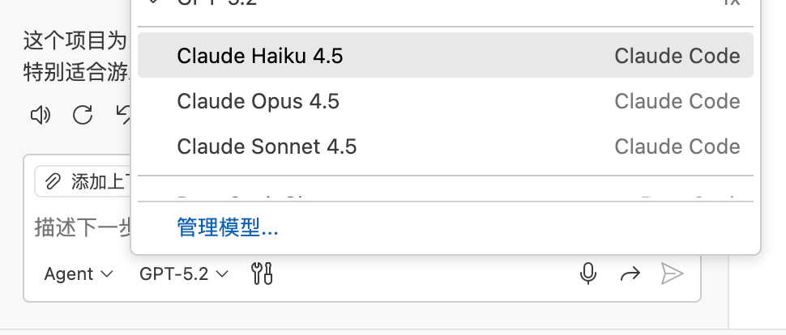
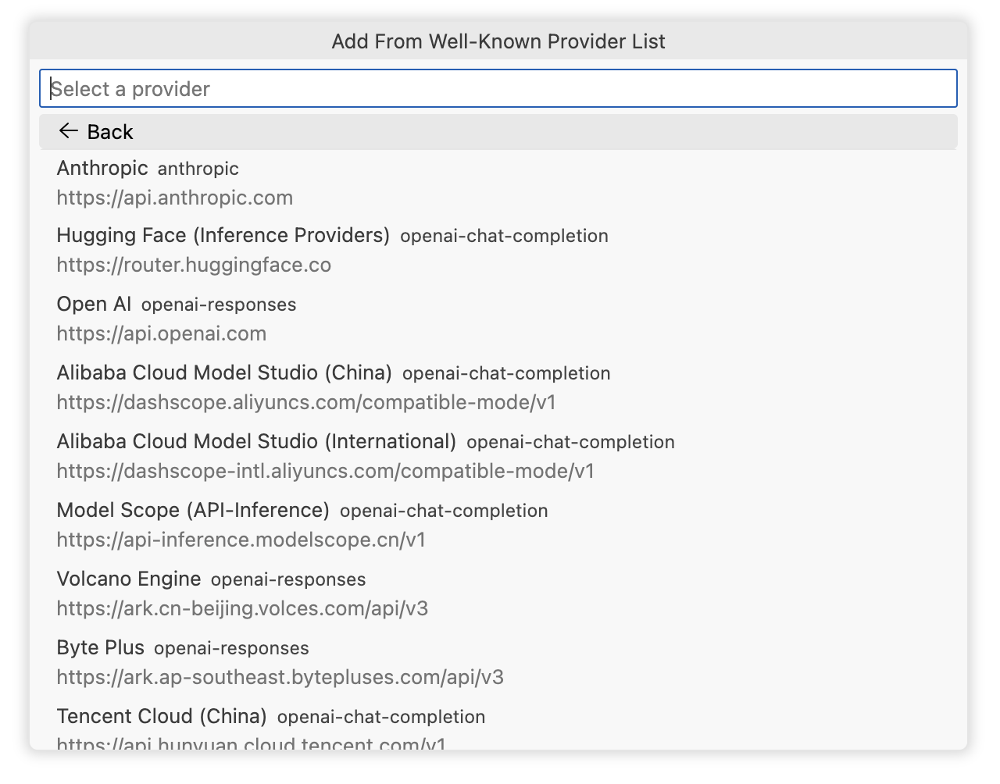
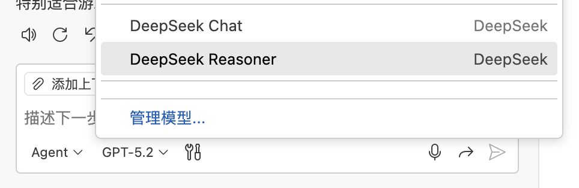
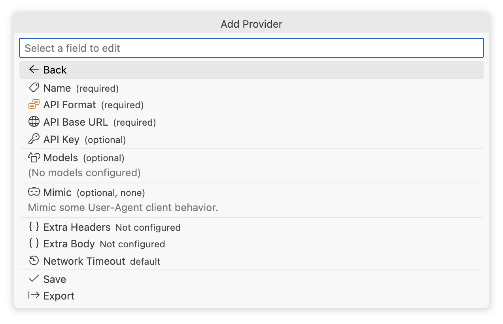

<h1 align="center">
Unify Chat Provider
</h1>

使用 Language Model API，将多个大语言模型 API 提供商集成到 VS Code 的 GitHub Copilot Chat 中。

<!--  

<a href="https://unocss.dev/">Documentation</a> |
<a href="https://unocss.dev/play/">Playground</a>

  -->

 

<a href="./README.md">English</a> |
简体中文

## 特性

- **[完美兼容]()**：支持所有主流的 LLM API 格式（OpenAI Chat Completion、OpenAI Responses、Anthropic Messages、Ollama Chat）。
- **[最佳性能]()**：极其重视模型供应商的特殊优化与完美实践，确保能够发挥模型 100% 的性能。
- **[开箱即用]()**：内置主流供应商与模型的推荐参数，且支持通过接口自动同步供应商的模型列表，无需进行任何繁琐的配置。
- **[快速迁移](#一键迁移)**：拥有完善的配置导入导出功能，且支持从主流应用或扩展（Cladue Code、CodeX、Gemini CLI...）一键迁移配置。
- **[可控参数]()**：开放所有接口参数的调整，并支持自定义 Header 与 Request 字段。
- **[极佳体验]()**：内置可视化用户界面，支持无限个供应商及模型配置，且支持同个供应商或模型的多个配置共存。

## 安装

- 在 VS Code 扩展市场搜索 [Unify Chat Provider](https://marketplace.visualstudio.com/items?itemName=SmallMain.vscode-unify-chat-provider) 并安装。
- 通过 [Github Releases](https://github.com/smallmain/vscode-unify-chat-provider/releases) 下载最新的 `.vsix` 文件，在 VS Code 中通过 `从 VSIX 安装扩展...` 或拖动到扩展面板进行安装。

## 快速开始

针对不同场景，可采用以下几种最适合的方式进行配置：

- [一键迁移](#一键迁移)：从其它应用或扩展迁移。
- [一键配置](#一键配置)：添加内置支持的模型提供商。
- [导入与导出](#导入与导出)：已有备份的配置或他人分享的配置。
- [手动配置](#手动配置)：完全从零开始添加任何提供商与模型。

无论使用哪种方式进行配置，在途中都能够对任何字段进行自定义。

### 基本操作

扩展的大部分界面都集成在 VSCode 命令面板，请知晓它的基本操作方式以完成后续的操作：

1. 打开 VSCode 命令面板：
   - 通过菜单 `查看` -> `命令面板...` 打开。
   - 通过 `Ctrl+Shift+P`（Windows/Linux）或 `Cmd+Shift+P`（Mac）快捷键打开。
2. 搜索命令：
   - 在命令面板中输入关键字 `Unify Chat Provider:` 或者 `ucp:` 搜索所有命令。
3. 选择命令：
   - 使用鼠标点击或键盘的上下箭头键选择命令，按回车键执行所选命令。

  

### 一键迁移

支持一键迁移的应用或扩展：

- Claude Code
- CodeX
- Gemini CLI

> 如果你所使用的应用或扩展不在上述列表中，可通过 [一键配置](#一键配置) 或 [手动配置](#手动配置) 来完成配置。

#### 操作步骤：

1. 打开 VSCode 命令面板，搜索 `Import Config From Other Applications`。

   

   
   

   - 界面展示所有支持的应用或扩展，及其检测到的配置文件路径。
   - 通过列表项最右侧的按钮组可执行其他操作：
     1. `自定义路径`：选择自定义的配置文件路径导入。
     2. `从配置内容导入`：直接输入配置内容进行导入。

2. 在弹出的列表中选择你想要导入的应用或扩展配置。
3. 选择后会进入配置导入界面，该界面与 [供应商配置]() 界面相似，你可以查看或编辑任何字段。
4. 点击 `Save` 按钮即完成导入，你可以立即在 Copilot Chat 中使用其中的模型。

   

   
   

### 一键配置

支持一键配置的模型供应商：

- OpenAI
- Anthropic
- Hugging Face
- 阿里云百炼大模型平台（Alibaba Cloud Model Studio）
- 魔搭（Model Scope）
- 火山引擎（Volcano Engine）
- Byte Plus
- 腾讯云（Tencent Cloud）
- DeepSeek
- Xiaomi MIMO
- Ollama
- 智谱 AI（ZhiPu AI）
- Z.AI
- MiniMax
- Moonshot AI

> 如果你所使用的应用或扩展不在上述列表中，可通过 [手动配置](#手动配置) 来添加。

#### 操作步骤：

1. 打开 VSCode 命令面板，搜索 `Add Provider From Well-Known Provider List`。

   

   
   

2. 在弹出的列表中选择你想要添加的供应商。
3. 根据提示输入 API Key，回车进入配置导入界面，该界面与 [供应商配置]() 界面相似，你可以查看或编辑任何字段。
   - 部分供应商可能不需要 API Key，直接回车跳过即可。
4. 点击 `Save` 按钮即完成导入，你可以立即在 Copilot Chat 中使用其中的模型。

   

   
   

### 手动配置

1. 打开 VSCode 命令面板，搜索 `Add Provider`。
   

   
   

2. 在添加配置界面填写配置，该界面与 [供应商配置]() 界面相似，你可以阅读该界面的文档了解每个字段的作用。
3. 点击 `Save` 按钮即完成添加，你可以立即在 Copilot Chat 中使用其中的模型。

## 开箱即用支持

待补充...

## 导入与导出

待补充...

## 贡献

- Build: `npm run compile`
- Watch: `npm run watch`
- Interactive release: `npm run release`

## 许可证

[MIT @ SmallMain](./LICENSE)
