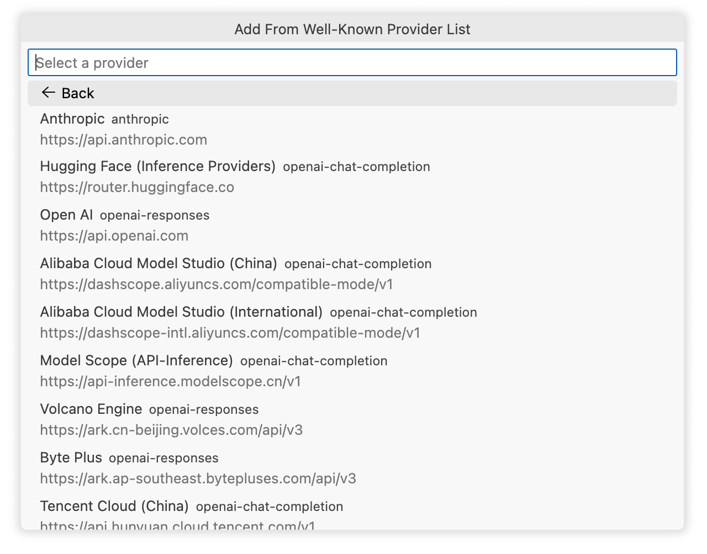

<p align="center">

</p>

<h1 align="center">
Unify Chat Provider
</h1>

<p align="center">
通过 Language Model API，将多个大语言模型 API 供应商集成到 VS Code 的 GitHub Copilot Chat 中。
</p>

<!-- <br>
<p align="center">
<a href="https://unocss.dev/">Documentation</a> |
<a href="https://unocss.dev/play/">Playground</a>
</p>
<br> -->

<br>
<p align="center">
<a href="./README.md">English</a> |
<span>简体中文</span>
</p>

## 特性

- 🐑 **免费聚合**：汇聚最新免费的主流模型，仅需几步即可配置！
- 🔌 **完整兼容**：支持所有主流的 LLM API 格式（OpenAI Chat Completion、OpenAI Responses、Anthropic Messages、Ollama Chat、Gemini）。
- 🎯 **深度适配**：适配 45+ 个主流供应商的特殊接口特性与最佳实践。
- 🚀 **最佳性能**：内置 200+ 种主流大模型的推荐参数，无需调参即可发挥模型最大潜力。
- 📦 **开箱即用**：一键配置，或从主流应用和扩展一键迁移，支持自动同步官方模型列表，无需繁琐操作。
- 💾 **导入导出**：拥有完善的导入和导出功能，支持多种方式（Base64、JSON、URL、URI）导入已有配置。
- 💎 **极致体验**：可视化界面配置，模型参数完全开放，支持无限供应商及模型配置，支持同供应商及模型多个配置变体共存。
- ✨ **One More Thing**：一键使用你的 Claude Code、Gemini CLI、Antigravity、Github Copilot、Qwen Code、OpenAI CodeX (ChatGPT Plus/Pro)、iFlow CLI 账号配额。

## 安装

- 在 VS Code 扩展市场搜索 [Unify Chat Provider](https://marketplace.visualstudio.com/items?itemName=SmallMain.vscode-unify-chat-provider) 并安装。
- 通过 [GitHub Releases](https://github.com/smallmain/vscode-unify-chat-provider/releases) 下载最新的 `.vsix` 文件，在 VS Code 中通过 `从 VSIX 安装扩展...` 或拖动到扩展面板进行安装。

## 快速开始

翻看 [食谱](#-食谱)，你可以在几分钟之内开始使用：

- **免费的 Claude 4.5 & Gemini 3 系列模型**：
  - [添加 Gemini CLI / Antigravity 账号](#添加-gemini-cli--antigravity-账号)
- **部分免费的 Claude、GPT、Gemini、Grok 等系列模型**：
  - [添加 GitHub Copilot 账号](#添加-github-copilot-账号)
- **免费的 Kimi K2.5、GLM 4.7、MiniMax M2.1 等系列模型**：
  - [添加 Nvidia 账号](#添加-nvidia-账号)
- **免费的 Kimi K2.5、GLM 4.7、MiniMax M2.1、Qwen3、DeepSeek 等系列模型**：
  - [添加 iFlow API Key 或 CLI 账号](#添加-iflow-api-key-或-cli-账号)
- 更多食谱：
  - [伪装 Claude Code 客户端](#伪装-claude-code-客户端)

你也可以查看 [供应商支持表](#供应商支持表)：

- 浏览所有含**长期免费额度**的供应商。
- [一键配置](#一键配置) 开始使用。

当你添加了多个供应商或者模型后：

- 使用 [管理供应商](#管理供应商) 界面进行统一管理。
- 通过 [导入与导出](#导入与导出) 进行备份或导出配置分享给其他人。

当前，你可能也在找：

- [一键迁移](#一键迁移)：从其它应用或扩展迁移。
- [手动配置](#手动配置)：完全从零开始添加任何供应商与模型。

如果以上内容对你依然没有帮助，请继续阅读本文档剩下的内容，或者创建一个 Issue 寻求帮助。

## 🍱 食谱

#### 添加 Gemini CLI / Antigravity 账号

<details>

> ⚠️ 警告：这可能会违反谷歌的服务条款，请知悉可能存在封号风险！

0. 你需要准备一个 Google 账号。
1. 打开 VS Code 命令面板，搜索 `Unify Chat Provider: 从内置供应商列表添加供应商`。
2. 在列表中选择 `Google Antigravity`，`Project ID` 可不填写直接回车。
3. 允许扩展打开浏览器进行授权登录，在浏览器中登录你的账号。
4. 登录完成后返回 VS Code，点击配置界面最下方的 `保存` 按钮完成。
5. 可选：重复以上步骤，添加 `Google Gemini CLI` 供应商。

同一个账号 Antigravity 和 Gemini CLI 的配额是独立的，所以建议都添加以获得更多免费额度。

**Gemini CLI 权限错误解决方案：**

在使用 Gemini CLI 模型时，您可能会看到以下错误：

- Permission 'cloudaicompanion.companions.generateChat' denied on resource '//cloudaicompanion.googleapis.com/projects/...'
- 'No project ID found for Gemini CLI.'

这意味着你需要创建自己的 `Project ID`。

1. 访问 [Google Cloud Console](https://console.cloud.google.com/)
2. 创建或选择一个项目。
3. 启用 Google Cloud 的 Gemini API (`cloudaicompanion.googleapis.com`)
4. 授权时，请明确填写 `Project ID`，而不是留空。

</details>

#### 添加 GitHub Copilot 账号

<details>

VS Code 的 Copilot Chat 本身就支持登录 GitHub Copilot 账号，所以一般用于快速切换多个账号。

0. 你需要准备一个 Github 账号。
1. 打开 VS Code 命令面板，搜索 `Unify Chat Provider: 从内置供应商列表添加供应商`。
2. 在列表中选择 `Github Copilot`，视你的账号是否为企业订阅选择 `Github.com` 或者 `Github Enterprise`。
3. 允许扩展打开浏览器进行授权登录，在浏览器中登录你的账号。
4. 登录完成后返回 VS Code，点击配置界面最下方的 `保存` 按钮完成。

</details>

#### 添加 Nvidia 账号

<details>

0. 你需要准备一个 Nvidia 账号。
1. 打开 VS Code 命令面板，搜索 `Unify Chat Provider: 从内置供应商列表添加供应商`。
2. 在列表中选择 `Nvidia`，填写在用户面板生成的 API Key 并回车。
3. 点击配置界面最下方的 `保存` 按钮完成。

> 如果你需要用 Kimi K2.5 模型，请从内置模型列表中添加，官方 API 可能暂未返回该模型信息。

</details>

#### 添加 iFlow API Key 或 CLI 账号

<details>

0. 你需要准备一个 iFlow 账号。
1. 打开 VS Code 命令面板，搜索 `Unify Chat Provider: 从内置供应商列表添加供应商`。
2. 在列表中选择 `iFlow`，可以选择两种验证方式：
   - `API Key`：填写在 iFlow 控制台生成的 API Key。
   - `iFlow CLI`：允许扩展打开浏览器进行授权登录，在浏览器中登录你的账号。
3. 验证完成后返回 VS Code，点击配置界面最下方的 `保存` 按钮完成。

</details>

#### 伪装 Claude Code 客户端

<details>

> ⚠️ 警告：这可能会违反供应商的服务条款，请知悉可能存在封号风险！

何时需要使用？

- 一些 Coding Plan 订阅、中转站点要求你必须只在 Claude Code 中使用他们的 API Key。
- 你需要在 Github Copilot 中使用 Claude Code 的账号配额。

步骤：

0. 你需要准备一个 Claude Code 账号或者 API Key（无论是否为官方 Key）。
1. 打开 VS Code 命令面板，搜索 `Unify Chat Provider: 从内置供应商列表添加供应商`。
2. 在列表中选择 `Claude Code`，可以选择两种验证方式：
   - `API Key`：填写在 Claude Code 中使用的 API Key。
   - `Claude Code`：允许扩展打开浏览器进行授权登录，在浏览器中登录你的账号。
3. 如果你的 `Base URL` 不是官网的 `https://api.anthropic.com`：
   - 在弹出的配置界面中点击 `供应商配置...` -> `API 基础 URL`，填写为你要使用的 URL。
   - 返回上一层界面。
4. 点击配置界面最下方的 `保存` 按钮完成。

</details>

## 基本操作

用户界面集成在 VS Code 命令面板以提供更原生的体验，请了解其基本操作方式：

1. 打开面板：
   - 通过菜单 `查看` -> `命令面板...` 打开。
   - 通过 `Ctrl+Shift+P`（Windows/Linux）或 `Cmd+Shift+P`（Mac）快捷键打开。
2. 搜索命令：
   - 在命令面板中输入关键字 `Unify Chat Provider:` 或者 `ucp:` 搜索所有命令。
3. 选择命令：
   - 使用鼠标点击或键盘的上下箭头键选择命令，按回车键执行所选命令。

<div align="center">
  
</div>

## 一键迁移

查看 [应用迁移支持表](#应用迁移支持表) 以了解支持一键迁移的应用和扩展。

> 如果使用的应用或扩展不在上述列表中，则可通过 [一键配置](#一键配置) 或 [手动配置](#手动配置) 来完成配置。

**操作步骤：**

1. 打开 VS Code 命令面板，搜索 `Unify Chat Provider: 从其他应用导入配置`。

   <div align="center">
   
   </div>
   - 界面会列出所有支持的应用或扩展，及其检测到的配置文件路径。
   - 通过列表项最右侧的按钮组可执行其他操作：
     1. `自定义路径`：选择自定义的配置文件路径导入。
     2. `从配置内容导入`：直接输入配置内容进行导入。

2. 在列表中选择要导入的应用或扩展，跳转到配置导入界面。
   - 该界面用于检查和修改即将导入的配置。
   - 详细介绍可查看 [供应商配置](#供应商配置) 文档。

3. 点击 `保存` 按钮即可完成整个导入，立即在 Copilot Chat 中使用导入的模型。

   <div align="center">
   
   </div>

## 一键配置

查看 [供应商支持表](#供应商支持表) 以了解支持一键配置的模型供应商。

> 如果使用的供应商不在上述列表中，可通过 [手动配置](#手动配置) 来添加。

**操作步骤：**

1. 打开 VS Code 命令面板，搜索 `Unify Chat Provider: 从内置供应商列表添加供应商`。

   <div align="center">
   
   </div>

2. 在列表中选择要添加的供应商。
3. 根据提示配置身份验证（通常是 API Key 或者要求在浏览器中登陆账号），跳转到配置导入界面。
   - 该界面用于检查和修改即将导入的配置。
   - 详细介绍可查看 [供应商配置](#供应商配置) 文档。

4. 点击 `保存` 按钮即可完成整个导入，立即在 Copilot Chat 中使用导入的模型。

   <div align="center">
   
   </div>

## 手动配置

本章节以 DeepSeek 为例，添加该供应商及其两个模型。

> 该供应商支持 [一键配置](#一键配置)，为教学用途本章节进行手动配置。

0. 准备工作，在供应商文档中获取 API 的相关信息，至少包括以下三个：
   - `API 格式`：接口格式，如 OpenAI Chat Completion、Anthropic Messages 等。
   - `API 基础 URL`：接口基础 URL 地址。
   - `身份验证`：通常是 API Key，注册账号后在用户中心或控制台获取。

1. 打开 VS Code 命令面板，搜索 `Unify Chat Provider: 添加供应商`。

   <div align="center">
   
   </div>
   - 该界面与 [供应商配置](#供应商配置) 界面相似，你可以阅读该界面的文档了解每个字段。

2. 填写供应商的名称：`名称`。
   - 该名称必须唯一，会在模型列表中展示，这里填写的是 `DeepSeek`。
   - 同一个供应商可以添加多个不同名称的配置，比如 `DeepSeek-Person`、`DeepSeek-Team`。

3. 填写接口格式：`API 格式`。
   - DeepSeek 的接口是 `OpenAI Chat Completion` 格式，所以选则该格式。
   - 要了解支持的所有格式可查看 [API 格式支持表](#api-格式支持表)。

4. 填写基础 URL：`API 基础 URL`。
   - DeepSeek 的基础 URL 是 `https://api.deepseek.com`。

5. 配置 `身份验证`。
   - DeepSeek 使用 API Key 进行身份验证，所以选择 `API Key`。
   - 在输入框中填写在 DeepSeek 控制台生成的 API Key。

6. 点击 `模型` 字段跳转到模型管理界面。

   <div align="center">
   
   </div>

7. 选中 `自动拉取官方模型` 以启用自动拉取官方模型。
   - 本章节选择从官方自动拉取模型以减少配置步骤，该功能的详细介绍可查看 [自动拉取官方模型](#自动拉取官方模型)。
   - 有关模型字段或其它添加方式的介绍可查看 [管理模型](#管理模型) 文档。

8. 点击 `保存` 按钮即完成添加，你可以立即在 Copilot Chat 中使用其中的模型。

   <div align="center">
   
   </div>

## 管理供应商

- 你可以创建无限个供应商配置，并且同个供应商可以创建多个不同配置共存。
- 供应商名称必须是唯一的。

### 供应商列表

打开 VS Code 命令面板，搜索 `Unify Chat Provider: 管理供应商`。

<div align="center">

</div>

- `添加供应商`: 通过 [手动配置](#手动配置) 添加新的供应商。
- `从内置供应商列表添加`: 通过 [一键配置](#一键配置) 添加新的供应商。
- `从配置导入`: 导入已有的供应商或供应商数组配置，详细介绍请查看 [导入与导出](#导入与导出)。
- `从其他应用导入`: 通过 [一键迁移](#一键迁移) 从其它应用或扩展导入配置。
- `导出所有供应商`: 导出所有供应商的配置，详细介绍请查看 [导入与导出](#导入与导出)。

界面还会展示当前所有的供应商，点击其中一个供应商列表项则进入 [模型列表](#模型列表) 界面。

列表项右侧的按钮组可执行其它操作：

- `导出`: 导出该供应商的配置，详细介绍请查看 [导入与导出](#导入与导出)。
- `克隆`: 克隆该供应商配置以创建一个新的配置。
- `删除`: 删除该供应商配置。

### 供应商配置

<div align="center">

</div>

- `模型`: 仅在添加或导入配置时存在该按钮，点击则进入 [模型列表](#模型列表) 界面。

界面会展示当前供应商的所有配置字段，具体字段说明可查看 [供应商参数](#供应商参数)。

## 管理模型

- 每个供应商均可创建无限个模型配置。
- 不同供应商之间允许存在相同的模型 ID。
- 单个供应商配置中，不允许直接存在多个相同的模型 ID，但可通过 `#xxx` 后缀添加多个配置。
- 例如可以分别添加 ID 为 `glm4.7` 和 `glm4.7#thinking` 的两个模型配置以随时切换是否开启思考。
- 模型 ID `#xxx` 后缀在实际发送请求时会被自动移除。
- 虽然模型名称允许重复，但建议使用不同的名称避免混淆使用。

### 模型列表

<div align="center">

</div>

- `添加模型`: 进入 [手动添加模型](#手动添加模型) 界面。
- `从内置模型列表添加`: 进入 [一键添加模型](#一键添加模型) 界面。
- `从官方模型列表添加`: 通过 API 接口拉取最新的官方模型列表，详细可查看 [一键添加模型](#一键添加模型)。
- `从配置导入`: 导入已有的模型或模型数组配置，详细介绍可查看 [导入与导出](#导入与导出)。
- `自动拉取官方模型`：启用或禁用 [自动拉取官方模型](#自动拉取官方模型)。
- `供应商配置`: 进入 [供应商配置](#供应商配置) 界面。
- `导出`: 导出该供应商或者模型数组配置，详细介绍请查看 [导入与导出](#导入与导出)。
- `克隆`: 克隆该供应商配置以创建一个新的配置。
- `删除`: 删除该供应商配置。

### 手动添加模型

该界面与 [模型配置](#模型配置) 界面相似，你可以阅读该界面的文档了解详情。

### 一键添加模型

<div align="center">

</div>

该界面会列出所有支持一键添加的模型，你可以一次性导入选中的多个模型。

所有支持的模型可查看 [模型支持表](#模型支持表)。

### 自动拉取官方模型

该功能通过供应商的 API 接口定时拉取最新的模型列表，并且自动配置好推荐的参数，极大地简化了模型的添加过程。

> 提示
>
> 供应商的 API 接口不一定会返回模型的推荐参数，所以推荐参数将根据模型 ID 从内部数据库获取，支持的模型可查看 [模型支持表](#模型支持表)。

<div align="center">

</div>

- 自动拉取的模型名称前面会有一个 `互联网` 图标以示区分。
- 如果自动拉取的模型 ID 与手动配置的模型 ID 冲突，则只展示手动配置的模型。
- 自动拉取的模型会定期更新，也可以点击 `（点击拉取）` 手动更新。
- 通过 VS Code 命令 `Unify Chat Provider: 刷新所有供应商的官方模型` 手动触发所有供应商的自动拉取更新。

### 模型配置

<div align="center">

</div>

- `导出`: 导出该模型的配置，详细介绍请查看 [导入与导出](#导入与导出)。
- `克隆`: 克隆该模型配置以创建一个新的配置。
- `删除`: 删除该模型配置。

界面会展示当前供应商的所有配置字段，具体字段说明可查看 [模型参数](#模型参数)。

## 调整参数

### 全局设置

<details>

| 名称                 | ID                      | 介绍                                        |
| -------------------- | ----------------------- | ------------------------------------------- |
| 全局网络设置         | `networkSettings`       | 网络超时/重试设置，这些设置仅影响聊天请求。 |
| 在设置中存储 Api Key | `storeApiKeyInSettings` | 请查看 [云同步兼容](#云同步兼容) 了解详情。 |
| 启用详细日志         | `verbose`               | 启用更详细的日志以排查错误。                |

</details>

### 供应商参数

<details>

以下字段对应 `ProviderConfig`（导入/导出 JSON 使用的字段名）。

| 名称             | ID                        | 介绍                                                                                |
| ---------------- | ------------------------- | ----------------------------------------------------------------------------------- |
| API 格式         | `type`                    | 供应商类型（决定 API 格式与兼容逻辑）。                                             |
| 供应商名称       | `name`                    | 该供应商配置的唯一名称（用于列表展示与引用）。                                      |
| API 基础 URL     | `baseUrl`                 | API 基础地址，例如 `https://api.anthropic.com`。                                    |
| 身份验证         | `auth`                    | 身份验证配置（`none` / `api-key` / `oauth2`）。                                     |
| 模型列表         | `models`                  | 模型配置数组（`ModelConfig[]`）。                                                   |
| 额外 Header      | `extraHeaders`            | 会附加到每次请求的 HTTP Header（`Record<string, string>`）。                        |
| 额外 Body 字段   | `extraBody`               | 会附加到请求 body 的额外字段（`Record<string, unknown>`），用于对齐供应商私有参数。 |
| 超时配置         | `timeout`                 | HTTP 请求与 SSE 流式的超时配置（毫秒）。                                            |
| 建连超时         | `timeout.connection`      | TCP 建立连接的最大等待时间；默认 `60000`（60 秒）。                                 |
| 响应间隔超时     | `timeout.response`        | SSE 流式接收数据块之间的最大等待时间；默认 `300000`（5 分钟）。                     |
| 重试配置         | `retry`                   | 临时错误的重试设置（仅 chat）。                                                     |
| 最大重试次数     | `retry.maxRetries`        | 最大重试次数；默认 `10`。                                                           |
| 初始延迟         | `retry.initialDelayMs`    | 首次重试前的延迟（毫秒）；默认 `1000`。                                             |
| 最大延迟         | `retry.maxDelayMs`        | 重试延迟上限（毫秒）；默认 `60000`。                                                |
| 退避倍数         | `retry.backoffMultiplier` | 指数退避倍数；默认 `2`。                                                            |
| 抖动因子         | `retry.jitterFactor`      | 抖动因子（0-1）用于随机化延迟；默认 `0.1`。                                         |
| 自动拉取官方模型 | `autoFetchOfficialModels` | 是否定期从供应商 API 拉取官方模型列表并自动更新。                                   |

</details>

### 模型参数

<details>

以下字段对应 `ModelConfig`（导入/导出 JSON 使用的字段名）。

| 名称              | ID                         | 介绍                                                                             |
| ----------------- | -------------------------- | -------------------------------------------------------------------------------- |
| 模型 ID           | `id`                       | 模型标识（可使用 `#xxx` 后缀创建同一模型的多份配置；发送请求时会自动移除后缀）。 |
| 显示名称          | `name`                     | UI 展示用名称（未填写时通常显示 `id`）。                                         |
| 模型家族          | `family`                   | 便于分组/匹配的一类模型标识（如 `gpt-4`、`claude-3`）。                          |
| 最大输入 Tokens   | `maxInputTokens`           | 最大输入/上下文 tokens（部分供应商语义为“输入+输出”总上下文）。                  |
| 最大输出 Tokens   | `maxOutputTokens`          | 最大生成 tokens（部分供应商要求必填，如 Anthropic 的 `max_tokens`）。            |
| 模型能力          | `capabilities`             | 能力声明（用于 UI 与路由逻辑判断，部分场景也会影响请求构造）。                   |
| 工具调用能力      | `capabilities.toolCalling` | 是否支持工具/函数调用；若为数字则表示最多工具数量。                              |
| 图片输入能力      | `capabilities.imageInput`  | 是否支持图像输入。                                                               |
| 流式输出          | `stream`                   | 是否启用流式响应（未设置则使用默认行为）。                                       |
| Temperature       | `temperature`              | 采样温度（随机性）。                                                             |
| Top-K             | `topK`                     | Top-k 采样。                                                                     |
| Top-P             | `topP`                     | Top-p（nucleus）采样。                                                           |
| Frequency Penalty | `frequencyPenalty`         | 频率惩罚。                                                                       |
| Presence Penalty  | `presencePenalty`          | 存在惩罚。                                                                       |
| 并行工具调用      | `parallelToolCalling`      | 是否允许并行工具调用（`true` 开启、`false` 禁用、`undefined` 使用默认）。        |
| 回复冗长度        | `verbosity`                | 约束回答冗长程度：`low` / `medium` / `high`（并非所有供应商支持）。              |
| 思考配置          | `thinking`                 | 思考/推理相关配置（不同供应商支持程度不同）。                                    |
| 思考模式          | `thinking.type`            | `enabled` / `disabled` / `auto`                                                  |
| 思考预算 Tokens   | `thinking.budgetTokens`    | 思考 token 预算。                                                                |
| 思考强度          | `thinking.effort`          | `none` / `minimal` / `low` / `medium` / `high` / `xhigh`                         |
| 额外 Header       | `extraHeaders`             | 会附加到该模型请求的 HTTP Header（`Record<string, string>`）。                   |
| 额外 Body 字段    | `extraBody`                | 会附加到该模型请求 body 的额外字段（`Record<string, unknown>`）。                |

</details>

## 导入与导出

支持导入/导出内容：

- 单个供应商配置
- 单个模型配置
- 多个供应商配置（数组）
- 多个模型配置（数组）

支持导入/导出格式：

- Base64-url 编码的 JSON 配置字符串（仅会导出该格式）
- 纯 JSON 配置字符串
- 指向 Base64-url 编码或纯 JSON 配置字符串的 URL

## URI 支持

支持响应 VS Code URI 快速导入供应商配置。

例如：

```
vscode://SmallMain.vscode-unify-chat-provider/import-config?config=<input>
```

其中 `<input>` 支持格式与 [导入与导出](#导入与导出) 中导入支持的格式相同。

### 覆盖配置字段

你可以添加 `query` 查询参数来覆盖导入配置中的某些字段。

例如：

```
vscode://SmallMain.vscode-unify-chat-provider/import-config?config=<input>&auth={"method":"api-key","apiKey":"my-api-key"}
```

导入时将会覆盖配置中的 `auth` 字段再导入。

### 供应商倡议

如果你是某个模型供应商的开发者，可以通过在网站上添加类似如下的链接，方便用户一键将你的模型添加到扩展中：

```
<a href="vscode://SmallMain.vscode-unify-chat-provider/import-config?config=eyJ0eXBlIjoi...">Add to Unify Chat Provider</a>
```

## 云同步兼容

扩展配置存储在 `settings.json` 文件中，支持 VS Code 自带的设置云同步功能。

但敏感信息默认通过 VS Code 的 Secret Storage 存储，当前还不支持云同步。

所以当配置同步到其它设备后，可能会要求你重新输入密钥或重新授权。

如果你希望同步支持多设备同步的敏感数据（例如 API Key），可以在设置中启用 [`storeApiKeyInSettings`](vscode://settings/unifyChatProvider.storeApiKeyInSettings)。

为避免多设备同步导致 token 刷新冲突，OAuth 凭证将始终保存在 Secret Storage 中。

这会有用户数据泄露风险，你需要自行评估并决定是否启用该选项。

## API 格式支持表

<details>

| API                                                                                          | ID                       | 典型端点                         | 备注                                      |
| :------------------------------------------------------------------------------------------- | :----------------------- | :------------------------------- | :---------------------------------------- |
| [OpenAI Chat Completion API](https://platform.openai.com/docs/api-reference/chat)            | `openai-chat-completion` | `/v1/chat/completions`           | 若非版本号后缀，则会自动追加 `/v1` 后缀。 |
| [OpenAI Responses API](https://platform.openai.com/docs/api-reference/responses)             | `openai-responses`       | `/v1/responses`                  | 若非版本号后缀，则会自动追加 `/v1` 后缀。 |
| [Google AI Studio (Gemini API)](https://ai.google.dev/aistudio)                              | `google-ai-studio`       | `/v1beta/models:generateContent` | 自动检测并处理版本号后缀。                |
| [Google Vertex AI](https://cloud.google.com/vertex-ai)                                       | `google-vertex-ai`       | `/v1beta/models:generateContent` | 根据身份验证自动使用不同的基础 URL。      |
| [Anthropic Messages API](https://platform.claude.com/docs/en/api/typescript/messages/create) | `anthropic`              | `/v1/messages`                   | 自动移除重复的 `/v1` 后缀。               |
| [Ollama Chat API](https://docs.ollama.com/api/chat)                                          | `ollama`                 | `/api/chat`                      | 自动移除重复的 `/api` 后缀。              |

</details>

## 供应商支持表

以下列出的供应商均支持 [一键配置](#一键配置)，并且已在实现中遵循官方文档的最佳实践，能够发挥模型的最佳性能。

> 提示
>
> 即使是非支持的供应商，也可以通过 [手动配置](#手动配置) 使用。

<details>

| 供应商                                                                                | 支持特性                                                        | 免费额度              |
| :------------------------------------------------------------------------------------ | --------------------------------------------------------------- | --------------------- |
| [Open AI](https://openai.com/)                                                        |                                                                 |                       |
| [Google AI Studio](https://aistudio.google.com/)                                      |                                                                 |                       |
| [Google Vertex AI](https://cloud.google.com/vertex-ai)                                | <li>Authentication                                              |                       |
| [Anthropic](https://www.anthropic.com/)                                               | <li>InterleavedThinking <li>FineGrainedToolStreaming            |                       |
| [xAI](https://docs.x.ai/)                                                             |                                                                 |                       |
| [Hugging Face (Inference Providers)](https://huggingface.co/docs/inference-providers) |                                                                 |                       |
| [OpenRouter](https://openrouter.ai/)                                                  | <li>CacheControl <li>ReasoningParam <li>ReasoningDetails        | [详情](#openrouter)   |
| [Cerebras](https://www.cerebras.ai/)                                                  | <li>ReasoningField <li>DisableReasoningParam <li>ClearThinking  | [详情](#cerebras)     |
| [OpenCode Zen (OpenAI Chat Completion)](https://opencode.ai/)                         | <li>ReasoningContent                                            | [详情](#opencode-zen) |
| [OpenCode Zen (OpenAI Responses)](https://opencode.ai/)                               | <li>ReasoningContent                                            | [详情](#opencode-zen) |
| [OpenCode Zen (Anthropic Messages)](https://opencode.ai/)                             | <li>InterleavedThinking <li>FineGrainedToolStreaming            | [详情](#opencode-zen) |
| [OpenCode Zen (Gemini)](https://opencode.ai/)                                         |                                                                 | [详情](#opencode-zen) |
| [英伟达](https://build.nvidia.com/)                                                   |                                                                 | [详情](#英伟达)       |
| [阿里云百炼平台 (中国站)](https://www.aliyun.com/product/bailian)                     | <li>ThinkingParam3 <li>ReasoningContent                         |                       |
| [阿里云百炼平台 (Coding Plan)](https://www.aliyun.com/product/bailian)                | <li>ThinkingParam3 <li>ReasoningContent                         |                       |
| [阿里云百炼平台 (国际站)](https://www.alibabacloud.com/help/en/model-studio)          | <li>ThinkingParam3 <li>ReasoningContent                         |                       |
| [魔搭社区 (API-Inference)](https://modelscope.cn/)                                    | <li>ThinkingParam3 <li>ReasoningContent                         | [详情](#魔搭社区)     |
| [火山引擎](https://www.volcengine.com/product/ark)                                    | <li>AutoThinking <li>ThinkingParam2                             | [详情](#火山引擎)     |
| [火山引擎 (Coding Plan)](https://www.volcengine.com/activity/codingplan)              | <li>AutoThinking <li>ThinkingParam2                             |                       |
| [Byte Plus](https://www.byteplus.com/en/product/modelark)                             | <li>AutoThinking <li>ThinkingParam2                             |                       |
| [腾讯云 (中国站)](https://cloud.tencent.com/product/hunyuan)                          |                                                                 |                       |
| [DeepSeek](https://www.deepseek.com/)                                                 | <li>ThinkingParam <li>ReasoningContent                          |                       |
| [模力方舟](https://ai.gitee.com/)                                                     |                                                                 |                       |
| [Xiaomi MIMO](https://mimo.xiaomi.com/)                                               | <li>ThinkingParam <li>ReasoningContent                          |                       |
| [Ollama Local](https://ollama.com/)                                                   |                                                                 |                       |
| [Ollama Cloud](https://ollama.com/)                                                   |                                                                 |                       |
| [阶跃星辰 (中国站)](https://platform.stepfun.com/)                                    | <li>ReasoningField                                              |                       |
| [阶跃星辰 (国际站)](https://platform.stepfun.com/)                                    | <li>ReasoningField                                              |                       |
| [智谱 AI](https://open.bigmodel.cn/)                                                  | <li>ThinkingParam <li>ReasoningContent <li>ClearThinking        | [详情](#智谱-ai--zai) |
| [智谱 AI (Coding Plan)](https://open.bigmodel.cn/)                                    | <li>ThinkingParam <li>ReasoningContent <li>ClearThinking        |                       |
| [Z.AI](https://z.ai/)                                                                 | <li>ThinkingParam <li>ReasoningContent <li>ClearThinking        | [详情](#智谱-ai--zai) |
| [Z.AI (Coding Plan)](https://z.ai/)                                                   | <li>ThinkingParam <li>ReasoningContent <li>ClearThinking        |                       |
| [MiniMax (中国站)](https://www.minimaxi.com/)                                         | <li>ReasoningDetails                                            |                       |
| [MiniMax (国际站)](https://www.minimax.io/)                                           | <li>ReasoningDetails                                            |                       |
| [LongCat](https://longcat.chat/)                                                      |                                                                 | [详情](#longcat)      |
| [Moonshot AI (中国站)](https://www.moonshot.cn/)                                      | <li>ReasoningContent                                            |                       |
| [Moonshot AI (国际站)](https://www.moonshot.ai/)                                      | <li>ReasoningContent                                            |                       |
| [Moonshot AI (Coding Plan)](https://www.kimi.com/coding)                              | <li>ReasoningContent                                            |                       |
| [快手万擎 (中国站)](https://streamlake.com/)                                          |                                                                 | [详情](#快手万擎)     |
| [快手万擎 (中国站, Coding Plan)](https://streamlake.com/)                             |                                                                 |                       |
| [快手万擎 (国际站)](https://www.streamlake.ai/)                                       |                                                                 | [详情](#快手万擎)     |
| [快手万擎 (国际站, Coding Plan)](https://www.streamlake.ai/)                          |                                                                 |                       |
| [iFlow](https://platform.iflow.cn/)                                                   | <li>ThinkingParam3 <li>ClearThinking <li>ReasoningSplitParam    | [详情](#iflow)        |
| [硅基流动 (中国站)](https://siliconflow.cn/)                                          | <li>ThinkingParam3 <li>ThinkingBudgetParam <li>ReasoningContent | [详情](#硅基流动)     |
| [硅基流动 (国际站)](https://siliconflow.com/)                                         | <li>ThinkingParam3 <li>ThinkingBudgetParam <li>ReasoningContent | [详情](#硅基流动)     |

实验性支持的供应商：

> ⚠️ 警告：添加以下供应商可能会违反它们的服务条款！
>
> - 你的账户可能会被暂停或永久封禁。
> - 你需要自行权衡，所有风险都将由你自己承担。

| 供应商                                                 | 免费额度                    |
| :----------------------------------------------------- | --------------------------- |
| [OpenAI CodeX (ChatGPT Plus/Pro)](https://openai.com/) |                             |
| [Qwen Code](https://github.com/QwenLM/qwen-code)       | [详情](#qwen-code)          |
| [GitHub Copilot](https://github.com/features/copilot)  | [详情](#github-copilot)     |
| [Google Antigravity](https://antigravity.google/)      | [详情](#google-antigravity) |
| [Google Gemini CLI](https://geminicli.com/)            | [详情](#google-gemini-cli)  |
| [Claude Code](https://claude.ai/)                      |                             |
| [iFlow CLI](https://platform.iflow.cn/)                | [详情](#iflow)              |

长期免费额度：

#### Qwen Code

- 完全免费。
- 支持模型：
  - qwen3-coder-plus
  - qwen3-coder-flash
  - qwen3-vl-plus

#### GitHub Copilot

- 部分模型有免费额度，部分模型需要 Copilot 订阅，订阅之后完全免费，按月刷新额度。
- 支持模型：Claude、GPT、Grok、Gemini 等主流模型。

#### Google Antigravity

- 每个模型有一定的免费额度，按时间刷新额度。
- 支持模型：Claude 4.5 系列、Gemini 3 系列。

#### Google Gemini CLI

- 每个模型有一定的免费额度，按时间刷新额度。
- 支持模型：Gemini 3 系列、Gemini 2.5 系列。

#### iFlow

- 完全免费。
- 支持模型：GLM、Kimi、Qwen、DeepSeek 等主流模型。

#### Cerebras

- 部分模型有免费额度，按时间刷新额度。
- 支持模型：
  - GLM 4.7
  - GPT-OSS-120B
  - Qwen 3 235B Instruct
  - ...

#### 英伟达

- 完全免费，但有速率限制。
- 支持几乎所有开源权重模型。

#### 火山引擎

- 每个模型有一定的免费额度，按时间刷新额度。
- 支持模型：Doubao、Kimi、DeepSeek 等主流模型。

#### 魔搭社区

- 每个模型有一定的免费额度，按时间刷新额度。
- 支持模型：GLM、Kimi、Qwen、DeepSeek 等主流模型。

#### 智谱 AI / Z.AI

- 部分模型完全免费。
- 支持模型：GLM Flash 系列模型。

#### 硅基流动

- 部分模型完全免费。
- 支持模型：大部分是 32B 以下的开源权重模型。

#### 快手万擎

- 完全免费，但有速率限制。
- 支持模型：
  - KAT-Coder-Pro V1
  - KAT-Coder-Air

#### LongCat

- 有一定的免费额度，按时间刷新额度。
- 支持模型：
  - LongCat-Flash-Chat
  - LongCat-Flash-Thinking
  - LongCat-Flash-Thinking-2601

#### OpenRouter

- 部分模型有一定的免费额度，按时间刷新额度。
- 支持模型：变动频繁，名称中带 free 的模型。

#### OpenCode Zen

- 部分模型完全免费。
- 支持模型：变动频繁，名称中带 free 的模型。

#### Ollama Cloud

- 有一定的免费额度，按时间刷新额度。
- 支持几乎所有开源权重模型。

</details>

## 模型支持表

以下列出的模型均支持 [一键添加模型](#一键添加模型)，并且已内置推荐参数，能够发挥模型的最佳性能。

> 提示
>
> 即使是非支持的模型，也可以通过 [手动添加模型](#手动添加模型) 使用，并且自行配置参数以发挥最佳性能。

<details>

| 厂商             | 系列                | 支持的模型                                                                                                                                                                                                                                                                                                                                                                                                                                                                                                                                                                                                                                                                                                                                                                                                                                                                     |
| :--------------- | :------------------ | :----------------------------------------------------------------------------------------------------------------------------------------------------------------------------------------------------------------------------------------------------------------------------------------------------------------------------------------------------------------------------------------------------------------------------------------------------------------------------------------------------------------------------------------------------------------------------------------------------------------------------------------------------------------------------------------------------------------------------------------------------------------------------------------------------------------------------------------------------------------------------- |
| **OpenAI**       | GPT-5 系列          | GPT-5, GPT-5.1, GPT-5.2, GPT-5.2 pro, GPT-5 mini, GPT-5 nano, GPT-5 pro, GPT-5-Codex, GPT-5.1-Codex, GPT-5.2-Codex, GPT-5.1-Codex-Max, GPT-5.1-Codex-mini, GPT-5.2 Chat, GPT-5.1 Chat, GPT-5 Chat                                                                                                                                                                                                                                                                                                                                                                                                                                                                                                                                                                                                                                                                              |
|                  | GPT-4 系列          | GPT-4o, GPT-4o mini, GPT-4o Search Preview, GPT-4o mini Search Preview, GPT-4.1, GPT-4.1 mini, GPT-4.1 nano, GPT-4.5 Preview, GPT-4 Turbo, GPT-4 Turbo Preview, GPT-4                                                                                                                                                                                                                                                                                                                                                                                                                                                                                                                                                                                                                                                                                                          |
|                  | GPT-3 系列          | GPT-3.5 Turbo, GPT-3.5 Turbo Instruct                                                                                                                                                                                                                                                                                                                                                                                                                                                                                                                                                                                                                                                                                                                                                                                                                                          |
|                  | o 系列              | o1, o1 pro, o1 mini, o1 preview, o3, o3 mini, o3 pro, o4 mini                                                                                                                                                                                                                                                                                                                                                                                                                                                                                                                                                                                                                                                                                                                                                                                                                  |
|                  | oss 系列            | gpt-oss-120b, gpt-oss-20b                                                                                                                                                                                                                                                                                                                                                                                                                                                                                                                                                                                                                                                                                                                                                                                                                                                      |
|                  | Deep Research 系列  | o3 Deep Research, o4 mini Deep Research                                                                                                                                                                                                                                                                                                                                                                                                                                                                                                                                                                                                                                                                                                                                                                                                                                        |
|                  | 其它模型            | babbage-002, davinci-002, Codex mini, Computer Use Preview                                                                                                                                                                                                                                                                                                                                                                                                                                                                                                                                                                                                                                                                                                                                                                                                                     |
| **Google**       | Gemini 3 系列       | gemini-3-pro-preview, gemini-3-flash-preview                                                                                                                                                                                                                                                                                                                                                                                                                                                                                                                                                                                                                                                                                                                                                                                                                                   |
|                  | Gemini 2.5 系列     | gemini-2.5-pro, gemini-2.5-flash, gemini-2.5-flash-lite                                                                                                                                                                                                                                                                                                                                                                                                                                                                                                                                                                                                                                                                                                                                                                                                                        |
|                  | Gemini 2.0 系列     | gemini-2.0-flash, gemini-2.0-flash-lite                                                                                                                                                                                                                                                                                                                                                                                                                                                                                                                                                                                                                                                                                                                                                                                                                                        |
| **Anthropic**    | Claude 4 系列       | Claude Sonnet 4.5, Claude Haiku 4.5, Claude Opus 4.5, Claude Sonnet 4, Claude Opus 4.1, Claude Opus 4                                                                                                                                                                                                                                                                                                                                                                                                                                                                                                                                                                                                                                                                                                                                                                          |
|                  | Claude 3 系列       | Claude Sonnet 3.7, Claude Sonnet 3.5, Claude Haiku 3.5, Claude Haiku 3, Claude Opus 3                                                                                                                                                                                                                                                                                                                                                                                                                                                                                                                                                                                                                                                                                                                                                                                          |
| **xAI**          | Grok 4 系列         | Grok 4.1 Fast (Reasoning), Grok 4.1 Fast (Non-Reasoning), Grok 4, Grok 4 Fast (Reasoning), Grok 4 Fast (Non-Reasoning)                                                                                                                                                                                                                                                                                                                                                                                                                                                                                                                                                                                                                                                                                                                                                         |
|                  | Grok Code 系列      | Grok Code Fast 1                                                                                                                                                                                                                                                                                                                                                                                                                                                                                                                                                                                                                                                                                                                                                                                                                                                               |
|                  | Grok 3 系列         | Grok 3, Grok 3 Mini                                                                                                                                                                                                                                                                                                                                                                                                                                                                                                                                                                                                                                                                                                                                                                                                                                                            |
|                  | Grok 2 系列         | Grok 2 Vision                                                                                                                                                                                                                                                                                                                                                                                                                                                                                                                                                                                                                                                                                                                                                                                                                                                                  |
| **DeepSeek**     | DeepSeek V3 系列    | DeepSeek Chat, DeepSeek Reasoner, DeepSeek V3.2, DeepSeek V3.2 Exp, DeepSeek V3.2 Speciale, DeepSeek V3.1, DeepSeek V3.1 Terminus, DeepSeek V3, DeepSeek V3 (0324)                                                                                                                                                                                                                                                                                                                                                                                                                                                                                                                                                                                                                                                                                                             |
|                  | DeepSeek R1 系列    | DeepSeek R1, DeepSeek R1 (0528)                                                                                                                                                                                                                                                                                                                                                                                                                                                                                                                                                                                                                                                                                                                                                                                                                                                |
|                  | DeepSeek V2.5 系列  | DeepSeek V2.5                                                                                                                                                                                                                                                                                                                                                                                                                                                                                                                                                                                                                                                                                                                                                                                                                                                                  |
|                  | DeepSeek V2 系列    | DeepSeek V2                                                                                                                                                                                                                                                                                                                                                                                                                                                                                                                                                                                                                                                                                                                                                                                                                                                                    |
|                  | DeepSeek VL 系列    | DeepSeek VL, DeepSeek VL2                                                                                                                                                                                                                                                                                                                                                                                                                                                                                                                                                                                                                                                                                                                                                                                                                                                      |
|                  | DeepSeek Coder 系列 | DeepSeek Coder, DeepSeek Coder V2                                                                                                                                                                                                                                                                                                                                                                                                                                                                                                                                                                                                                                                                                                                                                                                                                                              |
|                  | DeepSeek Math 系列  | DeepSeek Math V2                                                                                                                                                                                                                                                                                                                                                                                                                                                                                                                                                                                                                                                                                                                                                                                                                                                               |
| **ByteDance**    | Doubao 1.8 系列     | Doubao Seed 1.8                                                                                                                                                                                                                                                                                                                                                                                                                                                                                                                                                                                                                                                                                                                                                                                                                                                                |
|                  | Doubao 1.6 系列     | Doubao Seed 1.6, Doubao Seed 1.6 Lite, Doubao Seed 1.6 Flash, Doubao Seed 1.6 Vision                                                                                                                                                                                                                                                                                                                                                                                                                                                                                                                                                                                                                                                                                                                                                                                           |
|                  | Doubao 1.5 系列     | Doubao 1.5 Pro 32k, Doubao 1.5 Pro 32k Character, Doubao 1.5 Lite 32k                                                                                                                                                                                                                                                                                                                                                                                                                                                                                                                                                                                                                                                                                                                                                                                                          |
|                  | Doubao Code 系列    | Doubao Seed Code Preview                                                                                                                                                                                                                                                                                                                                                                                                                                                                                                                                                                                                                                                                                                                                                                                                                                                       |
|                  | 其他模型            | Doubao Lite 32k Character                                                                                                                                                                                                                                                                                                                                                                                                                                                                                                                                                                                                                                                                                                                                                                                                                                                      |
| **MiniMax**      | MiniMax M2 系列     | MiniMax-M2.1, MiniMax-M2.1-Lightning, MiniMax-M2                                                                                                                                                                                                                                                                                                                                                                                                                                                                                                                                                                                                                                                                                                                                                                                                                               |
| **LongCat**      | LongCat Flash 系列  | LongCat Flash Chat, LongCat Flash Thinking, LongCat Flash Thinking 2601                                                                                                                                                                                                                                                                                                                                                                                                                                                                                                                                                                                                                                                                                                                                                                                                        |
| **StreamLake**   | KAT-Coder 系列      | KAT-Coder-Pro V1, KAT-Coder-Exp-72B-1010, KAT-Coder-Air V1                                                                                                                                                                                                                                                                                                                                                                                                                                                                                                                                                                                                                                                                                                                                                                                                                     |
| **Moonshot AI**  | Kimi K2.5 系列      | Kimi K2.5                                                                                                                                                                                                                                                                                                                                                                                                                                                                                                                                                                                                                                                                                                                                                                                                                                                                      |
|                  | Kimi K2 系列        | Kimi K2 Thinking, Kimi K2 Thinking Turbo, Kimi K2 0905 Preview, Kimi K2 0711 Preview, Kimi K2 Turbo Preview, Kimi For Coding                                                                                                                                                                                                                                                                                                                                                                                                                                                                                                                                                                                                                                                                                                                                                   |
| **Qwen**         | Qwen 3 系列         | Qwen3-Max, Qwen3-Max Preview, Qwen3-Coder-Plus, Qwen3-Coder-Flash, Qwen3-VL-Plus, Qwen3-VL-Flash, Qwen3-VL-32B-Instruct, Qwen3 0.6B, Qwen3 1.7B, Qwen3 4B, Qwen3 8B, Qwen3 14B, Qwen3 32B, Qwen3 30B A3B, Qwen3 235B A22B, Qwen3 30B A3B Thinking 2507, Qwen3 30B A3B Instruct 2507, Qwen3 235B A22B Thinking 2507, Qwen3 235B A22B Instruct 2507, Qwen3 Coder 480B A35B Instruct, Qwen3 Coder 30B A3B Instruct, Qwen3-Omni-Flash, Qwen3-Omni-Flash-Realtime, Qwen3-Omni 30B A3B Captioner, Qwen-Omni-Turbo, Qwen-Omni-Turbo-Realtime, Qwen3-VL 235B A22B Thinking, Qwen3-VL 235B A22B Instruct, Qwen3-VL 32B Thinking, Qwen3-VL 30B A3B Thinking, Qwen3-VL 30B A3B Instruct, Qwen3-VL 8B Thinking, Qwen3-VL 8B Instruct, Qwen3 Next 80B A3B Thinking, Qwen3 Next 80B A3B Instruct, Qwen-Plus, Qwen-Flash, Qwen-Turbo, Qwen-Max, Qwen-Long, Qwen-Doc-Turbo, Qwen Deep Research |
|                  | Qwen 2.5 系列       | Qwen2.5 0.5B Instruct, Qwen2.5 1.5B Instruct, Qwen2.5 3B Instruct, Qwen2.5 7B Instruct, Qwen2.5 14B Instruct, Qwen2.5 32B Instruct, Qwen2.5 72B Instruct, Qwen2.5 7B Instruct (1M), Qwen2.5 14B Instruct (1M), Qwen2.5 Coder 0.5B Instruct, Qwen2.5 Coder 1.5B Instruct, Qwen2.5 Coder 3B Instruct, Qwen2.5 Coder 7B Instruct, Qwen2.5 Coder 14B Instruct, Qwen2.5 Coder 32B Instruct, Qwen2.5 Math 1.5B Instruct, Qwen2.5 Math 7B Instruct, Qwen2.5 Math 72B Instruct, Qwen2.5-VL 3B Instruct, Qwen2.5-VL 7B Instruct, Qwen2.5-VL 32B Instruct, Qwen2.5-Omni-7B, Qwen2 7B Instruct, Qwen2 72B Instruct, Qwen2 57B A14B Instruct, Qwen2-VL 72B Instruct                                                                                                                                                                                                                        |
|                  | Qwen 1.5 系列       | Qwen1.5 7B Chat, Qwen1.5 14B Chat, Qwen1.5 32B Chat, Qwen1.5 72B Chat, Qwen1.5 110B Chat                                                                                                                                                                                                                                                                                                                                                                                                                                                                                                                                                                                                                                                                                                                                                                                       |
|                  | QwQ/QvQ 系列        | QwQ-Plus, QwQ 32B, QwQ 32B Preview, QVQ-Max, QVQ-Plus, QVQ 72B Preview                                                                                                                                                                                                                                                                                                                                                                                                                                                                                                                                                                                                                                                                                                                                                                                                         |
|                  | Qwen Coder 系列     | Qwen-Coder-Plus, Qwen-Coder-Turbo                                                                                                                                                                                                                                                                                                                                                                                                                                                                                                                                                                                                                                                                                                                                                                                                                                              |
|                  | 其它模型            | Qwen-Math-Plus, Qwen-Math-Turbo, Qwen-VL-OCR, Qwen-VL-Max, Qwen-VL-Plus, Qwen-Plus Character (JA)                                                                                                                                                                                                                                                                                                                                                                                                                                                                                                                                                                                                                                                                                                                                                                              |
| **Xiaomi MiMo**  | MiMo V2 系列        | MiMo V2 Flash                                                                                                                                                                                                                                                                                                                                                                                                                                                                                                                                                                                                                                                                                                                                                                                                                                                                  |
| **ZhiPu AI**     | GLM 4 系列          | GLM-4.7, GLM-4.7-Flash, GLM-4.7-FlashX, GLM-4.6, GLM-4.5, GLM-4.5-X, GLM-4.5-Air, GLM-4.5-AirX, GLM-4-Plus, GLM-4-Air-250414, GLM-4-Long, GLM-4-AirX, GLM-4-FlashX-250414, GLM-4.5-Flash, GLM-4-Flash-250414, GLM-4.6V, GLM-4.5V, GLM-4.1V-Thinking-FlashX, GLM-4.6V-Flash, GLM-4.1V-Thinking-Flash                                                                                                                                                                                                                                                                                                                                                                                                                                                                                                                                                                            |
|                  | CodeGeeX 系列       | CodeGeeX-4                                                                                                                                                                                                                                                                                                                                                                                                                                                                                                                                                                                                                                                                                                                                                                                                                                                                     |
| **Tencent HY**   | HY 2.0 系列         | HY 2.0 Think, HY 2.0 Instruct                                                                                                                                                                                                                                                                                                                                                                                                                                                                                                                                                                                                                                                                                                                                                                                                                                                  |
|                  | HY 1.5 系列         | HY Vision 1.5 Instruct                                                                                                                                                                                                                                                                                                                                                                                                                                                                                                                                                                                                                                                                                                                                                                                                                                                         |
| **OpenCode Zen** | Zen                 | Big Pickle                                                                                                                                                                                                                                                                                                                                                                                                                                                                                                                                                                                                                                                                                                                                                                                                                                                                     |

</details>

## 应用迁移支持表

以下列出的供应商均支持 [一键迁移](#一键迁移)。

<details>

| 应用                                                  | 备注                                                                                                         |
| :---------------------------------------------------- | :----------------------------------------------------------------------------------------------------------- |
| [Claude Code](https://claude.com/product/claude-code) | 仅在使用自定义 Base URL 和 API Key 时支持迁移。                                                              |
| [CodeX](https://openai.com/codex/)                    | 仅在使用自定义 Base URL 和 API Key 时支持迁移。                                                              |
| [Gemini CLI](https://geminicli.com/)                  | 仅在使用 `GEMINI_API_KEY`、`GOOGLE_API_KEY`、`GOOGLE_APPLICATION_CREDENTIALS` 这三种身份验证方式时支持迁移。 |

</details>

## 贡献

- 欢迎创建 Issue 来报告 Bug、请求新功能或适配新供应商/模型。
- 欢迎提交 Pull Request 来参与本项目的开发，你可以查看 [路线图](./ROADMAP.md)。

## 开发

- Build: `npm run compile`
- Watch: `npm run watch`
- Interactive release: `npm run release`
- GitHub Actions 发布：`Actions → Release (VS Code Extension) → Run workflow`

## 许可证

[MIT @ SmallMain](./LICENSE)
