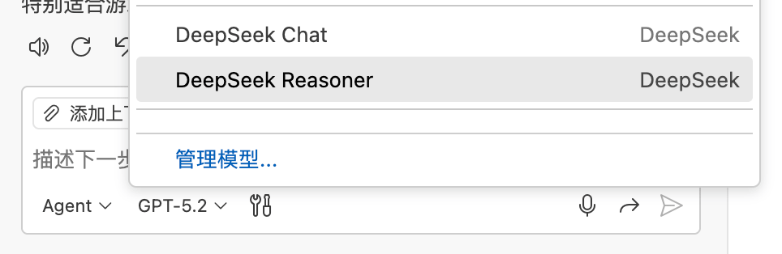
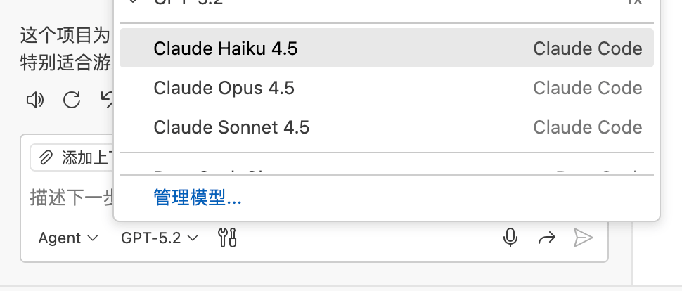

<p align="center">

</p>

<h1 align="center">
Unify Chat Provider
</h1>

<p align="center">
通过 Language Model API，将多个大语言模型 API 供应商集成到 VS Code 的 GitHub Copilot Chat 中。
</p>

<!-- <br>
<p align="center">
<a href="https://unocss.dev/">Documentation</a> |
<a href="https://unocss.dev/play/">Playground</a>
</p>
<br> -->

<br>
<p align="center">
<a href="./README.md">English</a> |
<span>简体中文</span>
</p>

## 特性

- 🐑 **免费聚合**：汇聚最新免费的主流模型渠道配置！
- 📦 **开箱即用**：一键配置、自动同步官方模型列表、支持从其它工具迁移模型配置。
- 🔌 **完整兼容**：支持所有主流的 LLM API 格式（OpenAI Chat Completion、OpenAI Responses、Anthropic Messages、Ollama Chat、Gemini）。
- 🎯 **深度适配**：适配 45+ 个主流供应商的特殊接口特性与最佳实践。
- 🚀 **最佳性能**：内置 200+ 种主流大模型的推荐参数，无需调参即可发挥模型最大潜力。
- 💻 **代码补全**：提供最佳性能、完整上下文适配、完全可自定义模型与算法的 FIM、NES、Next Edit Prediction 代码补全功能。
- 💬 **提交消息生成**：在同样的界面入口提供比 VS Code 效果更好的提交消息生成。
- 💾 **导入导出**：拥有完善的导入和导出功能，支持多种方式（Base64、JSON、URL、URI）导入配置。
- 💎 **极致体验**：可视化界面配置，模型参数完全开放自定义，支持无限供应商及模型配置，支持同供应商及模型多个配置变体共存。
- ✨ **One More Thing**：一键使用你的 Claude Code、Gemini CLI、Antigravity、Github Copilot、OpenAI Codex (ChatGPT Plus/Pro)、xAI Grok (SuperGrok / X Premium+) 、Zed 账号配额。

## 安装

- 需要 VS Code 1.115.0 或更高版本。
- 在 VS Code 扩展市场搜索 [Unify Chat Provider](https://marketplace.visualstudio.com/items?itemName=SmallMain.vscode-unify-chat-provider) 并安装。
- 通过 [GitHub Releases](https://github.com/smallmain/vscode-unify-chat-provider/releases) 下载最新的 `.vsix` 文件，在 VS Code 中通过 `从 VSIX 安装扩展...` 或拖动到扩展面板进行安装。

## 快速开始

如果你要添加的供应商在 [供应商支持表](#供应商支持表) 中，则使用 [一键配置](#一键配置)。

否则，也可以 [手动配置](#手动配置) 任何供应商和模型。

你可能也在找：

- [一键迁移](#一键迁移)：从其它应用或扩展迁移。
- [管理供应商](#管理供应商)：统一管理所有供应商和模型。
- [导入与导出](#导入与导出)：备份或导出配置分享给其他人。

> ⚠️ **避免 VS Code 后台消耗 Copilot 额度**
>
> 当前 VS Code 默认会在后台使用实用模型执行某些任务，如果你使用的是免费 Copilot 账号，这会消耗你的 Copilot 额度。
> 
> 你需要自行在 `settings.json` 中设置为其它模型以避免消耗 Copilot 额度，也可以使用本扩展提供的快捷设置界面进行配置，详情请查看 [快捷设置 VS Code 默认模型](#快捷设置-vs-code-默认模型)。

> ⚠️ **允许扩展开启 Proposed Api**
>
> 本扩展使用了部分 VS Code 实验性扩展 API，安装扩展后可能会提醒您需要启用这些 API（需要管理员权限），请您同意以获得最佳效果。
> 
> 若未启用，扩展仍然可以使用，但将有以下限制：
> - 部分模型的效果会被削弱。
> - 提交消息生成的效果大幅削弱。
> - 无法使用原生的提交消息生成按钮。
> - 无法使用代码补全功能。
> - 无法使用预设模板。

## 基本操作

用户界面集成在 VS Code 命令面板以提供更原生的体验，请了解其基本操作方式：

1. 打开面板：
   - 通过菜单 `查看` -> `命令面板...` 打开。
   - 通过 `Ctrl+Shift+P`（Windows/Linux）或 `Cmd+Shift+P`（Mac）快捷键打开。
2. 搜索命令：
   - 在命令面板中输入关键字 `Unify Chat Provider:` 或者 `ucp:` 搜索所有命令。
3. 选择命令：
   - 使用鼠标点击或键盘的上下箭头键选择命令，按回车键执行所选命令。

<div align="center">
  
</div>

## 一键配置

查看 [供应商支持表](#供应商支持表) 以了解支持一键配置的模型供应商。

> 如果使用的供应商不在上述列表中，可通过 [手动配置](#手动配置) 来添加。

**操作步骤：**

1. 打开 VS Code 命令面板，搜索 `Unify Chat Provider: 从内置供应商列表添加供应商`。

   <div align="center">
   
   </div>

2. 在列表中选择要添加的供应商。
3. 根据提示配置身份验证（通常是 API Key 或者要求在浏览器中登陆账号），跳转到配置导入界面。
   - 该界面用于检查和修改即将导入的配置。
   - 详细介绍可查看 [供应商配置](#供应商配置) 文档。

4. 点击 `保存` 按钮即可完成整个导入，立即在 Copilot Chat 中使用导入的模型。

   <div align="center">
   
   </div>

## 代码补全

打开 VS Code 命令面板，搜索 `Unify Chat Provider: 代码补全设置`。

代码补全功能默认启用，但需要添加至少一个有效的补全算法才会实际生效。

### 冲突提示

当本扩展的代码补全功能实际生效之后，会自动禁用 VS Code 内置代码补全。

如果你想让两者并存（不推荐），可以通过 `代码补全设置 -> 补全调度策略 -> 禁用VS Code内置补全` 选项调整。

如果存在多个扩展提供代码补全功能，VS Code 只会返回更快一方的补全结果，所以推荐你只启用一个扩展的代码补全功能。

### 支持算法

| 名称                   | ID             | 介绍                                            |
| ---------------------- | ---------------- | ------------------------------------------- |
| Simple           | `simple`          | 最简单的 FIM 补全实现，只发送当前文档的 prefix 和 suffix，兼容任何模型。 |
| Copilot (Replica)           | `copilot-replica`          | 完整复刻的 VS Code Copilot FIM/NES 核心实现，兼容任何模型。 |
| Zed           | `zed`          | 完整复刻的 Zed Edit Prediction 实现，仅支持 Zeta 模型。 |
| Inception           | `inception`          | 按照文档中的最佳实践进行实现，仅支持 Mercury Edit 2 模型。 |
| Mistral           | `mistral`          | 按照文档中的最佳实践进行实现，仅支持 Codestral 模型。 |

推荐使用 [Zed](#zed)、[Inception](#inception) 算法，它们有更好的效果。

### Simple

该算法支持任意模型，推荐使用 FIM 代码补全专用的模型，比如 Qwen Coder。

像 DeepSeek V4 这样的模型，虽然支持 FIM，但实际使用的效果不佳，并不推荐使用。

步骤：

1. 无论如何，先添加好一个模型配置，根据该模型是否支持 FIM 来修改模型的补全能力配置：
  - 支持 FIM：将 `completion.template` 设置为 `fim`。
  - 仅支持正常对话：将 `completion.template` 设置为 `fim`，并且将 `completion.transport` 设置为 `compatible`。
2. 通过 `代码补全设置 -> 从当前供应商列表添加 -> Simple` 添加一个 Simple 算法，并选择你要使用的模型。
3. 点击 `保存` 按钮即可。

### Zed

使用该算法能够获得与 Zed 编辑器中相同的代码补全体验。

Zed 编辑器使用自研的 Zeta 系列模型，这里推荐两种方式添加：

1. 通过 [一键配置](#一键配置) 添加 `Zed` 供应商，使用你的 Zed 账号配额。
2. 本地部署 Zeta 系列模型并添加。
3. 通过 `代码补全设置 -> 从当前供应商列表添加 -> Zed` 添加一个 Zed 算法，并选择刚刚添加的模型。
4. 点击 `保存` 按钮即可。

### Inception

1. 通过 [一键配置](#一键配置) 添加 `Inception` 供应商。
2. 通过 `代码补全设置 -> 从当前供应商列表添加 -> Inception` 添加一个 Inception 算法，并选择 `Mercury Edit 2` 模型。
3. 点击 `保存` 按钮即可。

### Mistral

1. 通过 [一键配置](#一键配置) 添加 `Mistral` 供应商。
2. 通过 `代码补全设置 -> 从当前供应商列表添加 -> Mistral` 添加一个 Mistral 算法，并选择 `Codestral` 模型。
3. 点击 `保存` 按钮即可。

## 手动配置

本章节以 DeepSeek 为例，添加该供应商及其两个模型。

> 该供应商支持 [一键配置](#一键配置)，为教学用途本章节进行手动配置。

0. 准备工作，在供应商文档中获取 API 的相关信息，至少包括以下三个：
   - `API 格式`：接口格式，如 OpenAI Chat Completion、Anthropic Messages 等。
   - `API 基础 URL`：接口基础 URL 地址。
   - `身份验证`：通常是 API Key，注册账号后在用户中心或控制台获取。

1. 打开 VS Code 命令面板，搜索 `Unify Chat Provider: 添加供应商`。

   <div align="center">
   
   </div>
   - 该界面与 [供应商配置](#供应商配置) 界面相似，你可以阅读该界面的文档了解每个字段。

2. 填写供应商的名称：`名称`。
   - 该名称必须唯一，会在模型列表中展示，这里填写的是 `DeepSeek`。
   - 同一个供应商可以添加多个不同名称的配置，比如 `DeepSeek-Person`、`DeepSeek-Team`。

3. 填写接口格式：`API 格式`。
   - DeepSeek 的接口是 `OpenAI Chat Completion` 格式，所以选则该格式。
   - 要了解支持的所有格式可查看 [API 格式支持表](#api-格式支持表)。

4. 填写基础 URL：`API 基础 URL`。
   - DeepSeek 的基础 URL 是 `https://api.deepseek.com`。

5. 配置 `身份验证`。
   - DeepSeek 使用 API Key 进行身份验证，所以选择 `API Key`。
   - 在输入框中填写在 DeepSeek 控制台生成的 API Key。

6. 点击 `模型` 字段跳转到模型管理界面。

   <div align="center">
   
   </div>

7. 选中 `自动拉取官方模型` 以启用自动拉取官方模型。
   - 本章节选择从官方自动拉取模型以减少配置步骤，该功能的详细介绍可查看 [自动拉取官方模型](#自动拉取官方模型)。
   - 有关模型字段或其它添加方式的介绍可查看 [管理模型](#管理模型) 文档。

8. 点击 `保存` 按钮即完成添加，你可以立即在 Copilot Chat 中使用其中的模型。

   <div align="center">
   
   </div>

## 一键迁移

查看 [应用迁移支持表](#应用迁移支持表) 以了解支持一键迁移的应用和扩展。

> 如果使用的应用或扩展不在上述列表中，则可通过 [一键配置](#一键配置) 或 [手动配置](#手动配置) 来完成配置。

**操作步骤：**

1. 打开 VS Code 命令面板，搜索 `Unify Chat Provider: 从其他应用导入配置`。

   <div align="center">
   
   </div>
   
   - 界面会列出所有支持的应用或扩展，及其检测到的配置文件路径。
   - 通过列表项最右侧的按钮组可执行其他操作：
     1. `自定义路径`：选择自定义的配置文件路径导入。
     2. `从配置内容导入`：直接输入配置内容进行导入。

2. 在列表中选择要导入的应用或扩展，跳转到配置导入界面。
   - 该界面用于检查和修改即将导入的配置。
   - 详细介绍可查看 [供应商配置](#供应商配置) 文档。

3. 点击 `保存` 按钮即可完成整个导入，立即在 Copilot Chat 中使用导入的模型。

   <div align="center">
   
   </div>

## 管理供应商

- 你可以创建无限个供应商配置，并且同个供应商可以创建多个不同配置共存。
- 供应商名称必须是唯一的。

### 供应商列表

打开 VS Code 命令面板，搜索 `Unify Chat Provider: 管理供应商`。

<div align="center">

</div>

- `添加供应商`: 通过 [手动配置](#手动配置) 添加新的供应商。
- `从内置供应商列表添加`: 通过 [一键配置](#一键配置) 添加新的供应商。
- `从配置导入`: 导入已有的供应商或供应商数组配置，详细介绍请查看 [导入与导出](#导入与导出)。
- `从其他应用导入`: 通过 [一键迁移](#一键迁移) 从其它应用或扩展导入配置。
- `导出所有供应商`: 导出所有供应商的配置，详细介绍请查看 [导入与导出](#导入与导出)。

界面还会展示当前所有的供应商，点击其中一个供应商列表项则进入 [模型列表](#模型列表) 界面。

列表项右侧的按钮组可执行其它操作：

- `导出`: 导出该供应商的配置，详细介绍请查看 [导入与导出](#导入与导出)。
- `克隆`: 克隆该供应商配置以创建一个新的配置。
- `删除`: 删除该供应商配置。

### 供应商配置

<div align="center">

</div>

- `模型`: 仅在添加或导入配置时存在该按钮，点击则进入 [模型列表](#模型列表) 界面。

界面会展示当前供应商的所有配置字段，具体字段说明可查看 [供应商参数](#供应商参数)。

## 管理模型

- 每个供应商均可创建无限个模型配置。
- 不同供应商之间允许存在相同的模型 ID。
- 单个供应商配置中，不允许直接存在多个相同的模型 ID，但可通过 `#xxx` 后缀添加多个配置。
- 例如可以分别添加 ID 为 `glm4.7` 和 `glm4.7#thinking` 的两个模型配置以随时切换是否开启思考。
- 模型 ID `#xxx` 后缀在实际发送请求时会被自动移除。
- 虽然模型名称允许重复，但建议使用不同的名称避免混淆使用。

### 模型列表

<div align="center">

</div>

- `添加模型`: 进入 [手动添加模型](#手动添加模型) 界面。
- `从内置模型列表添加`: 进入 [一键添加模型](#一键添加模型) 界面。
- `从官方模型列表添加`: 通过 API 接口拉取最新的官方模型列表，详细可查看 [一键添加模型](#一键添加模型)。
- `从配置导入`: 导入已有的模型或模型数组配置，详细介绍可查看 [导入与导出](#导入与导出)。
- `自动拉取官方模型`：启用或禁用 [自动拉取官方模型](#自动拉取官方模型)。
- `供应商配置`: 进入 [供应商配置](#供应商配置) 界面。
- `导出`: 导出该供应商或者模型数组配置，详细介绍请查看 [导入与导出](#导入与导出)。
- `克隆`: 克隆该供应商配置以创建一个新的配置。
- `删除`: 删除该供应商配置。

### 手动添加模型

该界面与 [模型配置](#模型配置) 界面相似，你可以阅读该界面的文档了解详情。

### 一键添加模型

<div align="center">

</div>

该界面会列出所有支持一键添加的模型，你可以一次性导入选中的多个模型。

所有支持的模型可查看 [模型支持表](#模型支持表)。

### 自动拉取官方模型

该功能通过供应商的 API 接口定时拉取最新的模型列表，并且自动配置好推荐的参数，极大地简化了模型的添加过程。

> 提示
>
> 供应商的 API 接口不一定会返回模型的推荐参数，所以推荐参数将根据模型 ID 从内部数据库获取，支持的模型可查看 [模型支持表](#模型支持表)。

<div align="center">

</div>

- 自动拉取的模型名称前面会有一个 `互联网` 图标以示区分。
- 如果自动拉取的模型 ID 与手动配置的模型 ID 冲突，则只展示手动配置的模型。
- 自动拉取的模型会定期更新，也可以点击 `（点击拉取）` 手动更新。
- 通过 VS Code 命令 `Unify Chat Provider: 刷新所有供应商的官方模型` 手动触发所有供应商的自动拉取更新。

### 模型配置

<div align="center">

</div>

- `导出`: 导出该模型的配置，详细介绍请查看 [导入与导出](#导入与导出)。
- `克隆`: 克隆该模型配置以创建一个新的配置。
- `删除`: 删除该模型配置。

界面会展示当前供应商的所有配置字段，具体字段说明可查看 [模型参数](#模型参数)。

### 同步内置参数到所有配置

运行 `Unify Chat Provider: 同步内置参数到所有配置`，可将本地模型的参数同步为内置模型参数。

一般用于新版本对内置模型参数进行了优化调整后进行一键同步。

## 提交消息生成

你可以通过以下命令生成提交消息：

- `Unify Chat Provider: 生成提交消息`
- `Unify Chat Provider: 生成提交消息(全部更改)`
- `Unify Chat Provider: 生成提交消息(暂存更改)`
- `Unify Chat Provider: 生成提交消息(未暂存更改)`

也可以点击在源代码管理面板的提交消息输入框右侧的星星按钮生成提交消息（首次使用你需要点击按钮右侧的下箭头，在下拉菜单中选择 `Unify Chat Provider: 生成提交消息`）。

## 余额监控

可在 `供应商配置` 中启用并查看供应商余额监控。

- 可通过 VS Code 命令 `Unify Chat Provider: 供应商余额监控` 打开余额监控面板。
- 通过 `余额监控` 字段进行配置。
- 当前内置方式：
  - `Moonshot AI 余额`：无需额外配置，直接使用供应商 `baseUrl` 和 API Key。
  - `Kimi Code 用量`：无需额外配置，直接使用供应商 `baseUrl` 和 API Key。
  - `New API 余额`：默认显示 API Key 余额；用户余额为可选，需配置 `userId` + `systemToken`（敏感数据）。
  - `DeepSeek 余额`：无需额外配置，直接使用供应商 `baseUrl` 和 API Key。
  - `OpenRouter 余额`：无需额外配置，直接使用供应商 `baseUrl` 和 API Key。
  - `SiliconFlow 余额`：无需额外配置，直接使用供应商 `baseUrl` 和 API Key。
  - `AIHubMix 余额`：余额监控无需额外配置，使用供应商 `baseUrl`、API Key，以及供应商 `extraHeaders` 中可选的 `APP-Code`。
  - `Claude Relay Service 余额`：无需额外配置，使用供应商 `baseUrl` 和 API Key。
  - `Antigravity 用量`：无需额外配置，使用供应商 OAuth 凭据与项目配置。
  - `Gemini CLI 用量`：无需额外配置，使用供应商 OAuth 凭据与可选项目配置。
  - `Codex 用量`：无需额外配置，使用供应商凭据（API Key 或 Codex 授权令牌）。
- 可通过 VS Code 命令 `Unify Chat Provider: 刷新所有供应商的余额信息` 强制刷新所有已配置余额监控的供应商。

## 用量统计

用量统计会从已完成的聊天请求中记录令牌用量，并将数据保存在 VS Code 本地全局存储中。

- 运行 `Unify Chat Provider: 显示用量统计` 可打开可视化用量页面。
- 状态栏会显示今日令牌总量，并在 tooltip 中显示历史总用量；点击后打开仪表盘。
- 运行 `Unify Chat Provider: 清空用量统计` 可删除所有已存储的用量记录。
- 用量明细默认按 `usageDetailRetentionDays` 保留 100 天。更早的明细会折叠进历史总量，因此总用量仍保持准确。
- 第一版会统计请求数、输入/输出/总令牌、延迟、结果状态，以及供应商返回的缓存令牌数据；暂不计算费用。

## 调整参数

### 全局设置

- 大部分 `unifyChatProvider.*` 设置项为应用级作用域，会在同一台设备的不同 Profile 之间共享。
- 代码补全与提交消息生成相关设置为窗口级作用域，可在不同工作区分别配置。

<details>

| 名称                       | ID                                             | 介绍                                                                                                                                       |
| -------------------------- | ---------------------------------------------- | ------------------------------------------------------------------------------------------------------------------------------------------ |
| 启用详细日志               | `verbose`                                      | 启用请求与响应的详细日志。默认：`false`。                                                                                                  |
| 模型显示名称模板           | `modelDisplayNameTemplate`                     | 聊天模型名称模板。默认：`{modelName}{{ ({providerName})}}`。                                                                                |
| 在设置中存储 API Key       | `storeApiKeyInSettings`                        | 是否将可同步的敏感数据存入 `settings.json`。默认：`false`；请查看 [云同步兼容](#云同步兼容)。                                               |
| 供应商列表倒序             | `providerList.newestFirst`                     | 是否在管理界面优先显示最近添加或修改的供应商。默认：`true`。                                                                               |
| 余额刷新间隔               | `balanceRefreshIntervalMs`                     | 供应商余额的定时刷新间隔（毫秒）。默认：`60000`，最小：`1000`。                                                                            |
| 余额节流窗口               | `balanceThrottleWindowMs`                      | 请求结束后刷新余额的节流窗口（毫秒）。默认：`10000`，最小：`0`。                                                                           |
| 余额状态栏图标             | `balanceStatusBarIcon`                         | 供应商余额状态栏使用的主题图标文本。默认：`$(credit-card)`；空字符串隐藏。                                                                 |
| 在配置中显示余额           | `displayBalanceInConfiguration`                | 是否在模型配置按钮区域显示已刷新的余额信息。默认：`false`。                                                                                 |
| 用量明细保留天数           | `usageDetailRetentionDays`                     | 保留用量明细记录的天数。默认：`100`，最小：`1`。                                                                                            |
| 启用余额警告               | `balanceWarning.enabled`                       | 是否在余额接近阈值时于模型名称旁显示警告图标。默认：`true`。                                                                                |
| 到期警告阈值               | `balanceWarning.timeThresholdDays`             | 到期提醒阈值（天，支持小数）。默认：`1`，最小：`0`。                                                                                        |
| 金额警告阈值               | `balanceWarning.amountThreshold`               | 余额提醒阈值（忽略货币单位）。默认：`1`，最小：`0`。                                                                                        |
| Token 警告阈值             | `balanceWarning.tokenThresholdMillions`        | 剩余 Token 提醒阈值（百万 Token）。默认：`1`，最小：`0`。                                                                                   |
| 全局网络设置               | `networkSettings`                              | 全局网络设置。超时与重试影响聊天请求；代理影响供应商 HTTP 请求。                                                                            |
| 全局超时配置               | `networkSettings.timeout`                      | 聊天请求的全局超时配置（毫秒）。                                                                                                             |
| 全局建连超时               | `networkSettings.timeout.connection`           | TCP 建立连接的最大等待时间。默认：`60000`（60 秒），必须为正整数。                                                                           |
| 全局响应间隔超时           | `networkSettings.timeout.response`             | SSE 流式接收数据块之间的最大等待时间。默认：`300000`（5 分钟），必须为正整数。                                                               |
| 全局重试配置               | `networkSettings.retry`                        | 聊天请求的全局重试配置。                                                                                                                     |
| 全局最大重试次数           | `networkSettings.retry.maxRetries`             | 默认：`10`，必须为非负整数。                                                                                                                 |
| 全局首次重试延迟           | `networkSettings.retry.initialDelayMs`         | 首次重试前的延迟（毫秒）。默认：`1000`，必须为非负整数。                                                                                     |
| 全局最大重试延迟           | `networkSettings.retry.maxDelayMs`             | 重试延迟上限（毫秒）。默认：`60000`，必须为正整数。                                                                                          |
| 全局退避倍数               | `networkSettings.retry.backoffMultiplier`      | 指数退避倍数。默认：`2`，最小：`1`。                                                                                                        |
| 全局抖动因子               | `networkSettings.retry.jitterFactor`           | 用于随机化延迟的抖动因子。默认：`0.1`，范围：`0`-`1`。                                                                                      |
| 全局可重试状态码           | `networkSettings.retry.statusCodes`            | 触发重试的 HTTP 状态码数组。设置后会完整覆盖默认规则；默认规则为 `408`、`409`、`429` 及所有 `>=500` 状态码。                                  |
| 全局代理配置               | `networkSettings.proxy`                        | 供应商请求的全局代理设置。字段请查看 [代理配置](#代理配置)。                                                                                 |
| 启用代码补全               | `completion.enabled`                           | 是否启用本扩展的代码补全。默认：`true`；详细说明请查看 [补全算法参数](#补全算法参数)。                                                       |
| 补全供应商                 | `completion.providers`                         | 补全算法配置数组。默认：`[]`；详细字段请查看 [补全算法参数](#补全算法参数)。                                                                |
| 补全调度策略               | `completion.strategy`                          | 补全算法的调度与停止条件；详细字段请查看 [补全调度策略参数](#补全调度策略参数)。                                                            |
| 提交消息生成按钮           | `commitMessageGeneration.enableButtons`        | 是否在源代码管理面板显示提交消息生成按钮。默认：`true`。                                                                                     |
| 提交消息生成模型           | `commitMessageGeneration.model`                | 用于提交消息生成的模型引用。默认：`{ "vendor": "", "id": "" }`。                                                                       |
| 提交消息模型供应商         | `commitMessageGeneration.model.vendor`         | 语言模型的 vendor 标识。                                                                                                                     |
| 提交消息模型 ID            | `commitMessageGeneration.model.id`             | 语言模型 ID。                                                                                                                               |
| 提交消息生成格式           | `commitMessageGeneration.format`               | `auto`（默认）/ `conventional` / `angular` / `google` / `atom` / `plain` / `custom`。                                                        |
| 提交消息生成自定义指令     | `commitMessageGeneration.customInstructions`   | 追加到系统提示中的额外指令。默认：空字符串。                                                                                                 |
| 提交消息生成排除文件       | `commitMessageGeneration.excludeFiles`         | 从 prompt 中省略 diff 的 VS Code glob 数组。默认：`[]`。                                                                                     |
| 供应商端点                 | `endpoints`                                    | 供应商配置数组。默认：`[]`；详细字段请查看 [供应商参数](#供应商参数)。                                                                      |

</details>

### 代理配置

代理可以通过 `unifyChatProvider.networkSettings.proxy` 全局配置，也可以通过 `unifyChatProvider.endpoints[].proxy` 为单个供应商配置。实际生效顺序为：

1. 供应商 `proxy`
2. 全局 `networkSettings.proxy`
3. VS Code HTTP 代理设置

`proxy.type` 支持：

- `vscode`（默认）：使用 VS Code 的 `http.proxy`、`http.proxyAuthorization`、`http.proxyStrictSSL` 和 `http.noProxy`。
- `direct`：直连，并绕过 VS Code 与全局代理设置。
- `custom`：使用 `proxy.url`；可选字段包括 `authorization`、`strictSSL` 和 `noProxy`。

自定义代理 URL 支持 `http`、`https`、`socks`、`socks4`、`socks4a`、`socks5` 和 `socks5h` 协议。代理设置会影响供应商 HTTP 请求，包括聊天请求、余额刷新和官方模型拉取。

全局代理示例：

```json
{
  "unifyChatProvider.networkSettings": {
    "proxy": {
      "type": "custom",
      "url": "http://127.0.0.1:7890",
      "noProxy": ["localhost", "127.0.0.1", ".example.com"]
    }
  }
}
```

供应商覆盖示例：

```json
{
  "unifyChatProvider.endpoints": [
    {
      "type": "openai-chat-completion",
      "name": "OpenAI Direct",
      "baseUrl": "https://api.openai.com",
      "proxy": {
        "type": "direct"
      },
      "models": ["gpt-5"]
    }
  ]
}
```

### 供应商参数

<details>

以下字段对应 `ProviderConfig`（导入/导出 JSON 使用的字段名）。

| 名称                     | ID                                               | 介绍                                                                                                                                                                                                  |
| ------------------------ | ------------------------------------------------ | ----------------------------------------------------------------------------------------------------------------------------------------------------------------------------------------------------- |
| API 格式                 | `type`                                           | 必填。供应商类型，决定 API 格式与兼容逻辑；支持值请查看 [API 格式支持表](#api-格式支持表)。                                                                                                           |
| 供应商名称               | `name`                                           | 必填。该供应商配置的唯一名称，用于列表展示与引用。                                                                                                                                                    |
| API 基础 URL             | `baseUrl`                                        | 必填。API 基础地址，例如 `https://api.anthropic.com`。                                                                                                                                                |
| 禁用自动规范化 URL       | `useRawBaseUrl`                                  | 是否禁用追加 `/v1`、移除后缀等供应商特定 URL 处理。默认：`false`。                                                                                                                                   |
| 聊天传输模式             | `transport`                                      | `auto` / `sse` / `websocket`；留空时使用供应商默认行为。                                                                                                                                             |
| 服务层级                 | `serviceTier`                                    | 供应商默认处理层级：`auto` / `standard` / `flex` / `scale` / `priority`。                                                                                                                            |
| 上下文缓存               | `contextCache`                                   | 上下文缓存配置，仅对支持 Prompt Caching 的供应商生效。                                                                                                                                               |
| 缓存类型                 | `contextCache.type`                              | `only-free`（默认）：仅在免费时使用；`allow-paid`：即使可能产生费用也使用。                                                                                                                           |
| 缓存 TTL（秒）           | `contextCache.ttl`                               | 正整数，默认：`300`。部分供应商会映射到其支持的 TTL 档位；可能产生费用的档位可能需要 `allow-paid`。                                                                                                  |
| 身份验证                 | `auth`                                           | 身份验证配置，通常由供应商设置界面管理。                                                                                                                                                              |
| 身份验证方式             | `auth.method`                                    | `none` / `api-key` / `oauth2` / `antigravity-oauth` / `google-gemini-oauth` / `google-vertex-ai-auth` / `claude-code` / `openai-codex` / `xai-grok-oauth` / `github-copilot` / `zed`。                |
| 旧版 API Key             | `apiKey`                                         | 已弃用，仅用于迁移旧配置；新配置应使用 `auth`，该字段不会继续持久化。                                                                                                                                 |
| 余额监控                 | `balanceProvider`                                | 供应商级余额监控配置。                                                                                                                                                                                |
| 补全能力                 | `completion`                                     | 此供应商的默认代码补全能力配置。                                                                                                                                                                      |
| 补全传输模式             | `completion.transport`                           | `auto`（继承后仍未设置时的默认值）/ `native` / `compatible`。                                                                                                                                         |
| 原生补全基础 URL         | `completion.baseUrl`                             | 仅用于原生补全请求；可为绝对 URL，或相对于供应商 `baseUrl` 的路径。                                                                                                                                   |
| 补全模板                 | `completion.templates`                           | `all` 或模板 ID 数组。支持 `fim`、`codegemma`、`copilot-replica-nes`、`zeta1`、`zeta2`、`zeta2.1`、`zeta3-internal`、`mercury-edit-2`、`codestral`；空数组禁用补全，供应商和模型均未设置时默认为空数组。  |
| 模型列表                 | `models`                                         | 必填。模型 ID 字符串或 `ModelConfig` 对象组成的数组。                                                                                                                                                 |
| 额外 Header              | `extraHeaders`                                   | 附加到每次请求的 HTTP Header（`Record<string, string>`）；值中可使用 `${APIKEY}` 引用供应商凭据。                                                                                                    |
| 额外 Body 字段           | `extraBody`                                      | 附加到请求 body 的字段（`Record<string, unknown>`），用于供应商私有参数。                                                                                                                             |
| 代理配置                 | `proxy`                                          | 供应商级代理覆盖；字段请查看 [代理配置](#代理配置)。                                                                                                                                                  |
| 超时配置                 | `timeout`                                        | 聊天请求的供应商级超时覆盖（毫秒）。                                                                                                                                                                  |
| 建连超时                 | `timeout.connection`                             | 必须为正整数。未设置时继承全局值；内置默认：`60000`（60 秒）。                                                                                                                                       |
| 响应间隔超时             | `timeout.response`                               | 必须为正整数。未设置时继承全局值；内置默认：`300000`（5 分钟）。                                                                                                                                     |
| 重试配置                 | `retry`                                          | 聊天请求的供应商级重试覆盖；可重试 HTTP 状态码只能通过全局 `networkSettings.retry.statusCodes` 配置。                                                                                                 |
| 最大重试次数             | `retry.maxRetries`                               | 必须为非负整数。未设置时继承全局值；内置默认：`10`。                                                                                                                                                  |
| 初始延迟                 | `retry.initialDelayMs`                           | 必须为非负整数，单位毫秒。未设置时继承全局值；内置默认：`1000`。                                                                                                                                     |
| 最大延迟                 | `retry.maxDelayMs`                               | 必须为正整数，单位毫秒。未设置时继承全局值；内置默认：`60000`。                                                                                                                                      |
| 退避倍数                 | `retry.backoffMultiplier`                        | 最小：`1`。未设置时继承全局值；内置默认：`2`。                                                                                                                                                        |
| 抖动因子                 | `retry.jitterFactor`                             | 范围：`0`-`1`。未设置时继承全局值；内置默认：`0.1`。                                                                                                                                                 |
| 自动拉取官方模型         | `autoFetchOfficialModels`                        | 是否从供应商 API 拉取并同步官方模型。默认：`false`。                                                                                                                                                  |

</details>

### 模型参数

<details>

以下字段对应 `ModelConfig`（导入/导出 JSON 使用的字段名）。

| 名称                     | ID                                          | 介绍                                                                                                                                                                                                                                                                                                               |
| ------------------------ | ------------------------------------------- | ------------------------------------------------------------------------------------------------------------------------------------------------------------------------------------------------------------------------------------------------------------------------------------------------------------------ |
| 模型 ID                  | `id`                                        | 必填。模型标识；可使用 `#xxx` 后缀创建同一模型的多份配置，发送请求时会自动移除后缀。                                                                                                                                                                                                                               |
| 显示名称                 | `name`                                      | UI 展示用名称，未设置时显示 `id`。                                                                                                                                                                                                                                                                                 |
| 模型家族                 | `family`                                    | 用于分组和匹配的模型标识（如 `gpt-4`、`claude-3`），未设置时使用移除 `#xxx` 后缀后的 `id`。                                                                                                                                                                                                                        |
| 最大输入 Tokens          | `maxInputTokens`                            | 最大输入或上下文 Token 数；部分供应商将其解释为输入与输出的总上下文。扩展运行时默认：`128000`。                                                                                                                                                                                                                    |
| 最大输出 Tokens          | `maxOutputTokens`                           | 最大生成 Token 数；部分供应商要求必填。扩展运行时默认：`64000`。                                                                                                                                                                                                                                                   |
| 分词器                   | `tokenizer`                                 | `default`（`char4` 的别名，默认）/ `conservative` / `char4` / `openai` / `deepseek`。                                                                                                                                                                                                                              |
| Token 计数倍率           | `tokenCountMultiplier`                      | 返回给 VS Code 前应用于 Token 计数的正数倍率。默认：`1.0`。                                                                                                                                                                                                                                                        |
| 模型能力                 | `capabilities`                              | 用于 UI、路由和部分请求构造的能力声明。                                                                                                                                                                                                                                                                            |
| 工具调用能力             | `capabilities.toolCalling`                  | 布尔值表示是否支持工具调用；整数表示最多支持的工具数量。                                                                                                                                                                                                                                                            |
| 图片输入能力             | `capabilities.imageInput`                   | 是否支持图片输入。                                                                                                                                                                                                                                                                                                 |
| 编辑工具提示             | `capabilities.editTools`                    | `find-replace` / `multi-find-replace` / `apply-patch` / `code-rewrite`。                                                                                                                                                                                                                                          |
| 流式输出                 | `stream`                                    | 是否启用流式响应；未设置时使用供应商默认行为。                                                                                                                                                                                                                                                                      |
| Temperature              | `temperature`                               | 采样温度。                                                                                                                                                                                                                                                                                                         |
| Top-K                    | `topK`                                      | Top-k 采样整数。                                                                                                                                                                                                                                                                                                   |
| Top-P                    | `topP`                                      | Top-p（nucleus）采样。                                                                                                                                                                                                                                                                                             |
| Frequency Penalty        | `frequencyPenalty`                          | 频率惩罚。                                                                                                                                                                                                                                                                                                         |
| Presence Penalty         | `presencePenalty`                           | 存在惩罚。                                                                                                                                                                                                                                                                                                         |
| 并行工具调用             | `parallelToolCalling`                       | `true` 启用、`false` 禁用；未设置时使用供应商默认行为。                                                                                                                                                                                                                                                             |
| 服务层级                 | `serviceTier`                               | `auto` / `standard` / `flex` / `scale` / `priority`；未设置时继承供应商值，供应商也未设置时不发送该字段。                                                                                                                                                                                                          |
| 回复冗长度               | `verbosity`                                 | `low` / `medium` / `high`，并非所有供应商都支持。                                                                                                                                                                                                                                                                  |
| 思考配置                 | `thinking`                                  | 思考或推理配置；支持程度取决于供应商。                                                                                                                                                                                                                                                                              |
| 思考类型                 | `thinking.type`                             | 存在 `thinking` 时必填：`enabled` / `disabled` / `auto`。                                                                                                                                                                                                                                                          |
| 思考预算 Tokens          | `thinking.budgetTokens`                     | 思考 Token 预算。                                                                                                                                                                                                                                                                                                  |
| 思考强度                 | `thinking.effort`                           | `none` / `minimal` / `low` / `medium` / `high` / `xhigh` / `max`。                                                                                                                                                                                                                                                 |
| 推理摘要                 | `thinking.summary`                          | `none` / `auto` / `concise` / `detailed`。                                                                                                                                                                                                                                                                         |
| 推理模式                 | `thinking.mode`                             | `standard` / `pro`。                                                                                                                                                                                                                                                                                               |
| 推理保留模式             | `thinking.context`                          | `auto` / `current_turn` / `all_turns`。                                                                                                                                                                                                                                                                            |
| 原生多智能体             | `multi-agent`                               | 原生多智能体执行配置。                                                                                                                                                                                                                                                                                              |
| 启用原生多智能体         | `multi-agent.enabled`                       | 存在 `multi-agent` 时必填。                                                                                                                                                                                                                                                                                         |
| 最大并发子智能体数       | `multi-agent.maxConcurrentSubagents`        | 可选的正整数，用于限制并发运行的子智能体数量。                                                                                                                                                                                                                                                                      |
| 原生网络搜索             | `webSearch`                                 | 原生网络搜索工具配置。                                                                                                                                                                                                                                                                                              |
| 原生记忆工具             | `memoryTool`                                | 是否启用原生记忆工具；仅对支持该能力的供应商生效。                                                                                                                                                                                                                                                                  |
| 额外 Header              | `extraHeaders`                              | 附加到该模型请求的 HTTP Header（`Record<string, string>`）；值中可使用 `${APIKEY}` 引用供应商凭据。                                                                                                                                                                                                                |
| 额外 Body 字段           | `extraBody`                                 | 附加到该模型请求 body 的字段（`Record<string, unknown>`）。                                                                                                                                                                                                                                                        |
| 补全能力覆盖             | `completion`                                | 模型级代码补全能力覆盖；每个未设置的子字段分别继承供应商配置。                                                                                                                                                                                                                                                      |
| 补全传输模式             | `completion.transport`                      | `auto` / `native` / `compatible`。                                                                                                                                                                                                                                                                                 |
| 原生补全基础 URL         | `completion.baseUrl`                        | 仅用于原生补全请求；可为绝对 URL，或相对于供应商 `baseUrl` 的路径。                                                                                                                                                                                                                                                 |
| 补全模板                 | `completion.templates`                      | `all` 或模板 ID 数组。支持 `fim`、`codegemma`、`copilot-replica-nes`、`zeta1`、`zeta2`、`zeta2.1`、`zeta3-internal`、`mercury-edit-2`、`codestral`；空数组显式禁用该模型的补全。                                                                        |
| 预设模板                 | `presetTemplates`                           | VS Code 模型二级菜单中的预设模板数组；模板按声明顺序应用，后面的模板会覆盖前面的同名字段。                                                                                                                                                                                                                          |

#### 服务层级说明

- 留空 `serviceTier` 表示不发送服务层级 / 速度字段，保持供应商默认行为。
- OpenAI API 的映射关系：
  - `auto` -> `auto`
  - `standard` -> `default`
  - `flex` -> `flex`
  - `scale` -> `scale`
  - `priority` -> `priority`
- Anthropic Messages API 的映射关系：
  - `auto` -> `auto`
  - `standard` / `flex` / `scale` -> `standard_only`
  - `priority` -> `speed: "fast"`，并携带 `fast-mode-2026-02-01`

#### 预设模板说明

你可以为单个模型配置多个预设模板，每个模板对应一组枚举选项，显示在 VS Code 模型选择的二级菜单中。

`thinking` 的预设覆盖会按子字段进行浅合并，因此相互独立的推理控制可以组合使用；其他顶层字段仍会整体替换。内置的 GPT-5.6 Sol、Terra 和 Luna 使用 ID `gpt-5.6-sol`、`gpt-5.6-terra` 和 `gpt-5.6-luna`；三者均具有 1,050,000 Token 上下文、128,000 Token 最大输出、OpenAI 分词器、工具与图像支持以及 apply-patch 编辑提示。`gpt-5.6` 别名会解析为 Sol。这些模型提供 `reasoningEffort`（`max`、`xhigh`、`high`、`medium`、`low`、`none`）、`reasoningMode`（`standard`、`pro`）和 `reasoningContext`（`auto`、`current_turn`、`all_turns`）三个预设组，且不包含供应商默认选项。它们的默认值分别为 `xhigh`、`standard` 和 `auto`。

<div align="center">

</div>

你可以自定义预设模板来快速切换模型参数，比如：

```json
{
  "presetTemplates": [
    {
      "name": "推理强度",
      "id": "reasoningEffort",
      "presets": [
        {
          "name": "高",
          "description": "适用于涉及规划、编码、综合分析或更高难度推理的任务。",
          "id": "high",
          "config": {
            "thinking": {
              "type": "enabled",
              "effort": "high"
            },
            "temperature": 0.7
          }
        },
        {
          "name": "低",
          "description": "少量额外思考可在几乎不增加延迟的情况下提升可靠性。",
          "id": "low",
          "config": {
            "thinking": {
              "type": "enabled",
              "effort": "low"
            },
            "temperature": 0.4
          }
        },
        {
          "name": "默认",
          "description": "使用模型当前配置。",
          "id": "default",
          "config": {}
        }
      ],
      "default": "default"
    }
  ]
}
```

- `config` 会覆盖模型配置中的字段，例如上述模板的 `high` 和 `low` 会覆盖 `thinking` 和 `temperature` 字段，而 `default` 则不会覆盖任何字段，使用模型当前配置。
- 如果存在多个模板，且它们覆盖了同一个字段，则会按照模板声明的顺序依次应用，后面的模板会覆盖前面模板的同名字段。

</details>

### 补全算法参数

<details>

| 名称         | ID                      | 介绍                                                                                                               |
| ------------ | ----------------------- | ------------------------------------------------------------------------------------------------------------------ |
| 启用代码补全 | `enabled`               | 是否启用本扩展的代码补全。默认：`true`；至少存在一个有效的补全供应商时才会实际生效。                                |
| 补全供应商   | `providers`             | 补全供应商数组（`CompletionAlgorithmEntry[]`）。默认：`[]`。                                                       |
| 供应商 ID    | `providers[].id`        | 唯一的补全供应商标识。                                       |
| 算法         | `providers[].algorithm` | `simple` / `copilot-replica` / `zed` / `inception` / `mistral`。                                                   |
| 算法选项     | `providers[].options`   | 算法配置对象。                  |

所有 `options` 中的模型字段均为 `CompletionModelReference`，格式为 `{ "vendor": string, "id": string }`。

#### Simple (`simple`)

| 名称 | ID              | 介绍                      |
| ---- | --------------- | ------------------------- |
| 模型 | `options.model` | 必填。用于生成 FIM 补全。 |

#### Copilot (Replica) (`copilot-replica`)

| 名称                     | ID                                      | 介绍                                                                                                                                                                                                                                                                                         |
| ------------------------ | --------------------------------------- | -------------------------------------------------------------------------------------------------------------------------------------------------------------------------------------------------------------------------------------------------------------------------------------------- |
| 启用 FIM                 | `options.enableFIM`                     | 必填布尔值。是否启用 FIM 补全。                                                                                                                                                                                                                                                     |
| 启用 NES                 | `options.enableNES`                     | 必填布尔值。是否启用 Next Edit Suggestion；`enableFIM` 与 `enableNES` 至少有一个为 `true`。                                                                                                                                                                                                    |
| FIM 模型                 | `options.fimModel`                      | 独立模型模式启用 FIM 时必填。                                                                                                                                                                                                                                                                 |
| FIM 候选数               | `options.n`                             | 正整数，默认：`1`。仅独立 FIM 模式使用；传输模式不支持多候选时会降级为单个候选。                                                                                                                                                                                                              |
| NES 模型                 | `options.nesModel`                      | 独立模型模式启用 NES 时必填。                                                                                                                                                                                                                                                                 |
| 模型统一                 | `options.modelUnification`              | 是否让 FIM 与 NES 共用一个模型，默认：`false`。仅当 FIM 与 NES 同时启用时可设为 `true`；启用后固定使用 `xtabUnifiedModel` 协议，不再调用独立 FIM 传输。                                                                                                                                            |
| 统一模型                 | `options.unifiedModel`                  | 启用模型统一时必填，同时用于 FIM 插入与 NES 编辑。                                                                                                                                                                                                                                            |
| 光标预测模型             | `options.cursorPredictionModel`         | 可选，仅用于 NES 的下一光标位置预测；未设置时复用当前 NES 或统一模型。该模型不可用时只禁用光标预测，不影响 NES 主请求。                                                                                                                                                                        |
| NES Prompt 策略          | `options.strategy`                      | 独立模型模式默认：`copilotNesXtab`。可选值：`copilotNesXtab`、`xtab275`、`xtabUnifiedModel`、`xtabAggressiveness`、`xtab275Aggressiveness`、`xtab275AggressivenessHighLow`、`xtab275EditIntent`、`xtab275EditIntentShort`；应与模型的 Prompt 和响应协议匹配。 |
| 积极程度                 | `options.eagerness`                     | NES 自适应请求策略：`auto` / `low` / `medium` / `high`，默认：`auto`。修改该字段不会重建有状态的 Copilot runtime。                                                                                                                                                                            |
| 补全语言                 | `options.enabledLanguages`              | 高级字段。语言 ID 到布尔值的映射，可用 `*` 设置回退值，控制自动 FIM；统一模型模式下会与 `inlineEditsEnabledLanguages` 共同决定补全通道。默认启用除 `plaintext`、`markdown`、`scminput` 外的语言；手动触发的独立 FIM 不受该限制。                                                                |
| 行内编辑语言             | `options.inlineEditsEnabledLanguages`   | 高级字段。语言 ID 到布尔值的映射，可用 `*` 设置回退值，控制 NES 行内编辑；默认启用除 `plaintext`、`markdown`、`scminput` 外的语言。                                                                                                                                                              |
| 使用已选补全信息         | `options.respectSelectedCompletionInfo` | 高级字段。控制 FIM 是否将建议小组件中已选中的补全作为待应用编辑。未设置时由 VS Code 版本和 `editor.quickSuggestions` 状态自动决定。                                                                                                                                                            |
| 包含行内补全             | `options.includeInlineCompletions`      | 高级字段。是否允许 NES 在当前文档中返回行内补全，默认：`true`。                                                                                                                                                                                                                               |
| 包含行内编辑             | `options.includeInlineEdits`            | 高级字段。是否允许 NES 返回行内编辑或跨文件编辑，默认：`true`。启用 NES 时，该字段与 `includeInlineCompletions` 不能同时为 `false`。                                                                                                                                                            |

#### Zed (`zed`)

| 名称            | ID                  | 介绍                                                             |
| --------------- | ------------------- | ---------------------------------------------------------------- |
| 模型            | `options.model`     | 必填。用于 Zed Edit Prediction。                                 |
| 最大输出 Tokens | `options.maxTokens` | 正整数，默认：`64`；Zed Cloud v3/v4 请求使用服务协议规定的限制。 |

#### Inception (`inception`)

| 名称 | ID              | 介绍                                                      |
| ---- | --------------- | --------------------------------------------------------- |
| 模型 | `options.model` | 必填。用于 Mercury Edit 2 Next Edit，输出上限由服务决定。 |

#### Mistral (`mistral`)

| 名称            | ID                  | 介绍                          |
| --------------- | ------------------- | ----------------------------- |
| 模型            | `options.model`     | 必填。用于 Codestral FIM。    |
| 最大输出 Tokens | `options.maxTokens` | 正整数，默认：`150`。         |

</details>

### 补全调度策略参数

<details>

| 名称                     | ID                               | 介绍                                                                                                                                                                                                             |
| ------------------------ | -------------------------------- | ---------------------------------------------------------------------------------------------------------------------------------------------------------------------------------------------------------------- |
| 调度模式                 | `mode`                           | `all`（默认）：立即并发请求所有供应商；`main-first`：优先采用主供应商。                                                                                                                                            |
| 禁用 VS Code 内置补全    | `disableVSCodeBuiltinCompletion` | 默认：`true`。屏蔽 VS Code 的代码补全功能，设为 `false` 可让它们并存。                                                                               |
| 禁用文件 Glob            | `disabledGlobs`                  | 不发送补全请求的额外文件 Glob 数组。始终与内置规则 `**/.env*`、`**/*.pem`、`**/*.key`、`**/*.cert`、`**/*.crt`、`**/.dev.vars`、`**/secrets.yml` 合并，因此内置规则不能通过设置空数组移除。                              |
| 主供应商                 | `mainProvider`                   | `main-first` 模式必填，值为 `providers[].id`。引用不存在时运行时会回退到默认策略并显示经过节流的配置警告。                                                                                                          |
| 主供应商等待时间         | `mainFirstTimeoutMs`             | 非负毫秒数，默认：`500`。主供应商仍未产生可用结果时，达到该时间会启动或放行其他供应商；它不是主请求的取消超时。                                                                                                     |
| 其他供应商并行启动       | `parallelRequestOthers`          | 仅用于 `main-first`，默认：`false`。为 `false` 时主供应商失败、返回空结果或等待超时后才启动其他供应商；为 `true` 时全部同时启动，但其他供应商的结果会等待主供应商结束或等待超时后才参与停止条件。                        |
| 停止条件                 | `stopWhen`                       | 控制何时结束等待并合并当前可用结果的对象。                                                                                                                                                                         |
| 停止条件类型             | `stopWhen.type`                  | `firstUsable`（默认）/ `deadline` / `enoughResults` / `allSettled`。                                                                                                                                               |
| 首个结果宽限期           | `stopWhen.graceMs`               | 非负毫秒数，仅用于 `firstUsable`；首个可用结果出现后继续收集结果的时间，默认：`0`。                                                                                                                                 |
| 时间限制                 | `stopWhen.timeoutMs`             | 非负毫秒数，`deadline` 必填；到时返回已经可用的结果。                                                                                                                                                               |
| 最少结果数               | `stopWhen.minItems`              | 正整数，`enoughResults` 必填；按合并去重后的补全项数量计算。                                                                                                                                                        |
| 足量结果宽限期           | `stopWhen.graceMs`               | 非负毫秒数，仅用于 `enoughResults`；达到 `minItems` 后继续收集结果的时间，默认：`0`。                                                                                                                               |

`main-first` 模式下，主供应商在优先阶段产生可用结果时会直接返回；只有主供应商未产生可用结果并进入回退阶段后，其他供应商才按 `stopWhen` 合并。各停止条件的行为如下：

- `firstUsable`：出现首个可用结果后最多等待 `graceMs`，然后返回并取消仍在运行的请求；若全部请求更早完成，则提前返回。
- `deadline`：达到 `timeoutMs` 时返回已有结果并取消仍在运行的请求；若全部请求更早完成，则提前返回。
- `enoughResults`：去重后的补全项达到 `minItems` 后等待 `graceMs`，然后返回并取消仍在运行的请求；若全部请求更早完成，则返回当时已有的结果。
- `allSettled`：等待所有已调度请求成功、失败或返回空结果后再返回。

多个供应商的结果按实际完成顺序合并，并按目标 URI、插入文本和替换范围去重，保留先出现的补全项。单个供应商出错不会阻止其他供应商返回结果。

</details>

## 导入与导出

支持导入/导出内容：

- 单个供应商配置
- 单个模型配置
- 多个供应商配置（数组）
- 多个模型配置（数组）

支持导入/导出格式：

- Base64-url 编码的 JSON 配置字符串（仅会导出该格式）
- 纯 JSON 配置字符串
- 指向 Base64-url 编码或纯 JSON 配置字符串的 URL

## URI 支持

支持响应 VS Code URI 快速导入供应商配置。

例如：

```
vscode://SmallMain.vscode-unify-chat-provider/import-config?config=<input>
```

其中 `<input>` 支持格式与 [导入与导出](#导入与导出) 中导入支持的格式相同。

### 覆盖配置字段

你可以添加 `query` 查询参数来覆盖导入配置中的某些字段。

例如：

```
vscode://SmallMain.vscode-unify-chat-provider/import-config?config=<input>&auth={"method":"api-key","apiKey":"my-api-key"}
```

导入时将会覆盖配置中的 `auth` 字段再导入。

### 供应商倡议

如果你是某个模型供应商的开发者，可以通过在网站上添加类似如下的链接，方便用户一键将你的模型添加到扩展中：

```
<a href="vscode://SmallMain.vscode-unify-chat-provider/import-config?config=eyJ0eXBlIjoi...">Add to Unify Chat Provider</a>
```

## 云同步兼容

扩展配置存储在 `settings.json` 文件中，支持 VS Code 自带的设置云同步功能。

会话型认证会在 `settings.json` 中保存一个非敏感绑定 ID；OAuth token、client secret、账户/项目上下文以及 Zed 组织和隐私状态则保存在 VS Code Secret Storage 的版本化信封中。Secret Storage 不参与同步。

因此每台设备会独立授权和刷新会话。在一台设备上同步配置、重命名供应商或切换账户，都不会替换另一台设备的 token 或账户上下文。新同步的设备会要求在本机授权。

如果你希望同步适合多设备共享的敏感数据（例如 API Key），可以在设置中启用 [`storeApiKeyInSettings`](vscode://settings/unifyChatProvider.storeApiKeyInSettings)。

为避免多设备刷新和账户上下文冲突，OAuth 和 Zed 凭证始终保存在 Secret Storage 中。用户显式进行敏感导出和导入时，仍可能把同一个上游凭证放到多台设备。

这会有用户数据泄露风险，你需要自行评估并决定是否启用该选项。

## 快捷设置 VS Code 默认模型

你可以通过 VS Code 命令 `Unify Chat Provider: 更改 VS Code 默认模型` 打开快速设置界面。

支持快速设置以下配置项：

- ★ `chat.utilityModel`
- ★ `chat.utilitySmallModel`
- ★ `chat.exploreAgent.defaultModel`
- ★ `github.copilot.chat.exploreAgent.model`
- `inlineChat.defaultModel`
- `chat.planAgent.defaultModel`
- `github.copilot.chat.askAgent.model`
- `github.copilot.chat.implementAgent.model`

使用 `★` 标记的配置项代表：

- 默认会使用 Copilot 内置模型，这些模型在付费计划中不消耗高级额度，但在免费计划中会消耗免费额度。
- 建议设置为快速、廉价的模型。

你可以选中 `更改所有内置实用模型` 按钮一键修改所有 `★` 标记的配置项。

## API 格式支持表

<details>

| API                                                                                          | ID                       | 典型端点                         | 备注                                      |
| :------------------------------------------------------------------------------------------- | :----------------------- | :------------------------------- | :---------------------------------------- |
| [OpenAI Chat Completion API](https://platform.openai.com/docs/api-reference/chat)            | `openai-chat-completion` | `/v1/chat/completions`           | 若非版本号后缀，则会自动追加 `/v1` 后缀。 |
| [OpenAI Responses API](https://platform.openai.com/docs/api-reference/responses)             | `openai-responses`       | `/v1/responses`                  | 若非版本号后缀，则会自动追加 `/v1` 后缀。 |
| [Google AI Studio (Gemini API)](https://ai.google.dev/aistudio)                              | `google-ai-studio`       | `/v1beta/models:generateContent` | 自动检测并处理版本号后缀。                |
| [Google Vertex AI](https://cloud.google.com/vertex-ai)                                       | `google-vertex-ai`       | `/v1beta/models:generateContent` | 根据身份验证自动使用不同的基础 URL。      |
| [Anthropic Messages API](https://platform.claude.com/docs/en/api/typescript/messages/create) | `anthropic`              | `/v1/messages`                   | 自动移除重复的 `/v1` 后缀。               |
| [Ollama Chat API](https://docs.ollama.com/api/chat)                                          | `ollama`                 | `/api/chat`                      | 自动移除重复的 `/api` 后缀。              |
| [Zed Cloud API](https://zed.dev/)                                                            | `zed`                    | `/completions`                   | 原生登录、组织模型与 Edit Prediction v3/v4。 |

</details>

## 供应商支持表

以下列出的供应商均支持 [一键配置](#一键配置)，并且已在实现中遵循官方文档的最佳实践，能够发挥模型的最佳性能。

> 提示
>
> 即使是非支持的供应商，也可以通过 [手动配置](#手动配置) 使用。

<details>

| 供应商                                                                                        | 支持特性                                                                             | 免费额度              | 余额监控 |
| :-------------------------------------------------------------------------------------------- | ------------------------------------------------------------------------------------ | --------------------- | :------: |
| [Open AI](https://openai.com/)                                                                |                                                                                      |                       |
| [Google AI Studio](https://aistudio.google.com/)                                              |                                                                                      |                       |
| [Google Vertex AI](https://cloud.google.com/vertex-ai)                                        | <li>Authentication                                                                   |                       |
| [Anthropic](https://www.anthropic.com/)                                                       | <li>InterleavedThinking <li>FineGrainedToolStreaming <li>AlwaysOnAdaptiveThinking    |                       |
| [Inception](https://www.inceptionlabs.ai/)                                                    | <li>Mercury Edit 2 补全                                                              |                       |
| [Mistral AI](https://mistral.ai/)                                                             | <li>Reasoning Content Chunks <li>Codestral FIM 补全                                 |                       |
| [xAI](https://docs.x.ai/)                                                                     |                                                                                      |                       |
| [Hugging Face (Inference Providers)](https://huggingface.co/docs/inference-providers)         |                                                                                      |                       |
| [OpenRouter](https://openrouter.ai/)                                                          | <li>CacheControl <li>ReasoningParam <li>ReasoningDetails <li>ClaudeAdaptiveVerbosity | [详情](#openrouter)   |    ✅    |
| [AIHubMix](https://aihubmix.com/)                                                             |                                                                                      |                       |    ✅    |
| [Cerebras](https://www.cerebras.ai/)                                                          | <li>ReasoningField <li>DisableReasoningParam <li>ClearThinking                       | [详情](#cerebras)     |
| [OpenCode Zen (OpenAI Chat Completion)](https://opencode.ai/)                                 | <li>ReasoningContent                                                                 | [详情](#opencode-zen) |
| [OpenCode Zen (OpenAI Responses)](https://opencode.ai/)                                       | <li>ReasoningContent                                                                 | [详情](#opencode-zen) |
| [OpenCode Zen (Anthropic Messages)](https://opencode.ai/)                                     | <li>InterleavedThinking <li>FineGrainedToolStreaming                                 | [详情](#opencode-zen) |
| [OpenCode Zen (Gemini)](https://opencode.ai/)                                                 |                                                                                      | [详情](#opencode-zen) |
| [OpenCode Go (OpenAI Chat Completion)](https://opencode.ai/)                                  | <li>ReasoningContent                                                                 | [详情](#opencode-go)  |
| [OpenCode Go (Anthropic Messages)](https://opencode.ai/)                                      | <li>InterleavedThinking <li>FineGrainedToolStreaming                                 | [详情](#opencode-go)  |
| [英伟达](https://build.nvidia.com/)                                                           |                                                                                      | [详情](#英伟达)       |
| [Kilo Code](https://kilo.ai/)                                                                 | <li>RawBaseUrl                                                                       | [详情](#kilo-code)    |
| [阿里云百炼平台 (中国站)](https://www.aliyun.com/product/bailian)                             | <li>ThinkingParam3 <li>ReasoningContent                                              |                       |
| [阿里云百炼平台 (Team Token Plan)](https://www.aliyun.com/product/bailian)                    | <li>ThinkingParam3 <li>ReasoningContent                                              |                       |
| [阿里云百炼平台 (国际站)](https://www.alibabacloud.com/help/en/model-studio)                  | <li>ThinkingParam3 <li>ReasoningContent                                              |                       |
| [腾讯云 TokenHub (中国站)](https://cloud.tencent.com/document/product/1823/130078)            | <li>ThinkingParam <li>ReasoningEffortParam <li>ReasoningContent                      |                       |
| [腾讯云 TokenHub (国际站)](https://cloud.tencent.com/document/product/1823/130078)            | <li>ThinkingParam <li>ReasoningEffortParam <li>ReasoningContent                      |                       |
| [腾讯云 TokenHub (个人版 Token Plan)](https://cloud.tencent.com/document/product/1823/130060) | <li>RawBaseUrl <li>ThinkingParam <li>ReasoningEffortParam <li>ReasoningContent       |                       |
| [腾讯云 Token Plan (企业版)](https://cloud.tencent.com/document/product/1823/130660)          | <li>RawBaseUrl <li>ThinkingParam <li>ReasoningEffortParam <li>ReasoningContent       |                       |
| [魔搭社区 (API-Inference)](https://modelscope.cn/)                                            | <li>ThinkingParam3 <li>ReasoningContent                                              | [详情](#魔搭社区)     |
| [Cline Bot](https://docs.cline.bot/api/overview)                                              |                                                                                      | [详情](#cline-bot)    |
| [火山引擎](https://www.volcengine.com/product/ark)                                            | <li>AutoThinking <li>ThinkingParam2 <li>VolcContextCaching                           | [详情](#火山引擎)     |
| [火山引擎 (Coding Plan)](https://www.volcengine.com/activity/codingplan)                      | <li>AutoThinking <li>ThinkingParam2                                                  |                       |
| [Byte Plus](https://www.byteplus.com/en/product/modelark)                                     | <li>AutoThinking <li>ThinkingParam2 <li>VolcContextCaching                           |                       |
| [DeepSeek](https://www.deepseek.com/)                                                         | <li>ThinkingParam <li>ReasoningEffortParam <li>ReasoningContent                      |                       |    ✅    |
| [模力方舟](https://ai.gitee.com/)                                                             |                                                                                      |                       |
| [Xiaomi MIMO](https://mimo.xiaomi.com/)                                                       | <li>ThinkingParam <li>ReasoningContent                                               |                       |
| [Xiaomi MIMO (中国站, Token Plan)](https://mimo.xiaomi.com/)                                  | <li>ThinkingParam <li>ReasoningContent                                               |                       |
| [Xiaomi MIMO (新加坡站, Token Plan)](https://mimo.xiaomi.com/)                                | <li>ThinkingParam <li>ReasoningContent                                               |                       |
| [Xiaomi MIMO (欧洲站, Token Plan)](https://mimo.xiaomi.com/)                                  | <li>ThinkingParam <li>ReasoningContent                                               |                       |
| [Ollama Local](https://ollama.com/)                                                           |                                                                                      |                       |
| [Ollama Cloud](https://ollama.com/)                                                           |                                                                                      |                       |
| [LM Studio Local](https://lmstudio.ai/)                                                           |                                                                                      |                       |
| [阶跃星辰 (中国站)](https://platform.stepfun.com/)                                            | <li>ReasoningField                                                                   |                       |
| [阶跃星辰 (国际站)](https://platform.stepfun.com/)                                            | <li>ReasoningField                                                                   |                       |
| [智谱 AI](https://open.bigmodel.cn/)                                                          | <li>ThinkingParam <li>ReasoningEffortParam <li>ReasoningContent <li>ClearThinking    | [详情](#智谱-ai--zai) |
| [智谱 AI (Coding Plan)](https://open.bigmodel.cn/)                                            | <li>ThinkingParam <li>ReasoningEffortParam <li>ReasoningContent <li>ClearThinking    |                       |
| [Z.AI](https://z.ai/)                                                                         | <li>ThinkingParam <li>ReasoningEffortParam <li>ReasoningContent <li>ClearThinking    | [详情](#智谱-ai--zai) |
| [Z.AI (Coding Plan)](https://z.ai/)                                                           | <li>ThinkingParam <li>ReasoningEffortParam <li>ReasoningContent <li>ClearThinking    |                       |
| [MiniMax (中国站)](https://www.minimaxi.com/)                                                 | <li>ReasoningDetails                                                                 |                       |
| [MiniMax (国际站)](https://www.minimax.io/)                                                   | <li>ReasoningDetails                                                                 |                       |
| [LongCat](https://longcat.chat/)                                                              |                                                                                      | [详情](#longcat)      |
| [Moonshot AI (中国站)](https://www.moonshot.cn/)                                              | <li>ThinkingParam <li>ReasoningEffortParam <li>ReasoningContent                     |                       |    ✅    |
| [Moonshot AI (国际站)](https://www.moonshot.ai/)                                              | <li>ThinkingParam <li>ReasoningEffortParam <li>ReasoningContent                     |                       |    ✅    |
| [Moonshot AI (Coding Plan)](https://www.kimi.com/coding)                                      | <li>ReasoningContent                                                                 |                       |    ✅    |
| [快手万擎 (中国站)](https://streamlake.com/)                                                  |                                                                                      | [详情](#快手万擎)     |
| [快手万擎 (中国站, Coding Plan)](https://streamlake.com/)                                     |                                                                                      |                       |
| [快手万擎 (国际站)](https://www.streamlake.ai/)                                               |                                                                                      | [详情](#快手万擎)     |
| [快手万擎 (国际站, Coding Plan)](https://www.streamlake.ai/)                                  |                                                                                      |                       |
| [硅基流动 (中国站)](https://siliconflow.cn/)                                                  | <li>ThinkingParam3 <li>ThinkingBudgetParam <li>ReasoningContent                      | [详情](#硅基流动)     |    ✅    |
| [硅基流动 (国际站)](https://siliconflow.com/)                                                 | <li>ThinkingParam3 <li>ThinkingBudgetParam <li>ReasoningContent                      | [详情](#硅基流动)     |    ✅    |

实验性支持的供应商：

> ⚠️ 警告：添加以下供应商可能会违反它们的服务条款！
>
> - 你的账户可能会被暂停或永久封禁。
> - 你需要自行权衡，所有风险都将由你自己承担。

| 供应商                                                       | 免费额度                    | 余额监控 |
| :----------------------------------------------------------- | --------------------------- | :------: |
| [OpenAI Codex (ChatGPT Plus/Pro)](https://openai.com/)       |                             |    ✅    |
| [xAI Grok Build (SuperGrok / X Premium+)](https://grok.com/) |                             |
| [GitHub Copilot](https://github.com/features/copilot)        | [详情](#github-copilot)     |
| [Google Antigravity](https://antigravity.google/)            | [详情](#google-antigravity) |    ✅    |
| [Google Gemini CLI](https://geminicli.com/)                  | [详情](#google-gemini-cli)  |    ✅    |
| [Claude Code](https://claude.ai/)                            |                             |
| [Zed](https://zed.dev/)                                      |                             |          |
| [Synthetic](https://synthetic.new/)                          | [详情](#synthetic)          |    ✅    |

长期免费额度：

#### Kilo Code

- 通常会提供免费模型，包括 stealth 模型与限时前沿模型。
- 可用性变化较快，请以应用内最新列表为准。

#### Cline Bot

- 支持模型：
  - `minimax/minimax-m2.5`
  - `kwaipilot/kat-coder-pro`
  - `z-ai/glm-5`

#### GitHub Copilot

- 部分模型有免费额度，部分模型需要 Copilot 订阅，订阅之后完全免费，按月刷新额度。
- 支持模型：Claude、GPT、Grok、Gemini 等主流模型。

#### Google Antigravity

- 每个模型有一定的免费额度，按时间刷新额度。
- 支持模型：Claude 4.5 系列、Gemini 3.1 系列、Gemini 3 系列。

#### Google Gemini CLI

- 每个模型有一定的免费额度，按时间刷新额度。
- 支持模型：Gemini 3.1 系列、Gemini 3 系列、Gemini 2.5 系列。

#### Synthetic

- 通过 OpenAI 兼容 API 提供多种主流模型。
- 支持模型：MiniMax M2.5、Qwen 3.5、Kimi K2.5、GLM 4.7、DeepSeek V3.2 / V3 / R1、Llama 3.3 等。

#### Cerebras

- 部分模型有免费额度，按时间刷新额度。
- 支持模型：
  - GLM 4.7
  - GPT-OSS-120B
  - Qwen 3 235B Instruct
  - ...

#### 英伟达

- 完全免费，但有速率限制。
- 支持几乎所有开源权重模型。

#### 火山引擎

- 每个模型有一定的免费额度，按时间刷新额度。
- 支持模型：Doubao、Kimi、DeepSeek 等主流模型。

#### 魔搭社区

- 每个模型有一定的免费额度，按时间刷新额度。
- 支持模型：GLM、Kimi、Qwen、DeepSeek 等主流模型。

#### 智谱 AI / Z.AI

- 部分模型完全免费。
- 支持模型：GLM Flash 系列模型。

#### 硅基流动

- 部分模型完全免费。
- 支持模型：大部分是 32B 以下的开源权重模型。

#### 快手万擎

- 完全免费，但有速率限制。
- 支持模型：
  - KAT-Coder-Pro V2.5
  - KAT-Coder-Air V2.5

#### LongCat

- 有一定的免费额度，按时间刷新额度。
- 支持模型：
  - LongCat-Flash-Chat
  - LongCat-Flash-Thinking
  - LongCat-Flash-Thinking-2601
  - LongCat-Flash-Lite

#### OpenRouter

- 部分模型有一定的免费额度，按时间刷新额度。
- 支持模型：变动频繁，名称中带 free 的模型。

#### OpenCode Zen

- 部分模型完全免费。
- 支持模型：变动频繁，名称中带 free 的模型。

#### Ollama Cloud

- 有一定的免费额度，按时间刷新额度。
- 支持几乎所有开源权重模型。

</details>

## 模型支持表

以下列出的模型均支持 [一键添加模型](#一键添加模型)，并且已内置推荐参数，能够发挥模型的最佳性能。

> 提示
>
> 即使是非支持的模型，也可以通过 [手动添加模型](#手动添加模型) 使用，并且自行配置参数以发挥最佳性能。

<details>

| 厂商             | 系列                | 支持的模型                                                                                                                                                                                                                                                                                                                                                                                                                                                                                                                                                                                                                                                                                                                                                                                                                                                                                                           |
| :--------------- | :------------------ | :------------------------------------------------------------------------------------------------------------------------------------------------------------------------------------------------------------------------------------------------------------------------------------------------------------------------------------------------------------------------------------------------------------------------------------------------------------------------------------------------------------------------------------------------------------------------------------------------------------------------------------------------------------------------------------------------------------------------------------------------------------------------------------------------------------------------------------------------------------------------------------------------------------------- |
| **OpenAI**       | GPT-5 系列          | GPT-5, GPT-5.1, GPT-5.2, GPT-5.4, GPT-5.5, GPT-5.6 Sol, GPT-5.6 Terra, GPT-5.6 Luna, GPT-5.4 pro, GPT-5.4 Mini, GPT-5.4 Nano, GPT-5.2 pro, GPT-5 mini, GPT-5 nano, GPT-5 pro, GPT-5-Codex, GPT-5.1-Codex, GPT-5.2-Codex, GPT-5.3-Codex, GPT-5.3-Codex-Spark, GPT-5.1-Codex-Max, GPT-5.1-Codex-mini, GPT-5.2 Chat, GPT-5.1 Chat, GPT-5 Chat                                                                                                                                                                                                                                                                                                                                                                                                                                                                                                                                                                                        |
|                  | GPT-4 系列          | GPT-4o, GPT-4o mini, GPT-4o Search Preview, GPT-4o mini Search Preview, GPT-4.1, GPT-4.1 mini, GPT-4.1 nano, GPT-4.5 Preview, GPT-4 Turbo, GPT-4 Turbo Preview, GPT-4                                                                                                                                                                                                                                                                                                                                                                                                                                                                                                                                                                                                                                                                                                                                                |
|                  | GPT-3 系列          | GPT-3.5 Turbo, GPT-3.5 Turbo Instruct                                                                                                                                                                                                                                                                                                                                                                                                                                                                                                                                                                                                                                                                                                                                                                                                                                                                                |
|                  | o 系列              | o1, o1 pro, o1 mini, o1 preview, o3, o3 mini, o3 pro, o4 mini                                                                                                                                                                                                                                                                                                                                                                                                                                                                                                                                                                                                                                                                                                                                                                                                                                                        |
|                  | oss 系列            | gpt-oss-120b, gpt-oss-20b                                                                                                                                                                                                                                                                                                                                                                                                                                                                                                                                                                                                                                                                                                                                                                                                                                                                                            |
|                  | Deep Research 系列  | o3 Deep Research, o4 mini Deep Research                                                                                                                                                                                                                                                                                                                                                                                                                                                                                                                                                                                                                                                                                                                                                                                                                                                                              |
|                  | 其它模型            | babbage-002, davinci-002, Codex mini, Computer Use Preview                                                                                                                                                                                                                                                                                                                                                                                                                                                                                                                                                                                                                                                                                                                                                                                                                                                           |
| **Google**       | Gemini 3.6 系列     | gemini-3.6-flash |
|                  | Gemini 3.5 系列     | gemini-3.5-flash, gemini-3.5-flash-lite |
|                  | Gemini 3.1 系列     | gemini-3.1-pro-preview, gemini-3.1-flash-lite-preview                                                                                                                                                                                                                                                                                                                                                                                                                                                                                                                                                                                                                                                                                                                                                                                                                                                                |
|                  | Gemini 3 系列       | gemini-3-pro-preview, gemini-3-flash-preview                                                                                                                                                                                                                                                                                                                                                                                                                                                                                                                                                                                                                                                                                                                                                                                                                                                                         |
|                  | Gemini 2.5 系列     | gemini-2.5-pro, gemini-2.5-flash, gemini-2.5-flash-lite                                                                                                                                                                                                                                                                                                                                                                                                                                                                                                                                                                                                                                                                                                                                                                                                                                                              |
|                  | Gemini 2.0 系列     | gemini-2.0-flash, gemini-2.0-flash-lite                                                                                                                                                                                                                                                                                                                                                                                                                                                                                                                                                                                                                                                                                                                                                                                                                                                                              |
|                  | Gemma 4 系列        | Gemma 4 31B, Gemma 4 26B A4B, Gemma 4 E4B, Gemma 4 E2B                                                                                                                                                                                                                                                                                                                                                                                                                                                                                                                                                                                                                                                                                                                                                                                                                                                               |
| **Anthropic**    | Claude 5 系列       | Claude Fable 5, Claude Mythos 5, Claude Sonnet 5                                                                                                                                                                                                                                                                                                                                                                                                                                                                                                                                                                                                                                                                                                                                                                                                                                                                    |
|                  | Claude 4 系列       | Claude Opus 4.8, Claude Opus 4.7, Claude Opus 4.6, Claude Sonnet 4.6, Claude Sonnet 4.5, Claude Haiku 4.5, Claude Opus 4.5, Claude Sonnet 4, Claude Opus 4.1, Claude Opus 4                                                                                                                                                                                                                                                                                                                                                                                                                                                                                                                                                                                                                                                                                                                                          |
|                  | Claude 3 系列       | Claude Sonnet 3.7, Claude Sonnet 3.5, Claude Haiku 3.5, Claude Haiku 3, Claude Opus 3                                                                                                                                                                                                                                                                                                                                                                                                                                                                                                                                                                                                                                                                                                                                                                                                                                |
| **xAI**          | Grok 4.20 系列      | Grok 4.20 0309 (Reasoning), Grok 4.20 0309 (Non-Reasoning)                                                                                                                                                                                                                                                                                                                                                                                                                                                                                                                                                                                                                                                                                                                                                                                                                                                           |
|                  | Grok 4 系列         | Grok 4.5, Grok 4.1 Fast (Reasoning), Grok 4.1 Fast (Non-Reasoning), Grok 4, Grok 4 Fast (Reasoning), Grok 4 Fast (Non-Reasoning), Grok 4.3                                                                                                                                                                                                                                                                                                                                                                                                                                                                                                                                                                                                                                                                                                                                                                                     |
|                  | Grok Build 系列     | Grok Build 0.1                                                                                                                                                                                                                                                                                                                                                                                                                                                                                                                                                                                                                                                                                                                                                                                                                                                                                                       |
|                  | Grok Code 系列      | Grok Code Fast 1                                                                                                                                                                                                                                                                                                                                                                                                                                                                                                                                                                                                                                                                                                                                                                                                                                                                                                     |
| **Cursor**       | Composer 系列       | Composer 2.5                                                                                                                                                                                                                                                                                                                                                                                                                                                                                                                                                                                                                                                                                                                                                                                                                                                                                                         |
|                  | Grok 3 系列         | Grok 3, Grok 3 Mini                                                                                                                                                                                                                                                                                                                                                                                                                                                                                                                                                                                                                                                                                                                                                                                                                                                                                                  |
|                  | Grok 2 系列         | Grok 2 Vision                                                                                                                                                                                                                                                                                                                                                                                                                                                                                                                                                                                                                                                                                                                                                                                                                                                                                                        |
| **Meta**         | Llama 3 系列        | Llama 3.1 8B, Llama 3.1 70B, Llama 3.1 405B, Llama 3.3 70B                                                                                                                                                                                                                                                                                                                                                                                                                                                                                                                                                                                                                                                                                                                                                                                                                                                           |
| **NVIDIA**       | Nemotron 3 系列     | Nemotron 3 Super 120B A12B                                                                                                                                                                                                                                                                                                                                                                                                                                                                                                                                                                                                                                                                                                                                                                                                                                                                                           |
| **DeepSeek**     | DeepSeek V4 系列    | DeepSeek V4 Flash, DeepSeek V4 Pro                                                                                                                                                                                                                                                                                                                                                                                                                                                                                                                                                                                                                                                                                                                                                                                                                                                                                   |
|                  | 兼容别名            | DeepSeek Chat, DeepSeek Reasoner                                                                                                                                                                                                                                                                                                                                                                                                                                                                                                                                                                                                                                                                                                                                                                                                                                                                                     |
|                  | DeepSeek V3 系列    | DeepSeek V3.2, DeepSeek V3.2 Exp, DeepSeek V3.2 Speciale, DeepSeek V3.1, DeepSeek V3.1 Terminus, DeepSeek V3, DeepSeek V3 (0324)                                                                                                                                                                                                                                                                                                                                                                                                                                                                                                                                                                                                                                                                                                                                                                                     |
|                  | DeepSeek R1 系列    | DeepSeek R1, DeepSeek R1 (0528)                                                                                                                                                                                                                                                                                                                                                                                                                                                                                                                                                                                                                                                                                                                                                                                                                                                                                      |
|                  | DeepSeek V2.5 系列  | DeepSeek V2.5                                                                                                                                                                                                                                                                                                                                                                                                                                                                                                                                                                                                                                                                                                                                                                                                                                                                                                        |
|                  | DeepSeek V2 系列    | DeepSeek V2                                                                                                                                                                                                                                                                                                                                                                                                                                                                                                                                                                                                                                                                                                                                                                                                                                                                                                          |
|                  | DeepSeek VL 系列    | DeepSeek VL, DeepSeek VL2                                                                                                                                                                                                                                                                                                                                                                                                                                                                                                                                                                                                                                                                                                                                                                                                                                                                                            |
|                  | DeepSeek Coder 系列 | DeepSeek Coder, DeepSeek Coder V2                                                                                                                                                                                                                                                                                                                                                                                                                                                                                                                                                                                                                                                                                                                                                                                                                                                                                    |
|                  | DeepSeek Math 系列  | DeepSeek Math V2                                                                                                                                                                                                                                                                                                                                                                                                                                                                                                                                                                                                                                                                                                                                                                                                                                                                                                     |
| **ByteDance**    | Doubao 2.1 系列     | Doubao Seed 2.1 Pro, Doubao Seed 2.1 Turbo                                                                                                                                                                                                                                                                                                                                                                                                                                                                                                                                                                                                                                                                                                                                                                                                                        |
|     | Doubao 2.0 系列     | Doubao Seed 2.0 Pro, Doubao Seed 2.0 Lite, Doubao Seed 2.0 Mini, Doubao Seed 2.0 Code Preview                                                                                                                                                                                                                                                                                                                                                                                                                                                                                                                                                                                                                                                                                                                                                                                                                        |
|                  | Doubao 1.8 系列     | Doubao Seed 1.8, Doubao Seed Code Preview                                                                                                                                                                                                                                                                                                                                                                                                                                                                                                                                                                                                                                                                                                                                                                                                                                                                            |
|                  | Doubao 1.6 系列     | Doubao Seed 1.6, Doubao Seed 1.6 Lite, Doubao Seed 1.6 Flash, Doubao Seed 1.6 Vision                                                                                                                                                                                                                                                                                                                                                                                                                                                                                                                                                                                                                                                                                                                                                                                                                                 |
|                  | Doubao 1.5 系列     | Doubao 1.5 Pro 32k, Doubao 1.5 Pro 32k Character, Doubao 1.5 Lite 32k                                                                                                                                                                                                                                                                                                                                                                                                                                                                                                                                                                                                                                                                                                                                                                                                                                                |
|                  | 其他模型            | Doubao Lite 32k Character                                                                                                                                                                                                                                                                                                                                                                                                                                                                                                                                                                                                                                                                                                                                                                                                                                                                                            |
| **MiniMax**      | MiniMax M3 系列     | MiniMax-M3                                                                                                                                                                                                                                                                                                                                                                                                                                                                                                                                                                                                                                                                                                                                                                                                                                                                                                           |
|                  | MiniMax M2 系列     | MiniMax-M2.7, MiniMax-M2.7-Highspeed, MiniMax-M2.5, MiniMax-M2.5-Highspeed, MiniMax-M2.1, MiniMax-M2.1-Highspeed, MiniMax-M2                                                                                                                                                                                                                                                                                                                                                                                                                                                                                                                                                                                                                                                                                                                                                                                         |
| **LongCat**      | LongCat 2 系列  | LongCat 2.0                                                                                                                                                                                                                                                                                                                                                                                                                                                                                                                                                                                                                                                                                                                                                                                                                          |
|      | LongCat Flash 系列  | LongCat Flash Chat, LongCat Flash Thinking, LongCat Flash Thinking 2601, LongCat Flash Lite                                                                                                                                                                                                                                                                                                                                                                                                                                                                                                                                                                                                                                                                                                                                                                                                                          |
| **StreamLake**   | KAT-Coder 系列      | KAT-Coder-Pro V2.5, KAT-Coder-Air V2.5, KAT-Coder-Pro V2, KAT-Coder-Pro V1, KAT-Coder-Exp-72B-1010, KAT-Coder-Air V1 |
| **Moonshot AI**  | Kimi K3 系列        | Kimi K3 |
|                  | Kimi K2.7 系列      | Kimi K2.7 Code, Kimi K2.7 Code Highspeed |
|                  | Kimi K2.6 系列      | Kimi K2.6                                                                                                                                                                                                                                                                                                                                                                                                                                                                                                                                                                                                                                                                                                                                                                                                                                                                                                            |
|                  | Kimi K2.5 系列      | Kimi K2.5                                                                                                                                                                                                                                                                                                                                                                                                                                                                                                                                                                                                                                                                                                                                                                                                                                                                                                            |
|                  | Kimi K2 系列        | Kimi K2 Thinking, Kimi K2 Thinking Turbo, Kimi K2 0905 Preview, Kimi K2 0711 Preview, Kimi K2 Turbo Preview, Kimi For Coding                                                                                                                                                                                                                                                                                                                                                                                                                                                                                                                                                                                                                                                                                                                                                                                         |
| **Qwen**         | Qwen 3.7 系列       | Qwen3.7-Max, Qwen3.7-Plus                                                                                                                                                                                                                                                                                                                                                                                                                                                                                                                                                                                                                                                                                                                                                                                                                                                                                            |
|                  | Qwen 3.6 系列       | Qwen3.6-Max-Preview, Qwen3.6-Plus, Qwen3.6-Flash, Qwen3.6-35B-A3B                                                                                                                                                                                                                                                                                                                                                                                                                                                                                                                                                                                                                                                                                                                                                                                                                                                    |
|                  | Qwen 3.5 系列       | Qwen3.5-Plus, Qwen3.5-Flash, Qwen3.5-397B-A17B, Qwen3.5-122B-A10B, Qwen3.5-27B, Qwen3.5-35B-A3B, Qwen3.5-9B, Qwen3.5-4B, Qwen3.5-2B, Qwen3.5-0.8B                                                                                                                                                                                                                                                                                                                                                                                                                                                                                                                                                                                                                                                                                                                                                                    |
|                  | Qwen 3 系列         | Qwen3-Max, Qwen3-Max-Thinking, Qwen3-Max Preview, Qwen3-Coder-Next, Qwen3-Coder-Plus, Qwen3-Coder-Flash, Qwen3-VL-Plus, Qwen3-VL-Flash, Qwen3-VL-32B-Instruct, Qwen3 0.6B, Qwen3 1.7B, Qwen3 4B, Qwen3 8B, Qwen3 14B, Qwen3 32B, Qwen3 30B A3B, Qwen3 235B A22B, Qwen3 30B A3B Thinking 2507, Qwen3 30B A3B Instruct 2507, Qwen3 235B A22B Thinking 2507, Qwen3 235B A22B Instruct 2507, Qwen3 Coder 480B A35B Instruct, Qwen3 Coder 30B A3B Instruct, Qwen3-Omni-Flash, Qwen3-Omni-Flash-Realtime, Qwen3-Omni 30B A3B Captioner, Qwen-Omni-Turbo, Qwen-Omni-Turbo-Realtime, Qwen3-VL 235B A22B Thinking, Qwen3-VL 235B A22B Instruct, Qwen3-VL 32B Thinking, Qwen3-VL 30B A3B Thinking, Qwen3-VL 30B A3B Instruct, Qwen3-VL 8B Thinking, Qwen3-VL 8B Instruct, Qwen3 Next 80B A3B Thinking, Qwen3 Next 80B A3B Instruct, Qwen-Plus, Qwen-Flash, Qwen-Turbo, Qwen-Max, Qwen-Long, Qwen-Doc-Turbo, Qwen Deep Research |
|                  | Qwen 2.5 系列       | Qwen2.5 0.5B Instruct, Qwen2.5 1.5B Instruct, Qwen2.5 3B Instruct, Qwen2.5 7B Instruct, Qwen2.5 14B Instruct, Qwen2.5 32B Instruct, Qwen2.5 72B Instruct, Qwen2.5 7B Instruct (1M), Qwen2.5 14B Instruct (1M), Qwen2.5 Coder 0.5B Instruct, Qwen2.5 Coder 1.5B Instruct, Qwen2.5 Coder 3B Instruct, Qwen2.5 Coder 7B Instruct, Qwen2.5 Coder 14B Instruct, Qwen2.5 Coder 32B Instruct, Qwen2.5 Math 1.5B Instruct, Qwen2.5 Math 7B Instruct, Qwen2.5 Math 72B Instruct, Qwen2.5-VL 3B Instruct, Qwen2.5-VL 7B Instruct, Qwen2.5-VL 32B Instruct, Qwen2.5-Omni-7B, Qwen2 7B Instruct, Qwen2 72B Instruct, Qwen2 57B A14B Instruct, Qwen2-VL 72B Instruct                                                                                                                                                                                                                                                              |
|                  | Qwen 1.5 系列       | Qwen1.5 7B Chat, Qwen1.5 14B Chat, Qwen1.5 32B Chat, Qwen1.5 72B Chat, Qwen1.5 110B Chat                                                                                                                                                                                                                                                                                                                                                                                                                                                                                                                                                                                                                                                                                                                                                                                                                             |
|                  | QwQ/QvQ 系列        | QwQ-Plus, QwQ 32B, QwQ 32B Preview, QVQ-Max, QVQ-Plus, QVQ 72B Preview                                                                                                                                                                                                                                                                                                                                                                                                                                                                                                                                                                                                                                                                                                                                                                                                                                               |
|                  | Qwen Coder 系列     | Qwen-Coder-Plus, Qwen-Coder-Turbo                                                                                                                                                                                                                                                                                                                                                                                                                                                                                                                                                                                                                                                                                                                                                                                                                                                                                    |
|                  | 其它模型            | Qwen-Math-Plus, Qwen-Math-Turbo, Qwen-VL-OCR, Qwen-VL-Max, Qwen-VL-Plus, Qwen-Plus Character (JA)                                                                                                                                                                                                                                                                                                                                                                                                                                                                                                                                                                                                                                                                                                                                                                                                                    |
| **Xiaomi MIMO**  | MiMo V2.5 系列      | MiMo V2.5 Pro UltraSpeed, MiMo V2.5 Pro, MiMo V2.5                                                                                                                                                                                                                                                                                                                                                                                                                                                                                                                                                                                                                                                                                                                                                                                                                                                                   |
|                  | MiMo V2 系列        | MiMo V2 Pro, MiMo V2 Omni, MiMo V2 Flash                                                                                                                                                                                                                                                                                                                                                                                                                                                                                                                                                                                                                                                                                                                                                                                                                                                                             |
| **ZhiPu AI**     | GLM 5 系列          | GLM-5.2, GLM-5.1, GLM-5, GLM-5V-Turbo, GLM-5-Turbo                                                                                                                                                                                                                                                                                                                                                                                                                                                                                                                                                                                                                                                                                                                                                                                                                                                                   |
|                  | GLM 4 系列          | GLM-4.7, GLM-4.7-Flash, GLM-4.7-FlashX, GLM-4.6, GLM-4.5, GLM-4.5-X, GLM-4.5-Air, GLM-4.5-AirX, GLM-4-Plus, GLM-4-Air-250414, GLM-4-Long, GLM-4-AirX, GLM-4-FlashX-250414, GLM-4.5-Flash, GLM-4-Flash-250414, GLM-4.6V, GLM-4.5V, GLM-4.1V-Thinking-FlashX, GLM-4.6V-Flash, GLM-4.1V-Thinking-Flash                                                                                                                                                                                                                                                                                                                                                                                                                                                                                                                                                                                                                  |
|                  | CodeGeeX 系列       | CodeGeeX-4                                                                                                                                                                                                                                                                                                                                                                                                                                                                                                                                                                                                                                                                                                                                                                                                                                                                                                           |
| **Tencent HY**   | HY 3 系列         | HY 3                                                                                                                                                                                                                                                                                                                                                                                                                                                                                                                                                                                                                                                                                                                                                                                                                                                                                        |
|  | HY 2.0 系列         | HY 2.0 Think, HY 2.0 Instruct                                                                                                                                                                                                                                                                                                                                                                                                                                                                                                                                                                                                                                                                                                                                                                                                                                                                                        |
|                  | HY 1.5 系列         | HY Vision 1.5 Instruct                                                                                                                                                                                                                                                                                                                                                                                                                                                                                                                                                                                                                                                                                                                                                                                                                                                                                               |
| **StepFun**      | Step 3 系列         | Step 3, Step 3.5 Flash                                                                                                                                                                                                                                                                                                                                                                                                                                                                                                                                                                                                                                                                                                                                                                                                                                                                                               |
|                  | Step 2 系列         | Step 2 16k, Step 2 16k Exp, Step 2 Mini                                                                                                                                                                                                                                                                                                                                                                                                                                                                                                                                                                                                                                                                                                                                                                                                                                                                              |
|                  | Step 1 系列         | Step 1 8k, Step 1 32k, Step 1 128k, Step 1 256k, Step 1o Turbo Vision, Step 1o Vision 32k, Step 1v 8k, Step 1v 32k, Step R1 V Mini                                                                                                                                                                                                                                                                                                                                                                                                                                                                                                                                                                                                                                                                                                                                                                                   |
| **OpenCode Zen** | Zen                 | Big Pickle                                                                                                                                                                                                                                                                                                                                                                                                                                                                                                                                                                                                                                                                                                                                                                                                                                                                                                           |
| **Zed**          | Zeta 系列          | Zeta, Zeta 2, Zeta 2.1 |
| **Inception**    | Mercury 系列       | Mercury 2, Mercury Edit 2 |
| **Mistral AI**   | Mistral 系列       | Mistral Medium 3.5, Mistral Small |
|                  | Codestral 系列     | Codestral |

</details>

## 应用迁移支持表

以下列出的供应商均支持 [一键迁移](#一键迁移)。

<details>

| 应用                                                  | 备注                                                                                                         |
| :---------------------------------------------------- | :----------------------------------------------------------------------------------------------------------- |
| [Claude Code](https://claude.com/product/claude-code) | 仅在使用自定义 Base URL 和 API Key 时支持迁移。                                                              |
| [Codex](https://openai.com/codex/)                    | 支持 Base URL、API Key 和 OAuth。                                                                            |
| [Gemini CLI](https://geminicli.com/)                  | 仅在使用 `GEMINI_API_KEY`、`GOOGLE_API_KEY`、`GOOGLE_APPLICATION_CREDENTIALS` 这三种身份验证方式时支持迁移。 |

</details>

## 贡献

- 欢迎创建 Issue 来报告 Bug、请求新功能或适配新供应商/模型。
- 欢迎提交 Pull Request 来参与本项目的开发，你可以查看 [路线图](./ROADMAP.md)。

## 开发

环境要求：Node.js 24.12 或更高版本。

- Build: `npm run compile`
- Watch: `npm run watch`
- 单元检查：`npm run test:unit`
- 完整非 E2E 检查：`npm run check`
- E2E 测试：`npm run test:e2e`
- 检查 chat-lib 更新：`npm run extract:chat-lib -- --source /path/to/vscode --check`
- 更新 chat-lib 源码：`npm run extract:chat-lib -- --source /path/to/vscode`
- 验证 chat-lib 移植：`npm run verify:chat-lib`
- 新版本发布: `npm run release`
- GitHub Actions 新版本发布：`Actions → Release (VS Code Extension) → Run workflow`

## 许可证

[MIT @ SmallMain](./LICENSE)

## 致谢

- [Awesome Codex CLI](https://github.com/RoggeOhta/awesome-codex-cli)
- [LINUX.DO](https://linux.do/)
